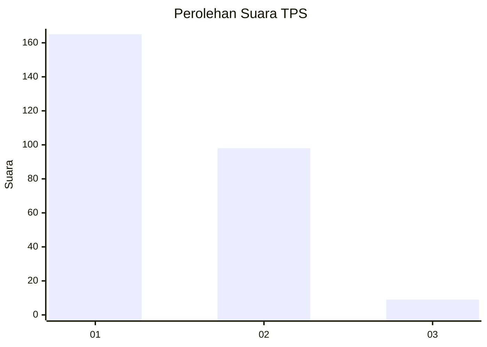
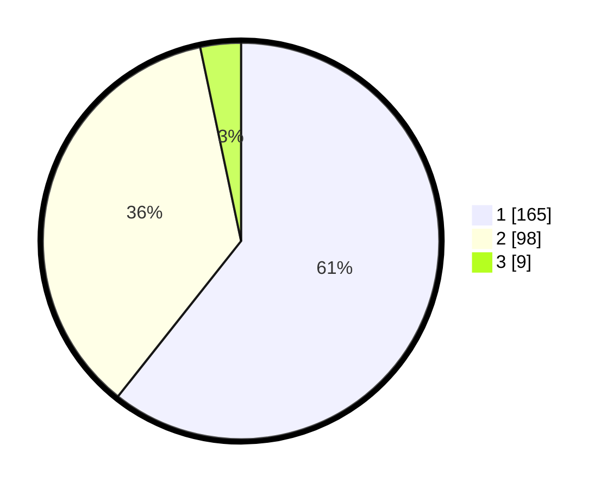

# Hasil

## Grafik

## Tabel

| No. | Nama Paslon    | Suara | Suara (raw) | Persentase |
|:--- |:-------------- | -----:| -----------:| ----------:|
| 1   | ANIES MUHAIMIN | 165   | [165][p-1]  | 60,66      |
| 2   | PRABOWO GIBRAN | 98    | [98][p-2]   | 36,03      |
| 3   | GANJAR MAHFUD  | 9     | [9][p-3]    | 3,31       |

[p-1]: https://github.com/gigit-pemilu/pemilu-2024-36-banten/blob/main/pilpres/hitung-suara/sub/36-banten/sub/03-tangerang/sub/18-cikupa/sub/2012-pasir-jaya/sub/013-tps/sub/paslon-1.txt
[p-2]: https://github.com/gigit-pemilu/pemilu-2024-36-banten/blob/main/pilpres/hitung-suara/sub/36-banten/sub/03-tangerang/sub/18-cikupa/sub/2012-pasir-jaya/sub/013-tps/sub/paslon-2.txt
[p-3]: https://github.com/gigit-pemilu/pemilu-2024-36-banten/blob/main/pilpres/hitung-suara/sub/36-banten/sub/03-tangerang/sub/18-cikupa/sub/2012-pasir-jaya/sub/013-tps/sub/paslon-3.txt

## Foto C Plano

https://sirekap-obj-formc.kpu.go.id/c4ee/pemilu/ppwp/36/03/18/20/12/3603182012013-20240214-205304--ce0bd9c8-f5dc-40af-9777-5c40c2e6fb79.jpg

https://sirekap-obj-formc.kpu.go.id/c4ee/pemilu/ppwp/36/03/18/20/12/3603182012013-20240214-233302--90f5df28-0779-4afb-a87e-887e20d3a5be.jpg

https://sirekap-obj-formc.kpu.go.id/c4ee/pemilu/ppwp/36/03/18/20/12/3603182012013-20240214-205414--68da2b3b-0c65-425e-a420-7f82210a4f81.jpg

## Metadata

| Key        | Value               |
| ---------- | ------------------- |
| Time Stamp | 2024-02-24 22:31:28 |

