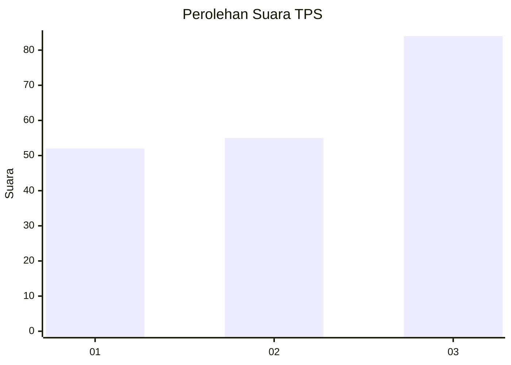
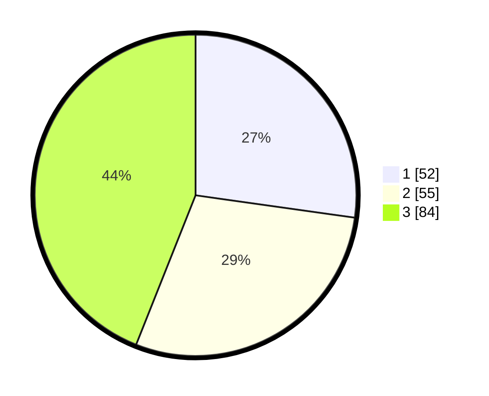

# Hasil

## Grafik

## Tabel

| No. | Nama Paslon    | Suara | Suara (raw) | Persentase |
|:--- |:-------------- | -----:| -----------:| ----------:|
| 1   | ANIES MUHAIMIN | 52    | [52][p-1]   | 27,23      |
| 2   | PRABOWO GIBRAN | 55    | [55][p-2]   | 28,80      |
| 3   | GANJAR MAHFUD  | 84    | [84][p-3]   | 43,98      |

[p-1]: https://github.com/gigit-pemilu/pemilu-2024-36-banten/blob/main/pilpres/hitung-suara/sub/36-banten/sub/03-tangerang/sub/19-panongan/sub/1002-mekar-bakti/sub/001-tps/sub/paslon-1.txt
[p-2]: https://github.com/gigit-pemilu/pemilu-2024-36-banten/blob/main/pilpres/hitung-suara/sub/36-banten/sub/03-tangerang/sub/19-panongan/sub/1002-mekar-bakti/sub/001-tps/sub/paslon-2.txt
[p-3]: https://github.com/gigit-pemilu/pemilu-2024-36-banten/blob/main/pilpres/hitung-suara/sub/36-banten/sub/03-tangerang/sub/19-panongan/sub/1002-mekar-bakti/sub/001-tps/sub/paslon-3.txt

## Foto C Plano

https://sirekap-obj-formc.kpu.go.id/feec/pemilu/ppwp/36/03/19/10/02/3603191002001-20240221-195143--40f5c53f-30e6-4860-b1e0-20217d3457f3.jpg

https://sirekap-obj-formc.kpu.go.id/feec/pemilu/ppwp/36/03/19/10/02/3603191002001-20240221-195258--b9b405d1-eaff-4c5b-a2e7-208b04c35677.jpg

https://sirekap-obj-formc.kpu.go.id/feec/pemilu/ppwp/36/03/19/10/02/3603191002001-20240221-195331--b384a3cb-9e9d-4e94-93a0-c35e0e40d0e1.jpg

## Metadata

| Key        | Value               |
| ---------- | ------------------- |
| Time Stamp | 2024-02-21 21:00:04 |

## DATA PEMILIH TETAP

Jumlah pemilih dalam DPT: **290**.
 * L: **550**.
 * P: **440**.

## DATA PENGGUNA HAK PILIH

Jumlah pengguna hak pilih dalam DPT: **237**.
 * L: **525**.
 * P: **826**.

Jumlah pengguna hak pilih dalam DPTb: **887**.
 * L: **885**.
 * P: **388**.

Jumlah pengguna hak pilih dalam DPK: **888**.
 * L: **8**.
 * P: **888**.

Jumlah pengguna hak pilih: **238**.
 * L: **222**.
 * P: **756**.

## JUMLAH SUARA SAH DAN TIDAK SAH

JUMLAH SELURUH SUARA SAH: **222**.

JUMLAH SUARA TIDAK SAH: **4**.

JUMLAH SELURUH SUARA SAH DAN SUARA TIDAK SAH: **232**.

