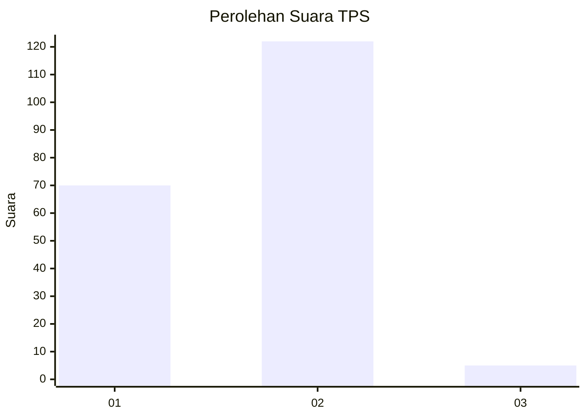
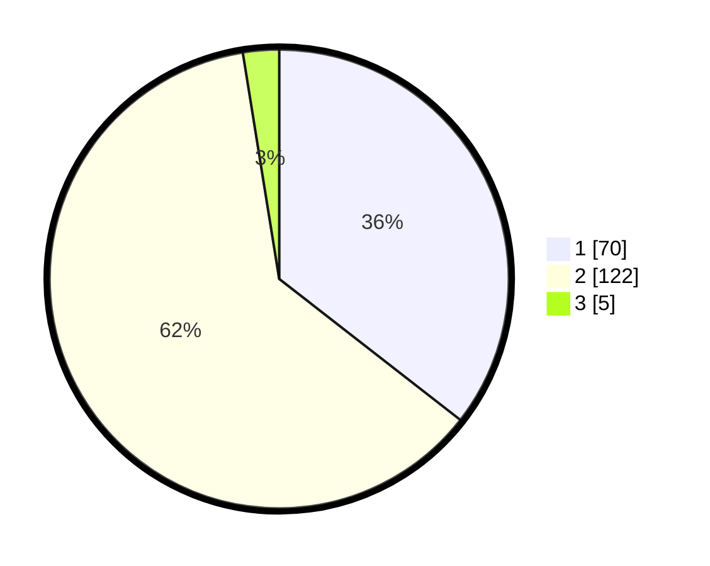

# Hasil

## Grafik

## Tabel

| No. | Nama Paslon    | Suara | Suara (raw) | Persentase |
|:--- |:-------------- | -----:| -----------:| ----------:|
| 1   | ANIES MUHAIMIN | 70    | [70][p-1]   | 35,53      |
| 2   | PRABOWO GIBRAN | 122   | [122][p-2]  | 61,93      |
| 3   | GANJAR MAHFUD  | 5     | [5][p-3]    | 2,54       |

[p-1]: https://github.com/gigit-pemilu/pemilu-2024/blob/main/pilpres/hitung-suara/sub/36-banten/sub/03-tangerang/sub/19-panongan/sub/1002-mekar-bakti/sub/003-tps/sub/paslon-1.txt
[p-2]: https://github.com/gigit-pemilu/pemilu-2024/blob/main/pilpres/hitung-suara/sub/36-banten/sub/03-tangerang/sub/19-panongan/sub/1002-mekar-bakti/sub/003-tps/sub/paslon-2.txt
[p-3]: https://github.com/gigit-pemilu/pemilu-2024/blob/main/pilpres/hitung-suara/sub/36-banten/sub/03-tangerang/sub/19-panongan/sub/1002-mekar-bakti/sub/003-tps/sub/paslon-3.txt

## Foto C Plano

https://sirekap-obj-formc.kpu.go.id/0f23/pemilu/ppwp/36/03/19/10/02/3603191002003-20240222-094652--80e24c24-a66d-4f48-944f-c04fbed9e9f8.jpg

https://sirekap-obj-formc.kpu.go.id/0f23/pemilu/ppwp/36/03/19/10/02/3603191002003-20240222-094740--236e74a5-d9b5-48b3-bb8c-3befa554e67e.jpg

https://sirekap-obj-formc.kpu.go.id/0f23/pemilu/ppwp/36/03/19/10/02/3603191002003-20240222-094822--a5d00c3d-d2f4-4d2f-b458-86fb4d3e7f5e.jpg

## Metadata

| Key        | Value               |
| ---------- | ------------------- |
| Time Stamp | 2024-02-25 15:00:00 |

