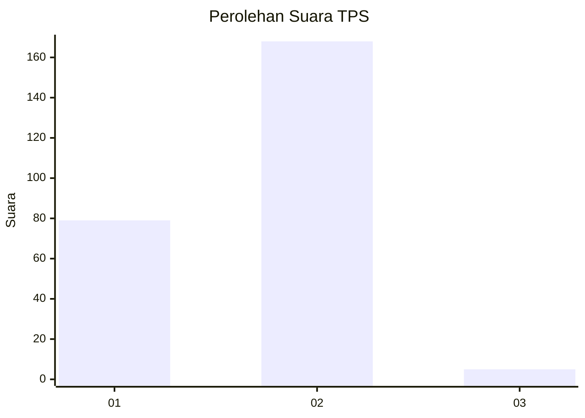
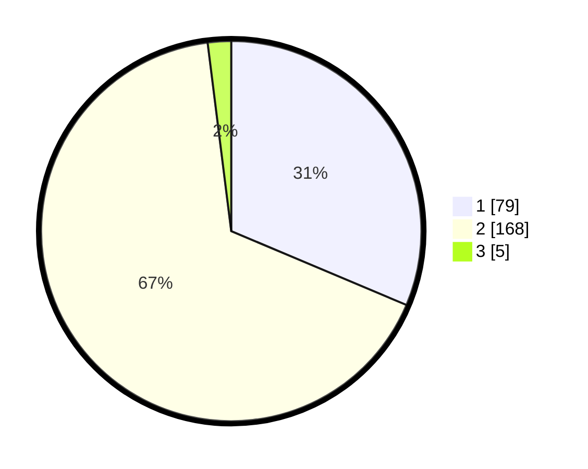

# Hasil

## Grafik

## Tabel

| No. | Nama Paslon    | Suara | Suara (raw) | Persentase |
|:--- |:-------------- | -----:| -----------:| ----------:|
| 1   | ANIES MUHAIMIN | 79    | [79][p-1]   | 31,35      |
| 2   | PRABOWO GIBRAN | 168   | [168][p-2]  | 66,67      |
| 3   | GANJAR MAHFUD  | 5     | [5][p-3]    | 1,98       |

[p-1]: https://github.com/gigit-pemilu/pemilu-2024-36-banten/blob/main/pilpres/hitung-suara/sub/36-banten/sub/03-tangerang/sub/19-panongan/sub/1002-mekar-bakti/sub/004-tps/sub/paslon-1.txt
[p-2]: https://github.com/gigit-pemilu/pemilu-2024-36-banten/blob/main/pilpres/hitung-suara/sub/36-banten/sub/03-tangerang/sub/19-panongan/sub/1002-mekar-bakti/sub/004-tps/sub/paslon-2.txt
[p-3]: https://github.com/gigit-pemilu/pemilu-2024-36-banten/blob/main/pilpres/hitung-suara/sub/36-banten/sub/03-tangerang/sub/19-panongan/sub/1002-mekar-bakti/sub/004-tps/sub/paslon-3.txt

## Foto C Plano

https://sirekap-obj-formc.kpu.go.id/ae22/pemilu/ppwp/36/03/19/10/02/3603191002004-20240222-105408--7dea24d4-f091-4cce-9c85-dd180f7fabc9.jpg

https://sirekap-obj-formc.kpu.go.id/ae22/pemilu/ppwp/36/03/19/10/02/3603191002004-20240222-105430--95d641d8-da38-4bd8-ab29-2f1189d08333.jpg

https://sirekap-obj-formc.kpu.go.id/ae22/pemilu/ppwp/36/03/19/10/02/3603191002004-20240222-105456--454cb8f6-53c9-4798-bae8-726e818f09ac.jpg

## Metadata

| Key        | Value               |
| ---------- | ------------------- |
| Time Stamp | 2024-02-24 22:31:28 |

