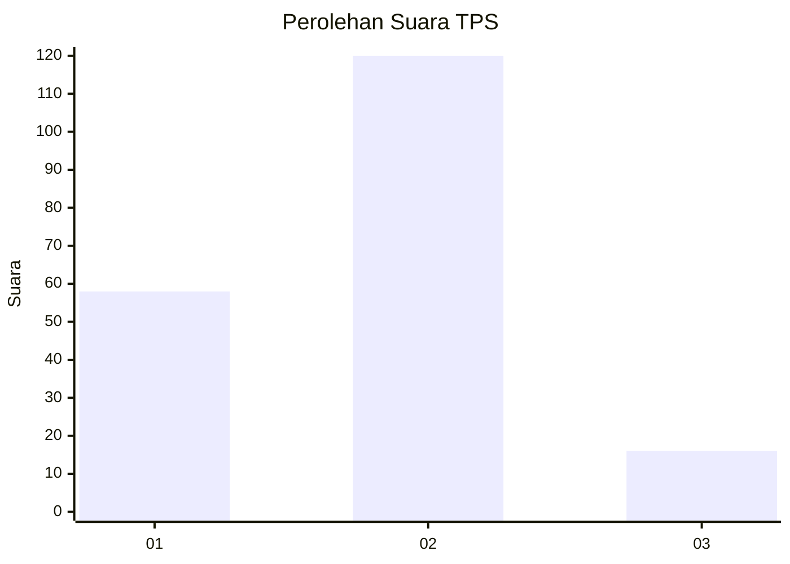
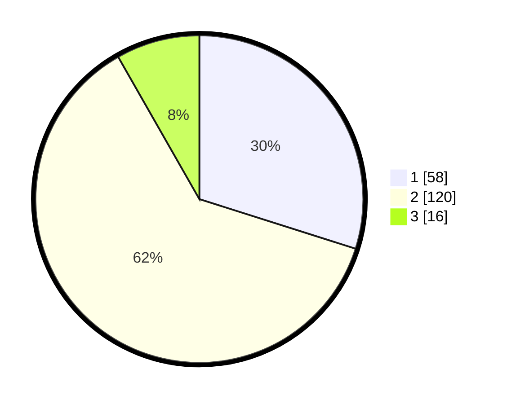

# Hasil

## Grafik

## Tabel

| No. | Nama Paslon    | Suara | Suara (raw) | Persentase |
|:--- |:-------------- | -----:| -----------:| ----------:|
| 1   | ANIES MUHAIMIN | 58    | [58][p-1]   | 29,90      |
| 2   | PRABOWO GIBRAN | 120   | [120][p-2]  | 61,86      |
| 3   | GANJAR MAHFUD  | 16    | [16][p-3]   | 8,25       |

[p-1]: https://github.com/gigit-pemilu/pemilu-2024-36-banten/blob/main/pilpres/hitung-suara/sub/36-banten/sub/03-tangerang/sub/19-panongan/sub/1002-mekar-bakti/sub/005-tps/sub/paslon-1.txt
[p-2]: https://github.com/gigit-pemilu/pemilu-2024-36-banten/blob/main/pilpres/hitung-suara/sub/36-banten/sub/03-tangerang/sub/19-panongan/sub/1002-mekar-bakti/sub/005-tps/sub/paslon-2.txt
[p-3]: https://github.com/gigit-pemilu/pemilu-2024-36-banten/blob/main/pilpres/hitung-suara/sub/36-banten/sub/03-tangerang/sub/19-panongan/sub/1002-mekar-bakti/sub/005-tps/sub/paslon-3.txt

## Foto C Plano

https://sirekap-obj-formc.kpu.go.id/a2f5/pemilu/ppwp/36/03/19/10/02/3603191002005-20240222-110259--86dd63fc-a513-4720-a6c8-b735f72a3c34.jpg

https://sirekap-obj-formc.kpu.go.id/a2f5/pemilu/ppwp/36/03/19/10/02/3603191002005-20240222-110322--a1f0bd34-7c31-4741-ab74-a31f58c631b3.jpg

https://sirekap-obj-formc.kpu.go.id/a2f5/pemilu/ppwp/36/03/19/10/02/3603191002005-20240222-110346--da81304f-3a4e-4441-9253-b93d7bfee63d.jpg

## Metadata

| Key        | Value               |
| ---------- | ------------------- |
| Time Stamp | 2024-02-25 17:00:00 |

