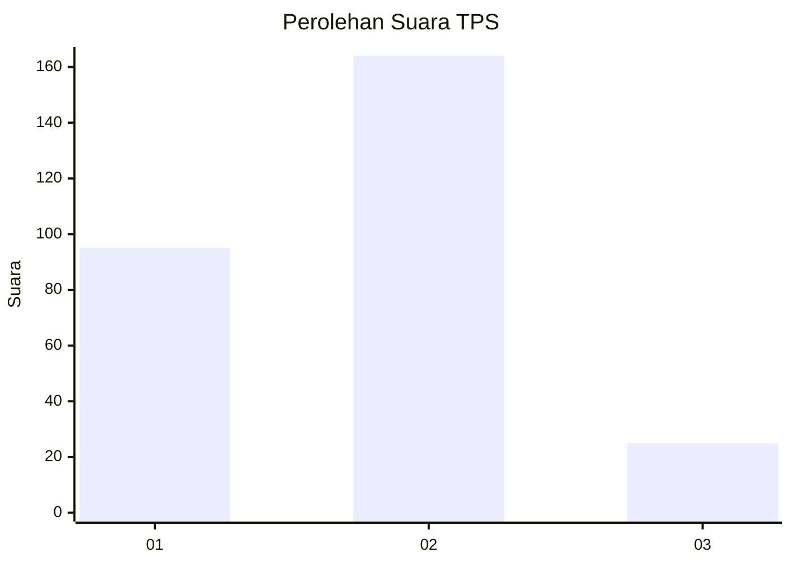
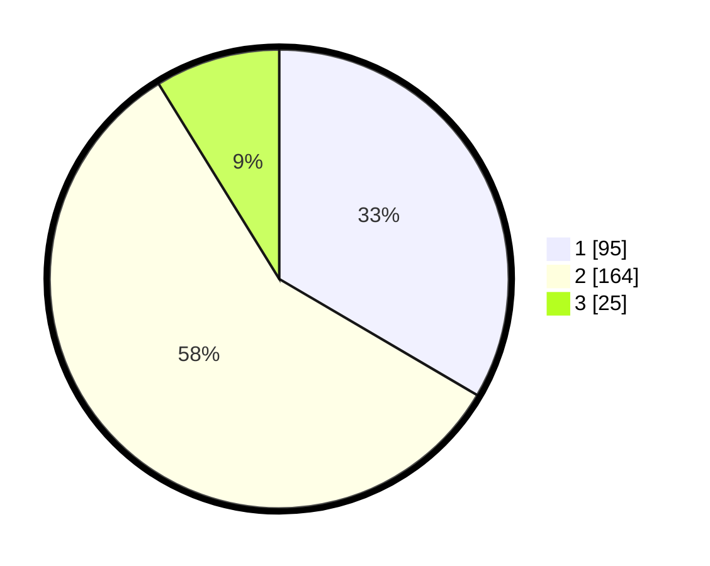

# Hasil

## Grafik

## Tabel

| No. | Nama Paslon    | Suara | Suara (raw) | Persentase |
|:--- |:-------------- | -----:| -----------:| ----------:|
| 1   | ANIES MUHAIMIN | 95    | [95][p-1]   | 33,45      |
| 2   | PRABOWO GIBRAN | 164   | [164][p-2]  | 57,75      |
| 3   | GANJAR MAHFUD  | 25    | [25][p-3]   | 8,80       |

[p-1]: https://github.com/gigit-pemilu/pemilu-2024/blob/main/pilpres/hitung-suara/sub/36-banten/sub/03-tangerang/sub/19-panongan/sub/1002-mekar-bakti/sub/061-tps/sub/paslon-1.txt
[p-2]: https://github.com/gigit-pemilu/pemilu-2024/blob/main/pilpres/hitung-suara/sub/36-banten/sub/03-tangerang/sub/19-panongan/sub/1002-mekar-bakti/sub/061-tps/sub/paslon-2.txt
[p-3]: https://github.com/gigit-pemilu/pemilu-2024/blob/main/pilpres/hitung-suara/sub/36-banten/sub/03-tangerang/sub/19-panongan/sub/1002-mekar-bakti/sub/061-tps/sub/paslon-3.txt

## Foto C Plano

https://sirekap-obj-formc.kpu.go.id/6342/pemilu/ppwp/36/03/19/10/02/3603191002061-20240227-202005--73fbcc46-3cca-48fc-83f1-b5bd8ee59941.jpg

https://sirekap-obj-formc.kpu.go.id/6342/pemilu/ppwp/36/03/19/10/02/3603191002061-20240227-202203--3e0c3c05-4fc6-43e8-a7cb-5897aedb7585.jpg

https://sirekap-obj-formc.kpu.go.id/6342/pemilu/ppwp/36/03/19/10/02/3603191002061-20240227-202228--8c1f0c83-660d-45c5-a22e-c5a2a48a400b.jpg

## Metadata

| Key        | Value               |
| ---------- | ------------------- |
| Time Stamp | 2024-02-28 19:00:00 |

