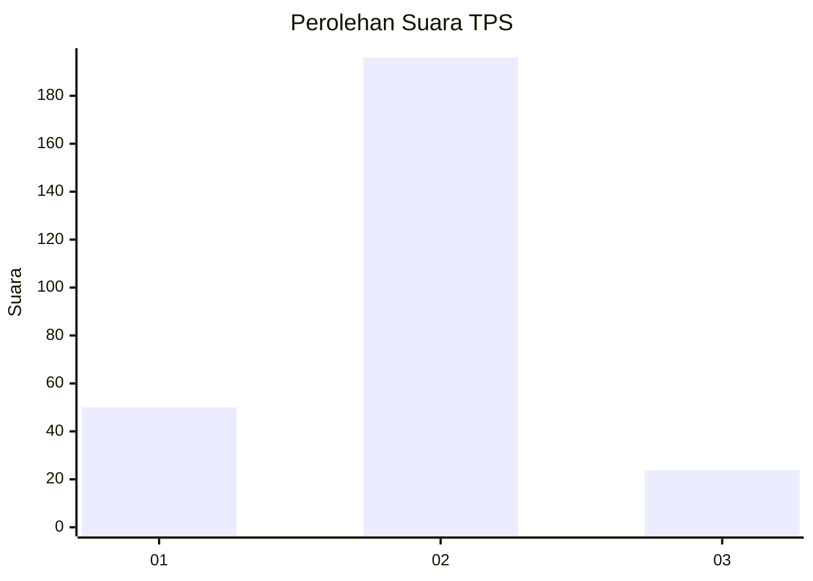
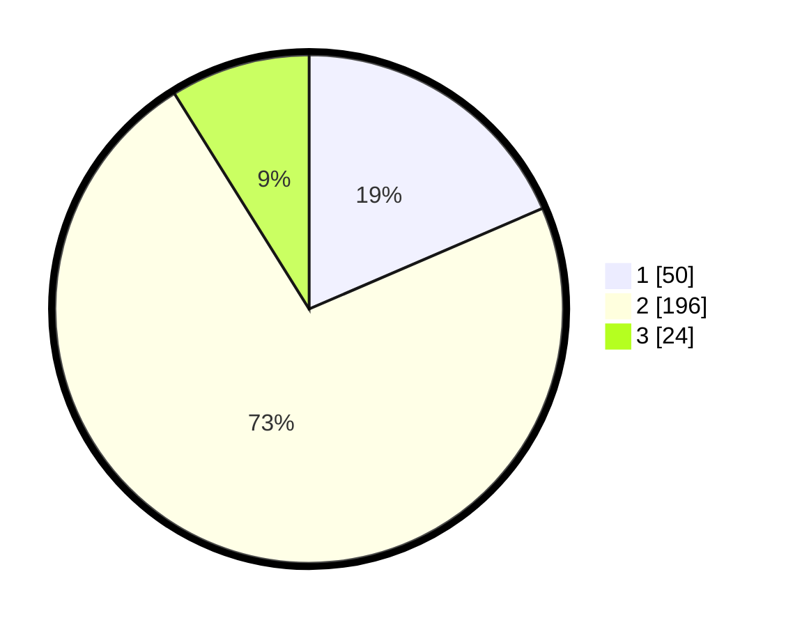

# Hasil

## Grafik

## Tabel

| No. | Nama Paslon    | Suara | Suara (raw) | Persentase |
|:--- |:-------------- | -----:| -----------:| ----------:|
| 1   | ANIES MUHAIMIN | 50    | [50][p-1]   | 18,52      |
| 2   | PRABOWO GIBRAN | 196   | [196][p-2]  | 72,59      |
| 3   | GANJAR MAHFUD  | 24    | [24][p-3]   | 8,89       |

[p-1]: https://github.com/gigit-pemilu/pemilu-2024/blob/main/pilpres/hitung-suara/sub/36-banten/sub/03-tangerang/sub/19-panongan/sub/2001-ranca-iyuh/sub/004-tps/sub/paslon-1.txt
[p-2]: https://github.com/gigit-pemilu/pemilu-2024/blob/main/pilpres/hitung-suara/sub/36-banten/sub/03-tangerang/sub/19-panongan/sub/2001-ranca-iyuh/sub/004-tps/sub/paslon-2.txt
[p-3]: https://github.com/gigit-pemilu/pemilu-2024/blob/main/pilpres/hitung-suara/sub/36-banten/sub/03-tangerang/sub/19-panongan/sub/2001-ranca-iyuh/sub/004-tps/sub/paslon-3.txt

## Foto C Plano

https://sirekap-obj-formc.kpu.go.id/47b2/pemilu/ppwp/36/03/19/20/01/3603192001004-20240226-111837--266d8520-bc89-454f-b280-6a1a0de63fd4.jpg

https://sirekap-obj-formc.kpu.go.id/47b2/pemilu/ppwp/36/03/19/20/01/3603192001004-20240226-111629--dedbc90a-0622-4bf8-b644-e719a36dc2aa.jpg

https://sirekap-obj-formc.kpu.go.id/47b2/pemilu/ppwp/36/03/19/20/01/3603192001004-20240226-111758--426ec90f-c295-47ed-b01a-5aa062a8052e.jpg

## Metadata

| Key        | Value               |
| ---------- | ------------------- |
| Time Stamp | 2024-02-28 19:00:00 |

