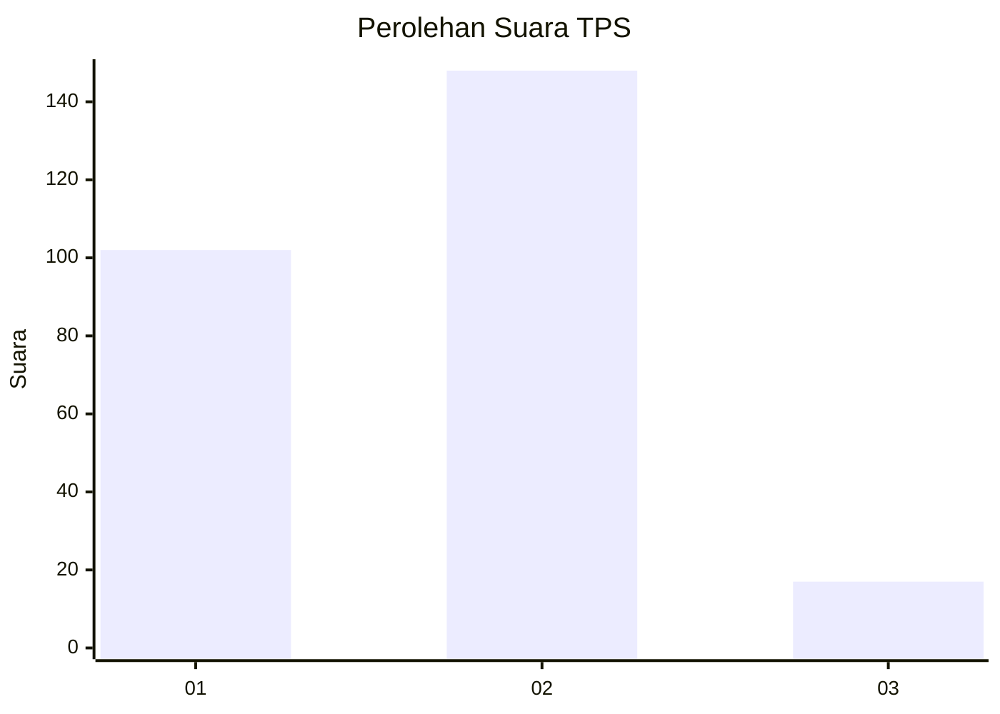

# Hasil

## Grafik

## Tabel

| No. | Nama Paslon    | Suara | Suara (raw) | Persentase |
|:--- |:-------------- | -----:| -----------:| ----------:|
| 1   | ANIES MUHAIMIN | 102   | [102][p-1]  | 38,20      |
| 2   | PRABOWO GIBRAN | 148   | [148][p-2]  | 55,43      |
| 3   | GANJAR MAHFUD  | 17    | [17][p-3]   | 6,37       |

[p-1]: https://github.com/gigit-pemilu/pemilu-2024-36-banten/blob/main/pilpres/hitung-suara/sub/36-banten/sub/03-tangerang/sub/19-panongan/sub/2003-peusar/sub/009-tps/sub/paslon-1.txt
[p-2]: https://github.com/gigit-pemilu/pemilu-2024-36-banten/blob/main/pilpres/hitung-suara/sub/36-banten/sub/03-tangerang/sub/19-panongan/sub/2003-peusar/sub/009-tps/sub/paslon-2.txt
[p-3]: https://github.com/gigit-pemilu/pemilu-2024-36-banten/blob/main/pilpres/hitung-suara/sub/36-banten/sub/03-tangerang/sub/19-panongan/sub/2003-peusar/sub/009-tps/sub/paslon-3.txt

## Foto C Plano

https://sirekap-obj-formc.kpu.go.id/0d8f/pemilu/ppwp/36/03/19/20/03/3603192003009-20240223-143431--8cc2ca7a-ef36-447d-aa15-c9ca032ad2a3.jpg

https://sirekap-obj-formc.kpu.go.id/0d8f/pemilu/ppwp/36/03/19/20/03/3603192003009-20240223-143517--e84bf6ef-6d7c-47f5-99eb-868c8631a99c.jpg

https://sirekap-obj-formc.kpu.go.id/0d8f/pemilu/ppwp/36/03/19/20/03/3603192003009-20240223-143558--3ccd3c99-6c7c-42b8-8b13-adca075f03ad.jpg

## Metadata

| Key        | Value               |
| ---------- | ------------------- |
| Time Stamp | 2024-02-24 22:31:28 |

