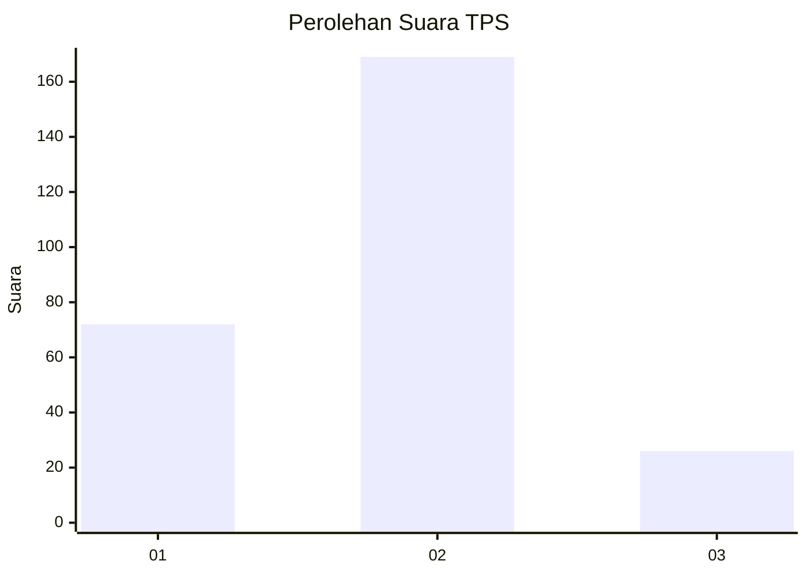
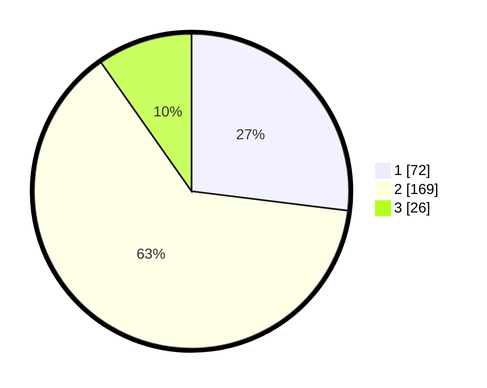

# Hasil

## Grafik

## Tabel

| No. | Nama Paslon    | Suara | Suara (raw) | Persentase |
|:--- |:-------------- | -----:| -----------:| ----------:|
| 1   | ANIES MUHAIMIN | 72    | [72][p-1]   | 26,97      |
| 2   | PRABOWO GIBRAN | 169   | [169][p-2]  | 63,30      |
| 3   | GANJAR MAHFUD  | 26    | [26][p-3]   | 9,74       |

[p-1]: https://github.com/gigit-pemilu/pemilu-2024-36-banten/blob/main/pilpres/hitung-suara/sub/36-banten/sub/03-tangerang/sub/19-panongan/sub/2004-ranca-kalapa/sub/013-tps/sub/paslon-1.txt
[p-2]: https://github.com/gigit-pemilu/pemilu-2024-36-banten/blob/main/pilpres/hitung-suara/sub/36-banten/sub/03-tangerang/sub/19-panongan/sub/2004-ranca-kalapa/sub/013-tps/sub/paslon-2.txt
[p-3]: https://github.com/gigit-pemilu/pemilu-2024-36-banten/blob/main/pilpres/hitung-suara/sub/36-banten/sub/03-tangerang/sub/19-panongan/sub/2004-ranca-kalapa/sub/013-tps/sub/paslon-3.txt

## Foto C Plano

https://sirekap-obj-formc.kpu.go.id/5332/pemilu/ppwp/36/03/19/20/04/3603192004013-20240220-101853--014ec52f-4035-4ca5-b640-2005fb24251b.jpg

https://sirekap-obj-formc.kpu.go.id/5332/pemilu/ppwp/36/03/19/20/04/3603192004013-20240220-101912--2ae6854b-f3be-4066-b2e7-466eb71f6fc0.jpg

https://sirekap-obj-formc.kpu.go.id/5332/pemilu/ppwp/36/03/19/20/04/3603192004013-20240220-101929--cbdc5893-b431-4922-b606-d5e94e006295.jpg

## Metadata

| Key        | Value               |
| ---------- | ------------------- |
| Time Stamp | 2024-02-24 22:31:28 |

