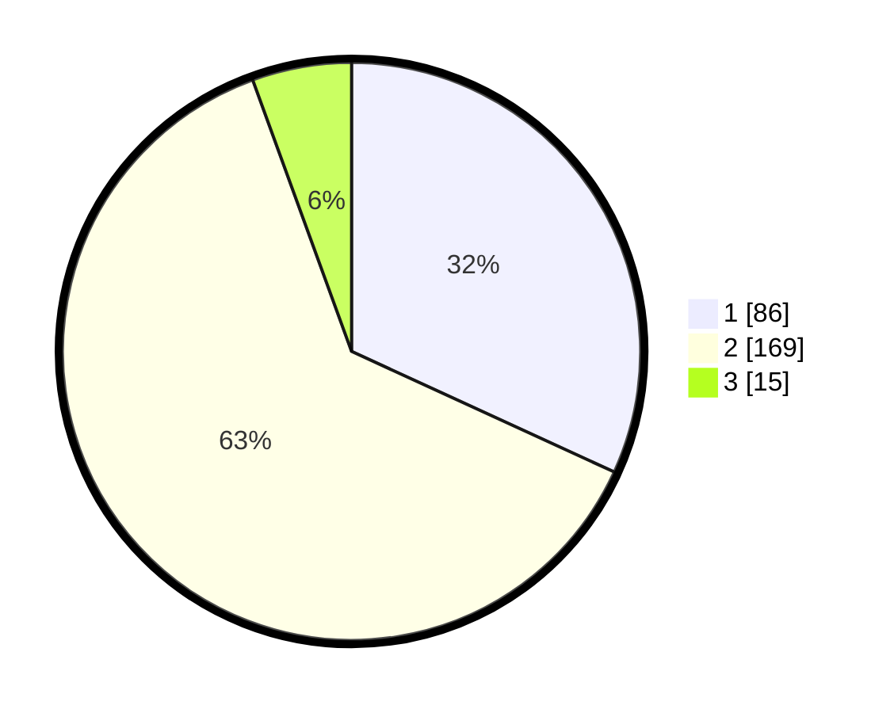

# Hasil

## Grafik

## Tabel

| No. | Nama Paslon    | Suara | Suara (raw) | Persentase |
|:--- |:-------------- | -----:| -----------:| ----------:|
| 1   | ANIES MUHAIMIN | 86    | [86][p-1]   | 31,85      |
| 2   | PRABOWO GIBRAN | 169   | [169][p-2]  | 62,59      |
| 3   | GANJAR MAHFUD  | 15    | [15][p-3]   | 5,56       |

[p-1]: https://github.com/gigit-pemilu/pemilu-2024-36-banten/blob/main/pilpres/hitung-suara/sub/36-banten/sub/03-tangerang/sub/19-panongan/sub/2005-serdang-kulon/sub/024-tps/sub/paslon-1.txt
[p-2]: https://github.com/gigit-pemilu/pemilu-2024-36-banten/blob/main/pilpres/hitung-suara/sub/36-banten/sub/03-tangerang/sub/19-panongan/sub/2005-serdang-kulon/sub/024-tps/sub/paslon-2.txt
[p-3]: https://github.com/gigit-pemilu/pemilu-2024-36-banten/blob/main/pilpres/hitung-suara/sub/36-banten/sub/03-tangerang/sub/19-panongan/sub/2005-serdang-kulon/sub/024-tps/sub/paslon-3.txt

## Foto C Plano

https://sirekap-obj-formc.kpu.go.id/1e6d/pemilu/ppwp/36/03/19/20/05/3603192005024-20240227-195706--b2169b87-c2d9-4fe0-bb34-f27b6caf6793.jpg

https://sirekap-obj-formc.kpu.go.id/1e6d/pemilu/ppwp/36/03/19/20/05/3603192005024-20240227-195817--d43e4dcd-b950-4df4-9e1a-d146a8cdf601.jpg

https://sirekap-obj-formc.kpu.go.id/1e6d/pemilu/ppwp/36/03/19/20/05/3603192005024-20240227-200012--da576f5c-1098-4bfd-83e4-7d31d9483648.jpg

## Metadata

| Key        | Value               |
| ---------- | ------------------- |
| Time Stamp | 2024-02-29 22:00:00 |

