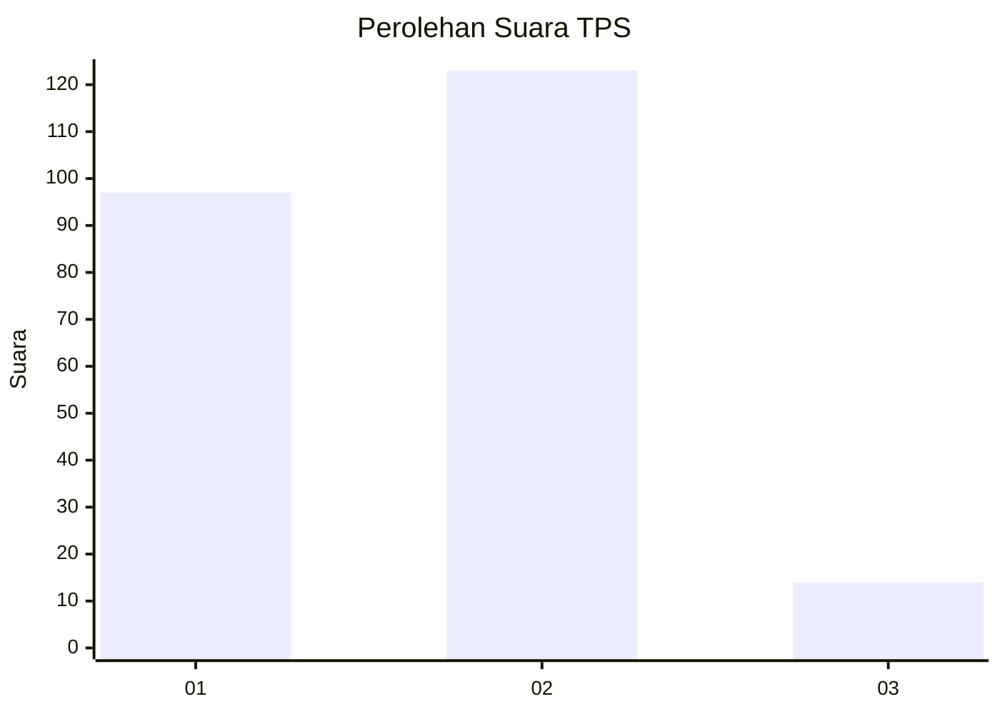
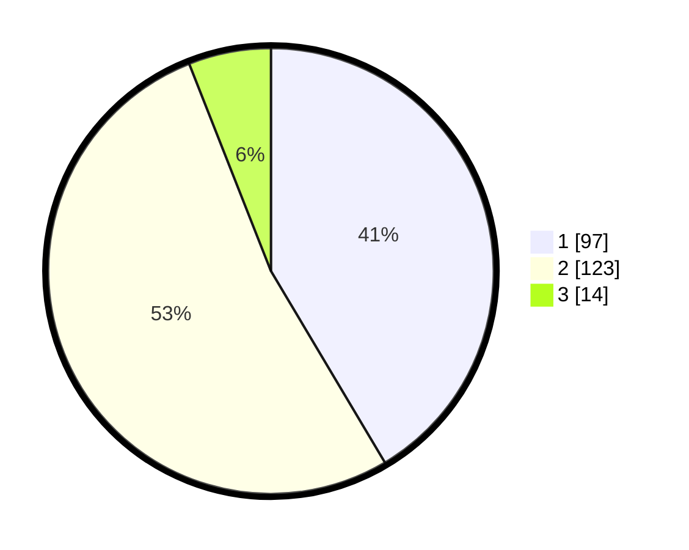

# Hasil

## Grafik

## Tabel

| No. | Nama Paslon    | Suara | Suara (raw) | Persentase |
|:--- |:-------------- | -----:| -----------:| ----------:|
| 1   | ANIES MUHAIMIN | 97    | [97][p-1]   | 41,45      |
| 2   | PRABOWO GIBRAN | 123   | [123][p-2]  | 52,56      |
| 3   | GANJAR MAHFUD  | 14    | [14][p-3]   | 5,98       |

[p-1]: https://github.com/gigit-pemilu/pemilu-2024-36-banten/blob/main/pilpres/hitung-suara/sub/36-banten/sub/03-tangerang/sub/20-legok/sub/1011-babakan/sub/002-tps/sub/paslon-1.txt
[p-2]: https://github.com/gigit-pemilu/pemilu-2024-36-banten/blob/main/pilpres/hitung-suara/sub/36-banten/sub/03-tangerang/sub/20-legok/sub/1011-babakan/sub/002-tps/sub/paslon-2.txt
[p-3]: https://github.com/gigit-pemilu/pemilu-2024-36-banten/blob/main/pilpres/hitung-suara/sub/36-banten/sub/03-tangerang/sub/20-legok/sub/1011-babakan/sub/002-tps/sub/paslon-3.txt

## Foto C Plano

https://sirekap-obj-formc.kpu.go.id/8137/pemilu/ppwp/36/03/20/10/11/3603201011002-20240218-103743--2d5d7156-7dbf-4210-ace0-040f5593e255.jpg

https://sirekap-obj-formc.kpu.go.id/8137/pemilu/ppwp/36/03/20/10/11/3603201011002-20240218-104208--97231682-95db-483b-9812-fdb7c5810ce0.jpg

https://sirekap-obj-formc.kpu.go.id/8137/pemilu/ppwp/36/03/20/10/11/3603201011002-20240218-104315--d5ee6832-95e9-4a1c-9b95-dfd7fa997abb.jpg

## Metadata

| Key        | Value               |
| ---------- | ------------------- |
| Time Stamp | 2024-02-24 22:31:28 |

