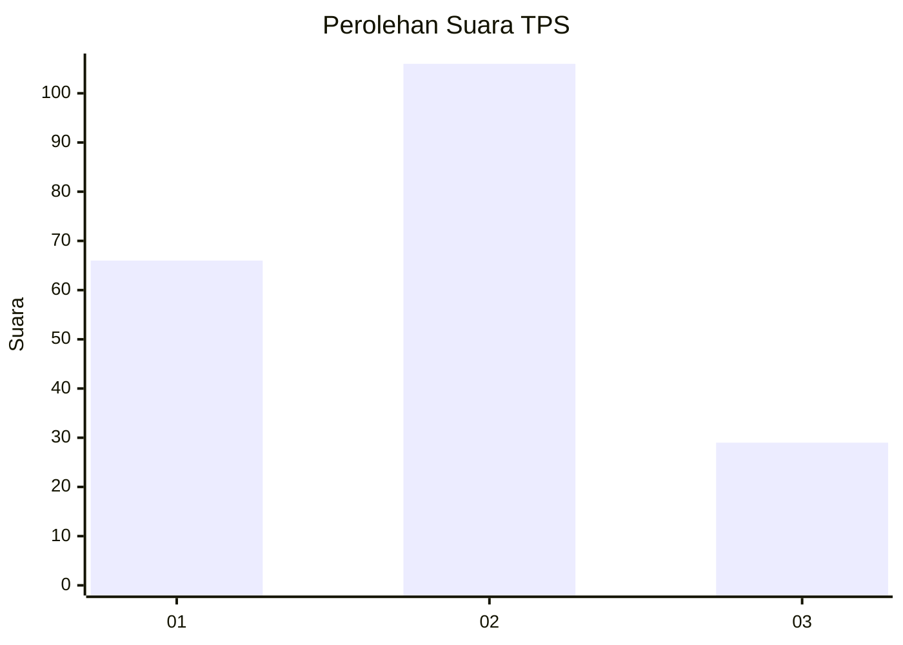
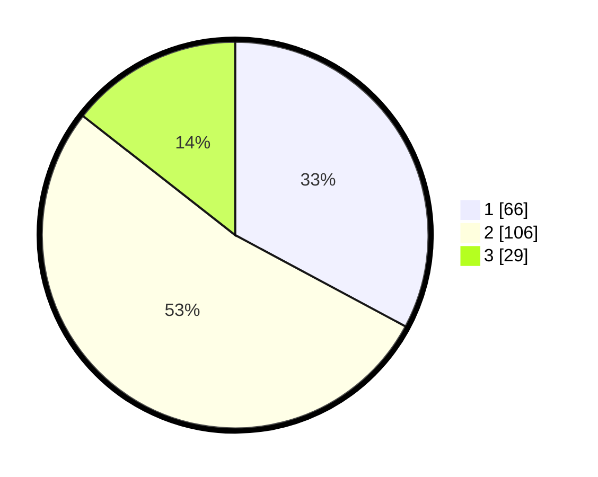

# Hasil

## Grafik

## Tabel

| No. | Nama Paslon    | Suara | Suara (raw) | Persentase |
|:--- |:-------------- | -----:| -----------:| ----------:|
| 1   | ANIES MUHAIMIN | 66    | [66][p-1]   | 32,84      |
| 2   | PRABOWO GIBRAN | 106   | [106][p-2]  | 52,74      |
| 3   | GANJAR MAHFUD  | 29    | [29][p-3]   | 14,43      |

[p-1]: https://github.com/gigit-pemilu/pemilu-2024/blob/main/pilpres/hitung-suara/sub/36-banten/sub/03-tangerang/sub/20-legok/sub/1011-babakan/sub/003-tps/sub/paslon-1.txt
[p-2]: https://github.com/gigit-pemilu/pemilu-2024/blob/main/pilpres/hitung-suara/sub/36-banten/sub/03-tangerang/sub/20-legok/sub/1011-babakan/sub/003-tps/sub/paslon-2.txt
[p-3]: https://github.com/gigit-pemilu/pemilu-2024/blob/main/pilpres/hitung-suara/sub/36-banten/sub/03-tangerang/sub/20-legok/sub/1011-babakan/sub/003-tps/sub/paslon-3.txt

## Foto C Plano

https://sirekap-obj-formc.kpu.go.id/006f/pemilu/ppwp/36/03/20/10/11/3603201011003-20240218-104522--e84106c2-5efa-487e-a4f8-91bde08da864.jpg

https://sirekap-obj-formc.kpu.go.id/006f/pemilu/ppwp/36/03/20/10/11/3603201011003-20240218-104640--405c9ea9-c11b-40ba-8118-6d686c26eeec.jpg

https://sirekap-obj-formc.kpu.go.id/006f/pemilu/ppwp/36/03/20/10/11/3603201011003-20240218-104715--54c91a38-aea4-4f85-916d-3214647bf720.jpg

## Metadata

| Key        | Value               |
| ---------- | ------------------- |
| Time Stamp | 2024-02-24 22:31:28 |

