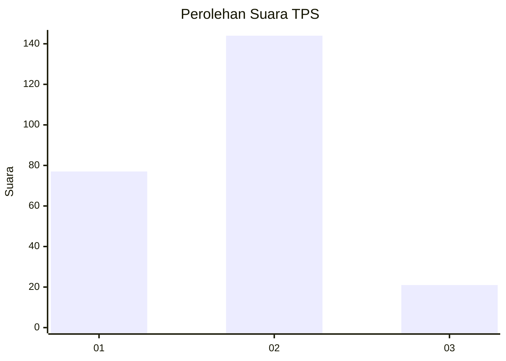
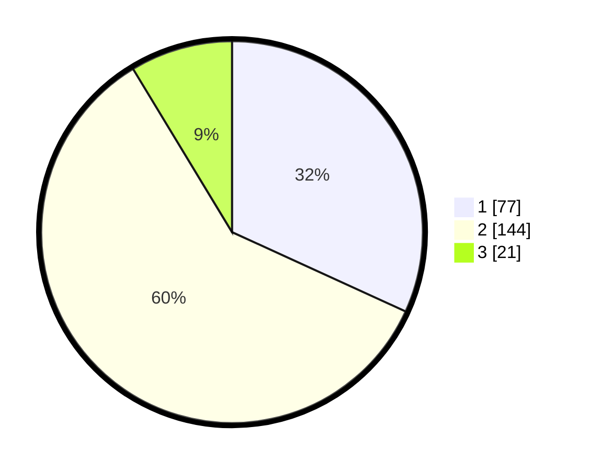

# Hasil

## Grafik

## Tabel

| No. | Nama Paslon    | Suara | Suara (raw) | Persentase |
|:--- |:-------------- | -----:| -----------:| ----------:|
| 1   | ANIES MUHAIMIN | 77    | [77][p-1]   | 31,82      |
| 2   | PRABOWO GIBRAN | 144   | [144][p-2]  | 59,50      |
| 3   | GANJAR MAHFUD  | 21    | [21][p-3]   | 8,68       |

[p-1]: https://github.com/gigit-pemilu/pemilu-2024-36-banten/blob/main/pilpres/hitung-suara/sub/36-banten/sub/03-tangerang/sub/20-legok/sub/1011-babakan/sub/005-tps/sub/paslon-1.txt
[p-2]: https://github.com/gigit-pemilu/pemilu-2024-36-banten/blob/main/pilpres/hitung-suara/sub/36-banten/sub/03-tangerang/sub/20-legok/sub/1011-babakan/sub/005-tps/sub/paslon-2.txt
[p-3]: https://github.com/gigit-pemilu/pemilu-2024-36-banten/blob/main/pilpres/hitung-suara/sub/36-banten/sub/03-tangerang/sub/20-legok/sub/1011-babakan/sub/005-tps/sub/paslon-3.txt

## Foto C Plano

https://sirekap-obj-formc.kpu.go.id/ff4e/pemilu/ppwp/36/03/20/10/11/3603201011005-20240218-105328--f96681b9-23fc-4dc7-9c4e-b1cbccc5ddcd.jpg

https://sirekap-obj-formc.kpu.go.id/ff4e/pemilu/ppwp/36/03/20/10/11/3603201011005-20240218-105418--f4ce761d-218c-4462-962e-4f2a7e99e289.jpg

https://sirekap-obj-formc.kpu.go.id/ff4e/pemilu/ppwp/36/03/20/10/11/3603201011005-20240218-105446--a5039215-5dad-4676-a154-51b0d57b30fe.jpg

## Metadata

| Key        | Value               |
| ---------- | ------------------- |
| Time Stamp | 2024-02-25 00:00:00 |

