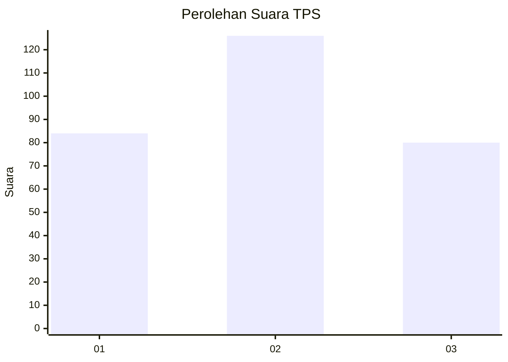
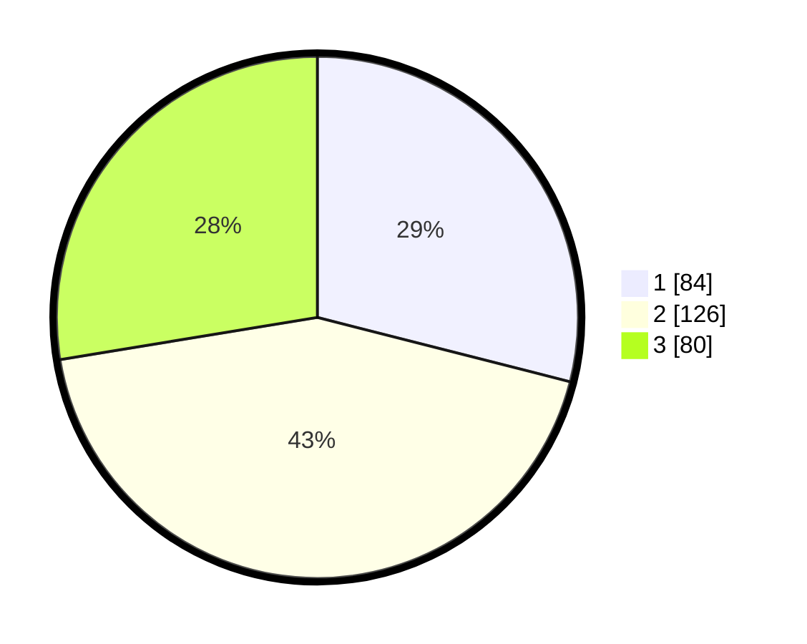

# Hasil

## Grafik

## Tabel

| No. | Nama Paslon    | Suara | Suara (raw) | Persentase |
|:--- |:-------------- | -----:| -----------:| ----------:|
| 1   | ANIES MUHAIMIN | 84    | [84][p-1]   | 28,97      |
| 2   | PRABOWO GIBRAN | 126   | [126][p-2]  | 43,45      |
| 3   | GANJAR MAHFUD  | 80    | [80][p-3]   | 27,59      |

[p-1]: https://github.com/gigit-pemilu/pemilu-2024/blob/main/pilpres/hitung-suara/sub/36-banten/sub/03-tangerang/sub/20-legok/sub/1011-babakan/sub/015-tps/sub/paslon-1.txt
[p-2]: https://github.com/gigit-pemilu/pemilu-2024/blob/main/pilpres/hitung-suara/sub/36-banten/sub/03-tangerang/sub/20-legok/sub/1011-babakan/sub/015-tps/sub/paslon-2.txt
[p-3]: https://github.com/gigit-pemilu/pemilu-2024/blob/main/pilpres/hitung-suara/sub/36-banten/sub/03-tangerang/sub/20-legok/sub/1011-babakan/sub/015-tps/sub/paslon-3.txt

## Foto C Plano

https://sirekap-obj-formc.kpu.go.id/0d54/pemilu/ppwp/36/03/20/10/11/3603201011015-20240218-114143--0723fd38-ee14-4148-8541-97451134a88e.jpg

https://sirekap-obj-formc.kpu.go.id/0d54/pemilu/ppwp/36/03/20/10/11/3603201011015-20240218-114213--46c689d1-7566-40f4-ba56-b2adadac1809.jpg

https://sirekap-obj-formc.kpu.go.id/0d54/pemilu/ppwp/36/03/20/10/11/3603201011015-20240218-114238--9c2086f8-7baa-4830-8aff-53dca7eb3ab6.jpg

## Metadata

| Key        | Value               |
| ---------- | ------------------- |
| Time Stamp | 2024-02-19 19:00:00 |

