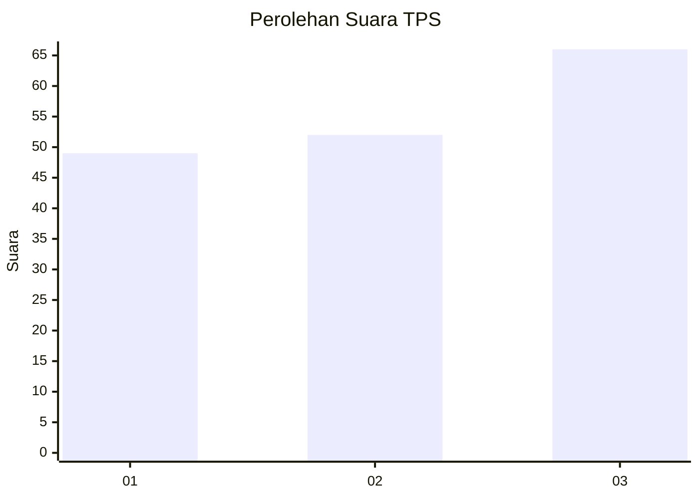
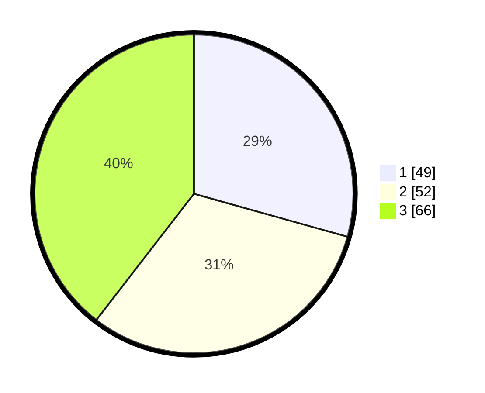

# Hasil

## Grafik

## Tabel

| No. | Nama Paslon    | Suara | Suara (raw) | Persentase |
|:--- |:-------------- | -----:| -----------:| ----------:|
| 1   | ANIES MUHAIMIN | 49    | [49][p-1]   | 29,34      |
| 2   | PRABOWO GIBRAN | 52    | [52][p-2]   | 31,14      |
| 3   | GANJAR MAHFUD  | 66    | [66][p-3]   | 39,52      |

[p-1]: https://github.com/gigit-pemilu/pemilu-2024/blob/main/pilpres/hitung-suara/sub/36-banten/sub/03-tangerang/sub/20-legok/sub/2002-caringin/sub/012-tps/sub/paslon-1.txt
[p-2]: https://github.com/gigit-pemilu/pemilu-2024/blob/main/pilpres/hitung-suara/sub/36-banten/sub/03-tangerang/sub/20-legok/sub/2002-caringin/sub/012-tps/sub/paslon-2.txt
[p-3]: https://github.com/gigit-pemilu/pemilu-2024/blob/main/pilpres/hitung-suara/sub/36-banten/sub/03-tangerang/sub/20-legok/sub/2002-caringin/sub/012-tps/sub/paslon-3.txt

## Foto C Plano

https://sirekap-obj-formc.kpu.go.id/4c31/pemilu/ppwp/36/03/20/20/02/3603202002012-20240224-204832--1fb14483-2169-4abd-b85c-8a54335fe980.jpg

https://sirekap-obj-formc.kpu.go.id/4c31/pemilu/ppwp/36/03/20/20/02/3603202002012-20240224-204734--54ae9ebd-7aa8-433f-83dc-b5397b5b2dcf.jpg

https://sirekap-obj-formc.kpu.go.id/4c31/pemilu/ppwp/36/03/20/20/02/3603202002012-20240224-204631--7a0a51aa-3dc2-4c84-a674-a545c70188d6.jpg

## Metadata

| Key        | Value               |
| ---------- | ------------------- |
| Time Stamp | 2024-02-24 22:31:28 |

## DATA PEMILIH TETAP

Jumlah pemilih dalam DPT: **250**.
 * L: **327**.
 * P: **337**.

## DATA PENGGUNA HAK PILIH

Jumlah pengguna hak pilih dalam DPT: **220**.
 * L: **509**.
 * P: **654**.

Jumlah pengguna hak pilih dalam DPTb: **883**.
 * L: **432**.
 * P: **333**.

Jumlah pengguna hak pilih dalam DPK: **887**.
 * L: **59**.
 * P: **888**.

Jumlah pengguna hak pilih: **224**.
 * L: **442**.
 * P: **242**.

## JUMLAH SUARA SAH DAN TIDAK SAH

JUMLAH SELURUH SUARA SAH: **266**.

JUMLAH SUARA TIDAK SAH: **283**.

JUMLAH SELURUH SUARA SAH DAN SUARA TIDAK SAH: **224**.

