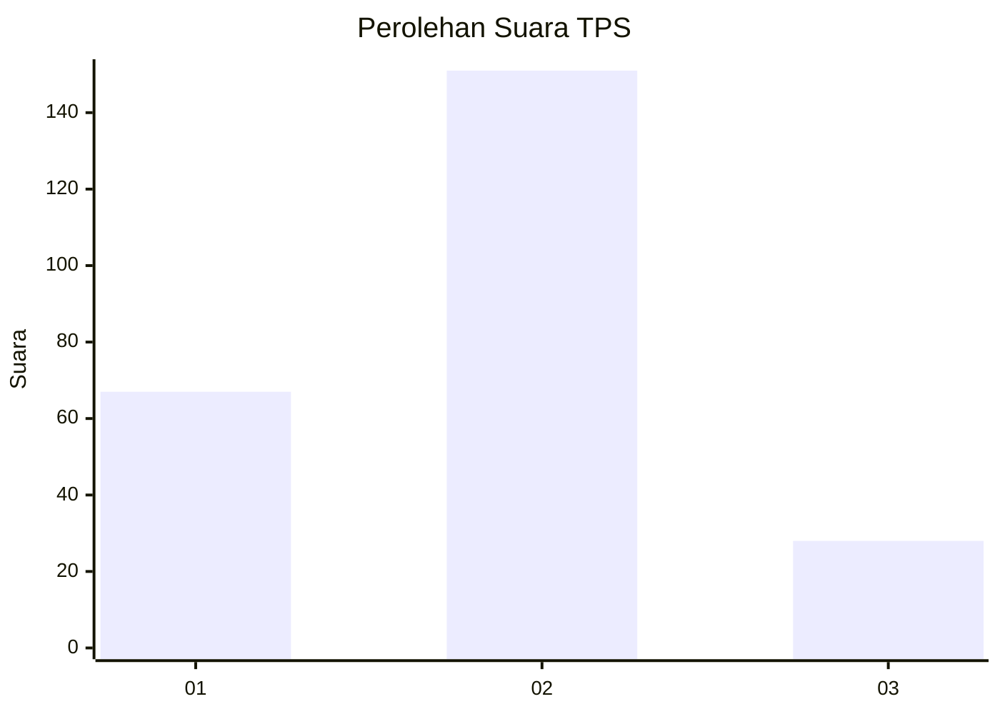
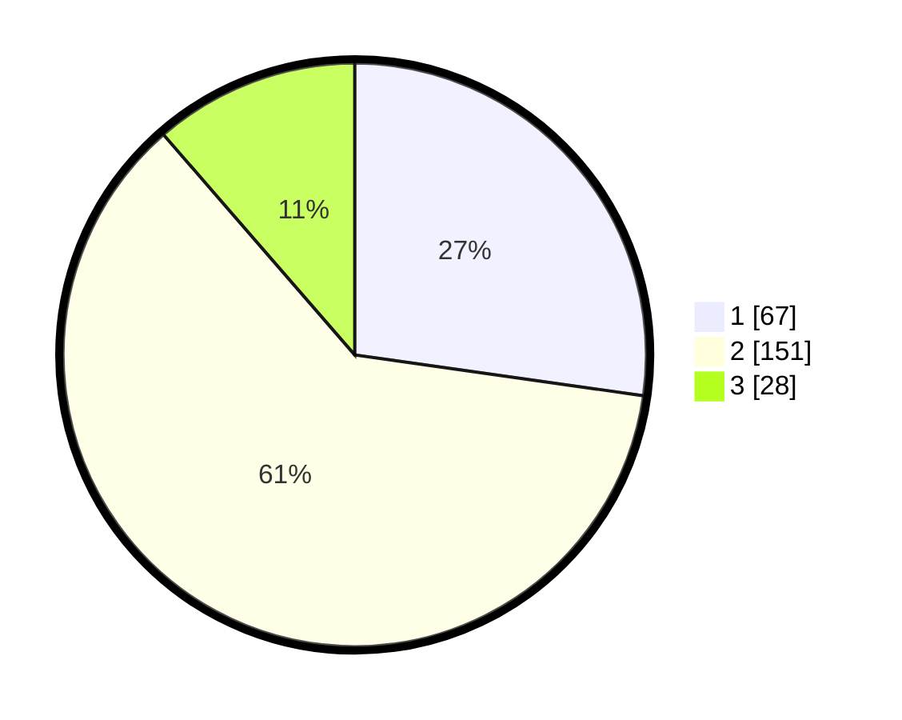

# Hasil

## Grafik

## Tabel

| No. | Nama Paslon    | Suara | Suara (raw) | Persentase |
|:--- |:-------------- | -----:| -----------:| ----------:|
| 1   | ANIES MUHAIMIN | 67    | [67][p-1]   | 27,24      |
| 2   | PRABOWO GIBRAN | 151   | [151][p-2]  | 61,38      |
| 3   | GANJAR MAHFUD  | 28    | [28][p-3]   | 11,38      |

[p-1]: https://github.com/gigit-pemilu/pemilu-2024/blob/main/pilpres/hitung-suara/sub/36-banten/sub/03-tangerang/sub/20-legok/sub/2002-caringin/sub/015-tps/sub/paslon-1.txt
[p-2]: https://github.com/gigit-pemilu/pemilu-2024/blob/main/pilpres/hitung-suara/sub/36-banten/sub/03-tangerang/sub/20-legok/sub/2002-caringin/sub/015-tps/sub/paslon-2.txt
[p-3]: https://github.com/gigit-pemilu/pemilu-2024/blob/main/pilpres/hitung-suara/sub/36-banten/sub/03-tangerang/sub/20-legok/sub/2002-caringin/sub/015-tps/sub/paslon-3.txt

## Foto C Plano

https://sirekap-obj-formc.kpu.go.id/9427/pemilu/ppwp/36/03/20/20/02/3603202002015-20240224-210146--e2ced3fc-d9b3-44ea-b0db-6470d46e427d.jpg

https://sirekap-obj-formc.kpu.go.id/9427/pemilu/ppwp/36/03/20/20/02/3603202002015-20240224-211519--2c4a09f4-cbf1-4880-98c0-b9cccb3555d1.jpg

https://sirekap-obj-formc.kpu.go.id/9427/pemilu/ppwp/36/03/20/20/02/3603202002015-20240224-210812--5fe8fea9-897c-46da-ba98-395d9bc682a6.jpg

## Metadata

| Key        | Value               |
| ---------- | ------------------- |
| Time Stamp | 2024-02-25 13:00:00 |

## DATA PEMILIH TETAP

Jumlah pemilih dalam DPT: **626**.
 * L: **222**.
 * P: **222**.

## DATA PENGGUNA HAK PILIH

Jumlah pengguna hak pilih dalam DPT: **459**.
 * L: **533**.
 * P: **128**.

Jumlah pengguna hak pilih dalam DPTb: **888**.
 * L: **888**.
 * P: **880**.

Jumlah pengguna hak pilih dalam DPK: **743**.
 * L: **883**.
 * P: **83**.

Jumlah pengguna hak pilih: **259**.
 * L: **539**.
 * P: **530**.

## JUMLAH SUARA SAH DAN TIDAK SAH

JUMLAH SELURUH SUARA SAH: **246**.

JUMLAH SUARA TIDAK SAH: **13**.

JUMLAH SELURUH SUARA SAH DAN SUARA TIDAK SAH: **259**.

