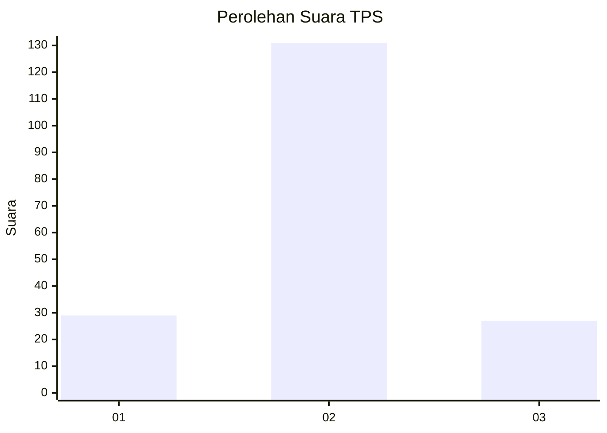

# Hasil

## Grafik

## Tabel

| No. | Nama Paslon    | Suara | Suara (raw) | Persentase |
|:--- |:-------------- | -----:| -----------:| ----------:|
| 1   | ANIES MUHAIMIN | 29    | [29][p-1]   | 15,51      |
| 2   | PRABOWO GIBRAN | 131   | [131][p-2]  | 70,05      |
| 3   | GANJAR MAHFUD  | 27    | [27][p-3]   | 14,44      |

[p-1]: https://github.com/gigit-pemilu/pemilu-2024-36-banten/blob/main/pilpres/hitung-suara/sub/36-banten/sub/03-tangerang/sub/20-legok/sub/2002-caringin/sub/019-tps/sub/paslon-1.txt
[p-2]: https://github.com/gigit-pemilu/pemilu-2024-36-banten/blob/main/pilpres/hitung-suara/sub/36-banten/sub/03-tangerang/sub/20-legok/sub/2002-caringin/sub/019-tps/sub/paslon-2.txt
[p-3]: https://github.com/gigit-pemilu/pemilu-2024-36-banten/blob/main/pilpres/hitung-suara/sub/36-banten/sub/03-tangerang/sub/20-legok/sub/2002-caringin/sub/019-tps/sub/paslon-3.txt

## Foto C Plano

https://sirekap-obj-formc.kpu.go.id/4772/pemilu/ppwp/36/03/20/20/02/3603202002019-20240224-214503--2a051c0d-1e0b-4d41-8286-01e0632eedb0.jpg

https://sirekap-obj-formc.kpu.go.id/4772/pemilu/ppwp/36/03/20/20/02/3603202002019-20240224-214215--eb3ddd86-b1f6-4707-9a1e-e46a221410ac.jpg

https://sirekap-obj-formc.kpu.go.id/4772/pemilu/ppwp/36/03/20/20/02/3603202002019-20240224-214302--9c0928d2-7894-44f7-8d33-79a0bb484aca.jpg

## Metadata

| Key        | Value               |
| ---------- | ------------------- |
| Time Stamp | 2024-02-24 22:31:28 |

## DATA PEMILIH TETAP

Jumlah pemilih dalam DPT: **500**.
 * L: **557**.
 * P: **557**.

## DATA PENGGUNA HAK PILIH

Jumlah pengguna hak pilih dalam DPT: **750**.
 * L: **577**.
 * P: **777**.

Jumlah pengguna hak pilih dalam DPTb: **335**.
 * L: **447**.
 * P: **433**.

Jumlah pengguna hak pilih dalam DPK: **442**.
 * L: **804**.
 * P: **444**.

Jumlah pengguna hak pilih: **422**.
 * L: **244**.
 * P: **444**.

## JUMLAH SUARA SAH DAN TIDAK SAH

JUMLAH SELURUH SUARA SAH: **197**.

JUMLAH SUARA TIDAK SAH: **9**.

JUMLAH SELURUH SUARA SAH DAN SUARA TIDAK SAH: **205**.

