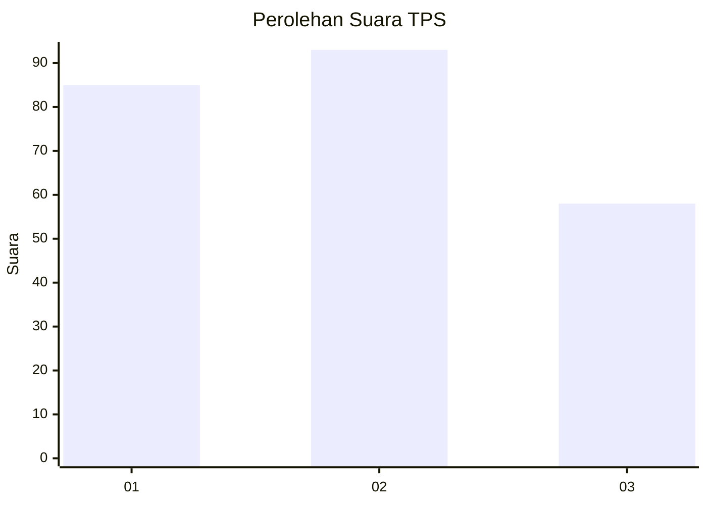
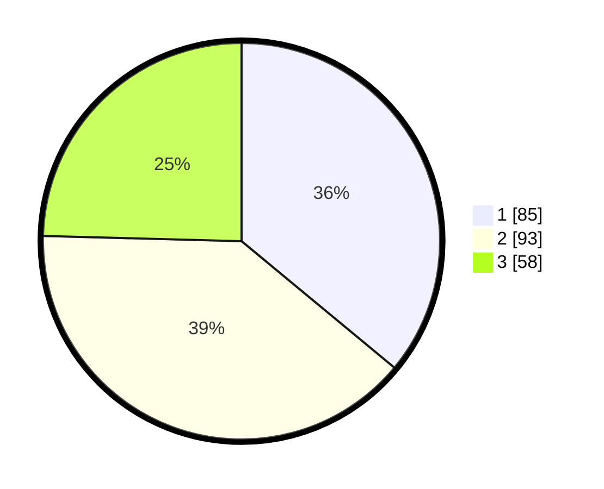

# Hasil

## Grafik

## Tabel

| No. | Nama Paslon    | Suara | Suara (raw) | Persentase |
|:--- |:-------------- | -----:| -----------:| ----------:|
| 1   | ANIES MUHAIMIN | 85    | [85][p-1]   | 36,02      |
| 2   | PRABOWO GIBRAN | 93    | [93][p-2]   | 39,41      |
| 3   | GANJAR MAHFUD  | 58    | [58][p-3]   | 24,58      |

[p-1]: https://github.com/gigit-pemilu/pemilu-2024-36-banten/blob/main/pilpres/hitung-suara/sub/36-banten/sub/03-tangerang/sub/20-legok/sub/2002-caringin/sub/024-tps/sub/paslon-1.txt
[p-2]: https://github.com/gigit-pemilu/pemilu-2024-36-banten/blob/main/pilpres/hitung-suara/sub/36-banten/sub/03-tangerang/sub/20-legok/sub/2002-caringin/sub/024-tps/sub/paslon-2.txt
[p-3]: https://github.com/gigit-pemilu/pemilu-2024-36-banten/blob/main/pilpres/hitung-suara/sub/36-banten/sub/03-tangerang/sub/20-legok/sub/2002-caringin/sub/024-tps/sub/paslon-3.txt

## Foto C Plano

https://sirekap-obj-formc.kpu.go.id/50d0/pemilu/ppwp/36/03/20/20/02/3603202002024-20240224-211924--132bed80-e08d-48cd-b0fb-ef9b61200c74.jpg

https://sirekap-obj-formc.kpu.go.id/50d0/pemilu/ppwp/36/03/20/20/02/3603202002024-20240224-211849--55abc188-e32b-4ea9-a33b-add2e276a21c.jpg

https://sirekap-obj-formc.kpu.go.id/50d0/pemilu/ppwp/36/03/20/20/02/3603202002024-20240224-211756--abf76a55-f916-453a-b38f-bc4adb547536.jpg

## Metadata

| Key        | Value               |
| ---------- | ------------------- |
| Time Stamp | 2024-02-25 16:00:00 |

## DATA PEMILIH TETAP

Jumlah pemilih dalam DPT: **276**.
 * L: **344**.
 * P: **332**.

## DATA PENGGUNA HAK PILIH

Jumlah pengguna hak pilih dalam DPT: **235**.
 * L: **820**.
 * P: **325**.

Jumlah pengguna hak pilih dalam DPTb: **2**.
 * L: **2**.
 * P: **8**.

Jumlah pengguna hak pilih dalam DPK: **153**.
 * L: **525**.
 * P: **363**.

Jumlah pengguna hak pilih: **233**.
 * L: **822**.
 * P: **385**.

## JUMLAH SUARA SAH DAN TIDAK SAH

JUMLAH SELURUH SUARA SAH: **236**.

JUMLAH SUARA TIDAK SAH: **1**.

JUMLAH SELURUH SUARA SAH DAN SUARA TIDAK SAH: **237**.

