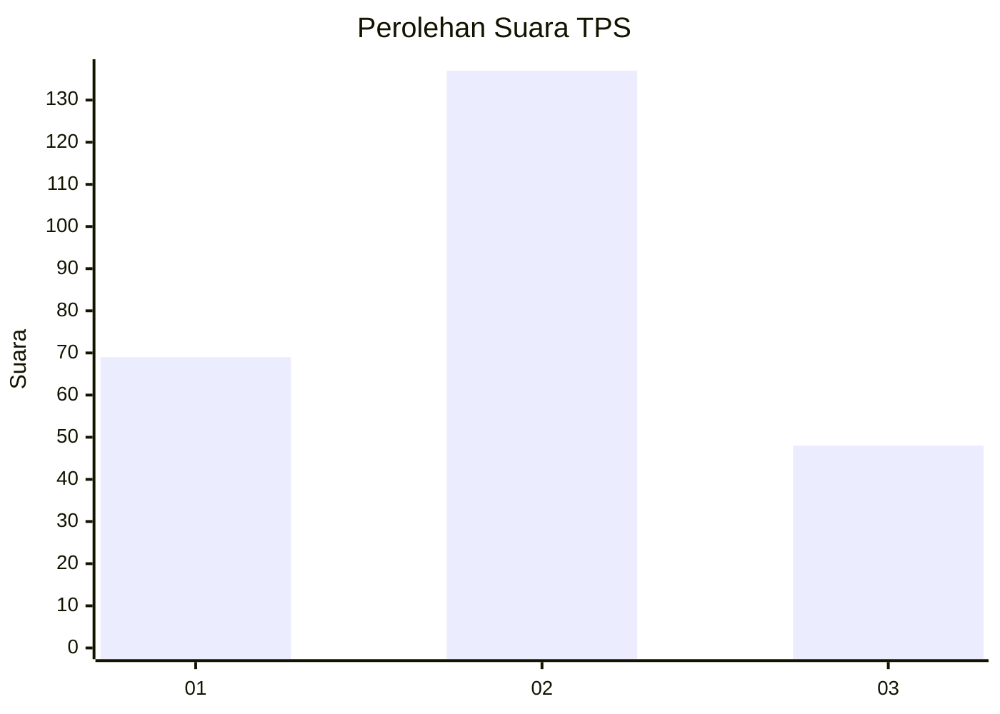
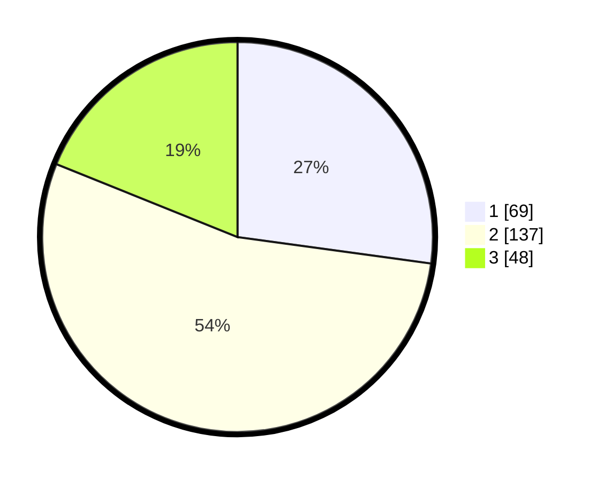

# Hasil

## Grafik

## Tabel

| No. | Nama Paslon    | Suara | Suara (raw) | Persentase |
|:--- |:-------------- | -----:| -----------:| ----------:|
| 1   | ANIES MUHAIMIN | 69    | [69][p-1]   | 27,17      |
| 2   | PRABOWO GIBRAN | 137   | [137][p-2]  | 53,94      |
| 3   | GANJAR MAHFUD  | 48    | [48][p-3]   | 18,90      |

[p-1]: https://github.com/gigit-pemilu/pemilu-2024/blob/main/pilpres/hitung-suara/sub/36-banten/sub/03-tangerang/sub/20-legok/sub/2002-caringin/sub/027-tps/sub/paslon-1.txt
[p-2]: https://github.com/gigit-pemilu/pemilu-2024/blob/main/pilpres/hitung-suara/sub/36-banten/sub/03-tangerang/sub/20-legok/sub/2002-caringin/sub/027-tps/sub/paslon-2.txt
[p-3]: https://github.com/gigit-pemilu/pemilu-2024/blob/main/pilpres/hitung-suara/sub/36-banten/sub/03-tangerang/sub/20-legok/sub/2002-caringin/sub/027-tps/sub/paslon-3.txt

## Foto C Plano

https://sirekap-obj-formc.kpu.go.id/d8f6/pemilu/ppwp/36/03/20/20/02/3603202002027-20240224-214053--fc38bc1a-202e-409f-8329-0d1d7a91e896.jpg

https://sirekap-obj-formc.kpu.go.id/d8f6/pemilu/ppwp/36/03/20/20/02/3603202002027-20240224-214306--ddf504ed-8127-44f6-8593-fc79f8814bbd.jpg

https://sirekap-obj-formc.kpu.go.id/d8f6/pemilu/ppwp/36/03/20/20/02/3603202002027-20240224-214159--d1e8bfd6-e72f-497d-9690-a6ed9ed49181.jpg

## Metadata

| Key        | Value               |
| ---------- | ------------------- |
| Time Stamp | 2024-02-25 15:00:00 |

## DATA PEMILIH TETAP

Jumlah pemilih dalam DPT: **293**.
 * L: **650**.
 * P: **143**.

## DATA PENGGUNA HAK PILIH

Jumlah pengguna hak pilih dalam DPT: **237**.
 * L: **705**.
 * P: **22**.

Jumlah pengguna hak pilih dalam DPTb: **806**.
 * L: **883**.
 * P: **803**.

Jumlah pengguna hak pilih dalam DPK: **825**.
 * L: **807**.
 * P: **888**.

Jumlah pengguna hak pilih: **258**.
 * L: **625**.
 * P: **333**.

## JUMLAH SUARA SAH DAN TIDAK SAH

JUMLAH SELURUH SUARA SAH: **254**.

JUMLAH SUARA TIDAK SAH: **4**.

JUMLAH SELURUH SUARA SAH DAN SUARA TIDAK SAH: **258**.

