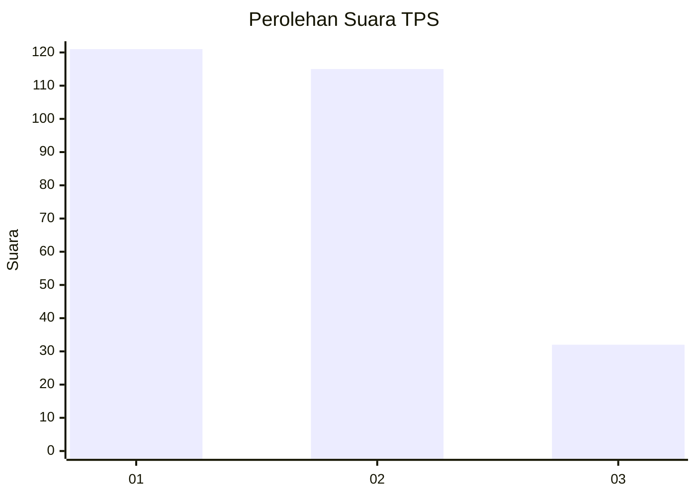
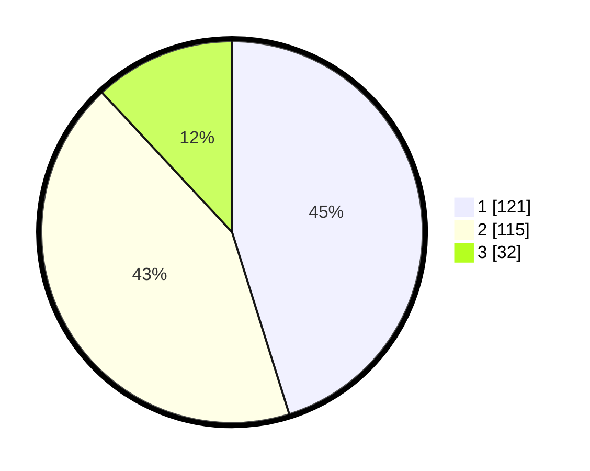

# Hasil

## Grafik

## Tabel

| No. | Nama Paslon    | Suara | Suara (raw) | Persentase |
|:--- |:-------------- | -----:| -----------:| ----------:|
| 1   | ANIES MUHAIMIN | 121   | [121][p-1]  | 45,15      |
| 2   | PRABOWO GIBRAN | 115   | [115][p-2]  | 42,91      |
| 3   | GANJAR MAHFUD  | 32    | [32][p-3]   | 11,94      |

[p-1]: https://github.com/gigit-pemilu/pemilu-2024/blob/main/pilpres/hitung-suara/sub/36-banten/sub/03-tangerang/sub/20-legok/sub/2002-caringin/sub/030-tps/sub/paslon-1.txt
[p-2]: https://github.com/gigit-pemilu/pemilu-2024/blob/main/pilpres/hitung-suara/sub/36-banten/sub/03-tangerang/sub/20-legok/sub/2002-caringin/sub/030-tps/sub/paslon-2.txt
[p-3]: https://github.com/gigit-pemilu/pemilu-2024/blob/main/pilpres/hitung-suara/sub/36-banten/sub/03-tangerang/sub/20-legok/sub/2002-caringin/sub/030-tps/sub/paslon-3.txt

## Foto C Plano

https://sirekap-obj-formc.kpu.go.id/8070/pemilu/ppwp/36/03/20/20/02/3603202002030-20240214-212521--e4c4a377-99a0-4090-8ca5-4206b6ebb86d.jpg

https://sirekap-obj-formc.kpu.go.id/8070/pemilu/ppwp/36/03/20/20/02/3603202002030-20240214-225659--ed5da0f2-df45-4caf-ad5e-f412c417241a.jpg

https://sirekap-obj-formc.kpu.go.id/8070/pemilu/ppwp/36/03/20/20/02/3603202002030-20240214-225602--0ed97d70-3e70-4cc9-a6c0-2784e0a93671.jpg

## Metadata

| Key        | Value               |
| ---------- | ------------------- |
| Time Stamp | 2024-02-25 12:00:00 |

