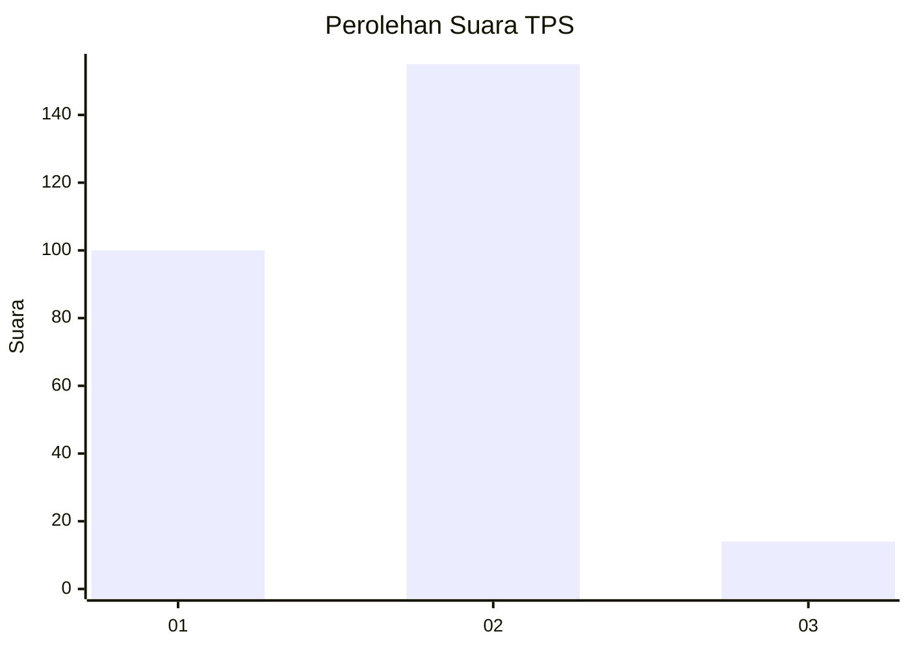
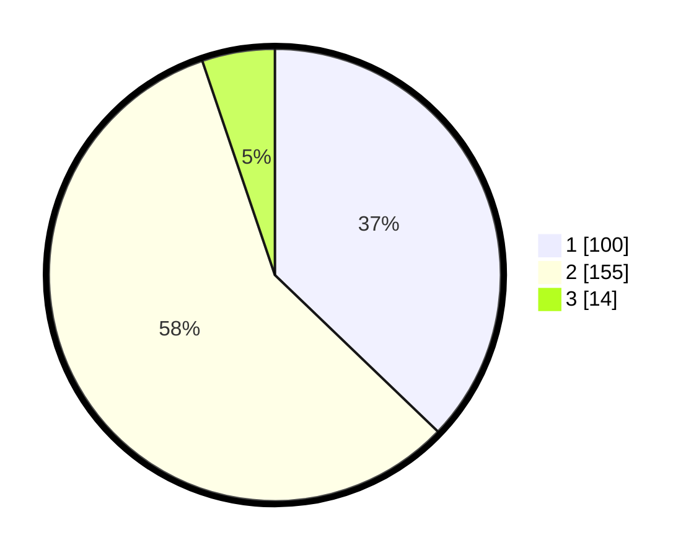

# Hasil

## Grafik

## Tabel

| No. | Nama Paslon    | Suara | Suara (raw) | Persentase |
|:--- |:-------------- | -----:| -----------:| ----------:|
| 1   | ANIES MUHAIMIN | 100   | [100][p-1]  | 37,17      |
| 2   | PRABOWO GIBRAN | 155   | [155][p-2]  | 57,62      |
| 3   | GANJAR MAHFUD  | 14    | [14][p-3]   | 5,20       |

[p-1]: https://github.com/gigit-pemilu/pemilu-2024-36-banten/blob/main/pilpres/hitung-suara/sub/36-banten/sub/03-tangerang/sub/20-legok/sub/2004-babat/sub/005-tps/sub/paslon-1.txt
[p-2]: https://github.com/gigit-pemilu/pemilu-2024-36-banten/blob/main/pilpres/hitung-suara/sub/36-banten/sub/03-tangerang/sub/20-legok/sub/2004-babat/sub/005-tps/sub/paslon-2.txt
[p-3]: https://github.com/gigit-pemilu/pemilu-2024-36-banten/blob/main/pilpres/hitung-suara/sub/36-banten/sub/03-tangerang/sub/20-legok/sub/2004-babat/sub/005-tps/sub/paslon-3.txt

## Foto C Plano

https://sirekap-obj-formc.kpu.go.id/ed6f/pemilu/ppwp/36/03/20/20/04/3603202004005-20240224-105914--3497414b-6cad-4f06-b9e9-4538f00a3066.jpg

https://sirekap-obj-formc.kpu.go.id/ed6f/pemilu/ppwp/36/03/20/20/04/3603202004005-20240224-110129--95ea908f-d73b-4d67-a46a-ddfee01178c4.jpg

https://sirekap-obj-formc.kpu.go.id/ed6f/pemilu/ppwp/36/03/20/20/04/3603202004005-20240224-110235--3eb58307-d55d-4f5f-8240-ba748ec77ecd.jpg

## Metadata

| Key        | Value               |
| ---------- | ------------------- |
| Time Stamp | 2024-02-24 22:31:28 |

## DATA PEMILIH TETAP

Jumlah pemilih dalam DPT: **755**.
 * L: **245**.
 * P: **156**.

## DATA PENGGUNA HAK PILIH

Jumlah pengguna hak pilih dalam DPT: **205**.
 * L: **920**.
 * P: **147**.

Jumlah pengguna hak pilih dalam DPTb: **2**.
 * L: **0**.
 * P: **85**.

Jumlah pengguna hak pilih dalam DPK: **805**.
 * L: **0**.
 * P: **0**.

Jumlah pengguna hak pilih: **255**.
 * L: **120**.
 * P: **149**.

## JUMLAH SUARA SAH DAN TIDAK SAH

JUMLAH SELURUH SUARA SAH: **269**.

JUMLAH SUARA TIDAK SAH: **0**.

JUMLAH SELURUH SUARA SAH DAN SUARA TIDAK SAH: **269**.

