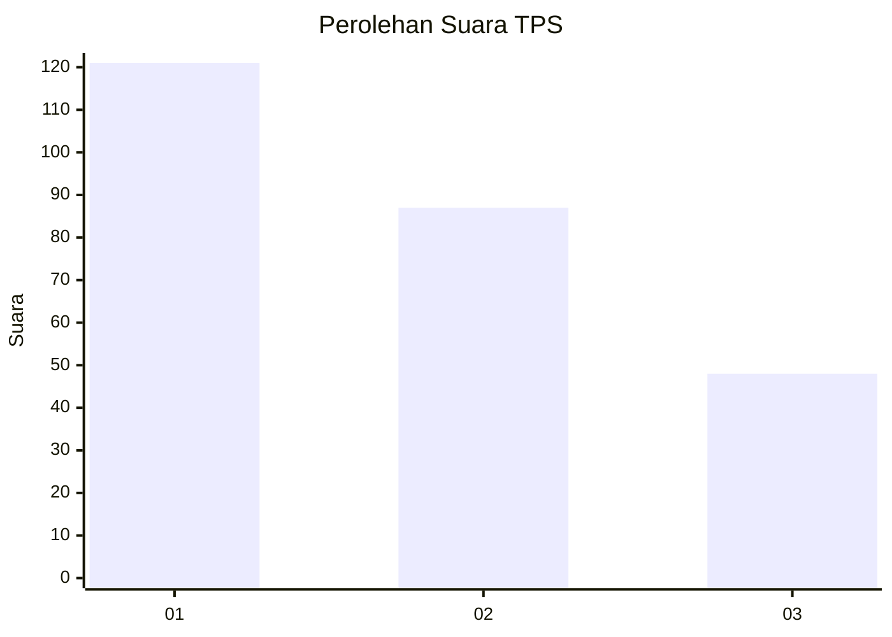
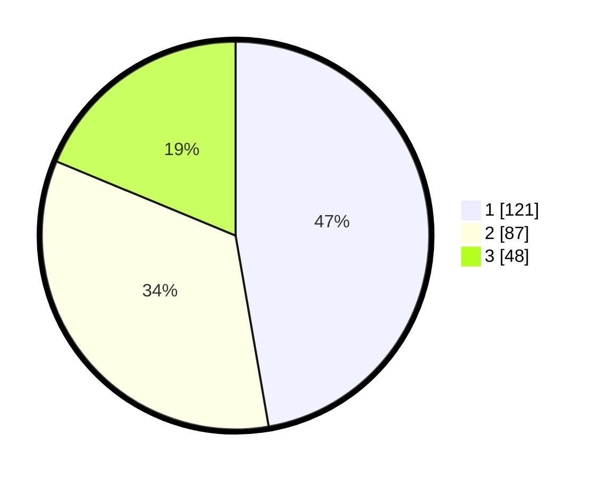

# Hasil

## Grafik

## Tabel

| No. | Nama Paslon    | Suara | Suara (raw) | Persentase |
|:--- |:-------------- | -----:| -----------:| ----------:|
| 1   | ANIES MUHAIMIN | 121   | [121][p-1]  | 47,27      |
| 2   | PRABOWO GIBRAN | 87    | [87][p-2]   | 33,98      |
| 3   | GANJAR MAHFUD  | 48    | [48][p-3]   | 18,75      |

[p-1]: https://github.com/gigit-pemilu/pemilu-2024/blob/main/pilpres/hitung-suara/sub/36-banten/sub/03-tangerang/sub/20-legok/sub/2006-legok/sub/031-tps/sub/paslon-1.txt
[p-2]: https://github.com/gigit-pemilu/pemilu-2024/blob/main/pilpres/hitung-suara/sub/36-banten/sub/03-tangerang/sub/20-legok/sub/2006-legok/sub/031-tps/sub/paslon-2.txt
[p-3]: https://github.com/gigit-pemilu/pemilu-2024/blob/main/pilpres/hitung-suara/sub/36-banten/sub/03-tangerang/sub/20-legok/sub/2006-legok/sub/031-tps/sub/paslon-3.txt

## Foto C Plano

https://sirekap-obj-formc.kpu.go.id/9198/pemilu/ppwp/36/03/20/20/06/3603202006031-20240214-221836--622c0a2e-98e8-4379-abd2-ce03c0a91640.jpg

https://sirekap-obj-formc.kpu.go.id/9198/pemilu/ppwp/36/03/20/20/06/3603202006031-20240214-221926--a2116448-ef66-4225-a415-db6ba067522b.jpg

https://sirekap-obj-formc.kpu.go.id/9198/pemilu/ppwp/36/03/20/20/06/3603202006031-20240214-222011--a6119522-d3ca-4d22-9287-4f9e7857820a.jpg

## Metadata

| Key        | Value               |
| ---------- | ------------------- |
| Time Stamp | 2024-02-25 11:00:00 |

