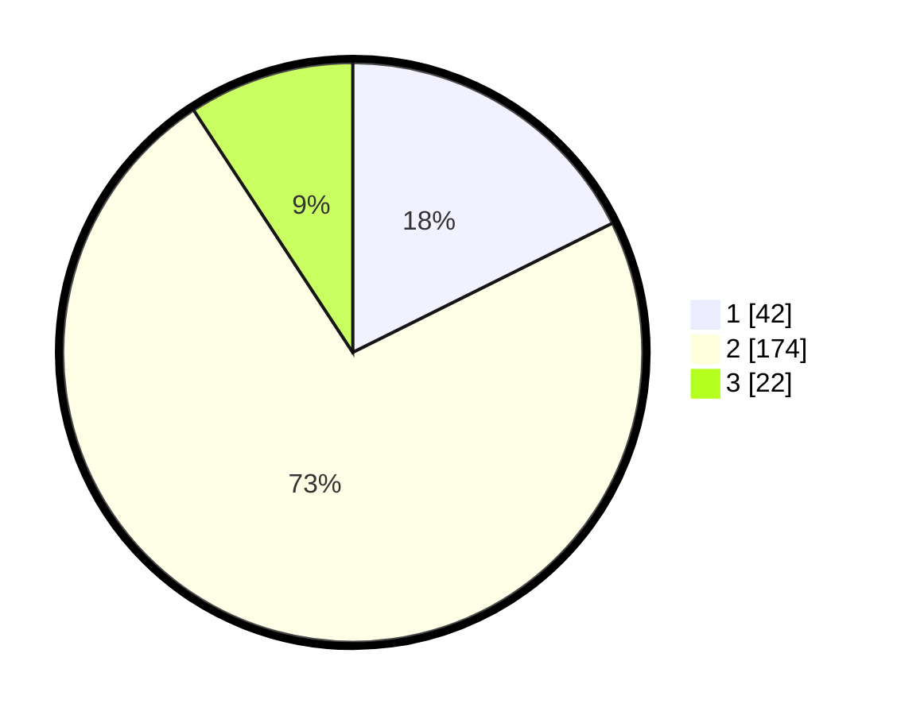

# Hasil

## Grafik

## Tabel

| No. | Nama Paslon    | Suara | Suara (raw) | Persentase |
|:--- |:-------------- | -----:| -----------:| ----------:|
| 1   | ANIES MUHAIMIN | 42    | [42][p-1]   | 17,65      |
| 2   | PRABOWO GIBRAN | 174   | [174][p-2]  | 73,11      |
| 3   | GANJAR MAHFUD  | 22    | [22][p-3]   | 9,24       |

[p-1]: https://github.com/gigit-pemilu/pemilu-2024-36-banten/blob/main/pilpres/hitung-suara/sub/36-banten/sub/03-tangerang/sub/20-legok/sub/2008-bojongkamal/sub/002-tps/sub/paslon-1.txt
[p-2]: https://github.com/gigit-pemilu/pemilu-2024-36-banten/blob/main/pilpres/hitung-suara/sub/36-banten/sub/03-tangerang/sub/20-legok/sub/2008-bojongkamal/sub/002-tps/sub/paslon-2.txt
[p-3]: https://github.com/gigit-pemilu/pemilu-2024-36-banten/blob/main/pilpres/hitung-suara/sub/36-banten/sub/03-tangerang/sub/20-legok/sub/2008-bojongkamal/sub/002-tps/sub/paslon-3.txt

## Foto C Plano

https://sirekap-obj-formc.kpu.go.id/0bfc/pemilu/ppwp/36/03/20/20/08/3603202008002-20240225-112514--906aa07a-642b-44b8-9177-79dab100fafd.jpg

https://sirekap-obj-formc.kpu.go.id/0bfc/pemilu/ppwp/36/03/20/20/08/3603202008002-20240225-112725--87debe30-6515-4ce0-bf28-ee88523752d0.jpg

https://sirekap-obj-formc.kpu.go.id/0bfc/pemilu/ppwp/36/03/20/20/08/3603202008002-20240225-112914--6868c918-52d6-4082-ba07-6c80f77dc793.jpg

## Metadata

| Key        | Value               |
| ---------- | ------------------- |
| Time Stamp | 2024-02-25 17:00:00 |

## DATA PEMILIH TETAP

Jumlah pemilih dalam DPT: **234**.
 * L: **857**.
 * P: **237**.

## DATA PENGGUNA HAK PILIH

Jumlah pengguna hak pilih dalam DPT: **353**.
 * L: **630**.
 * P: **423**.

Jumlah pengguna hak pilih dalam DPTb: **2**.
 * L: **0**.
 * P: **880**.

Jumlah pengguna hak pilih dalam DPK: **3**.
 * L: **280**.
 * P: **8**.

Jumlah pengguna hak pilih: **233**.
 * L: **430**.
 * P: **223**.

## JUMLAH SUARA SAH DAN TIDAK SAH

JUMLAH SELURUH SUARA SAH: **238**.

JUMLAH SUARA TIDAK SAH: **15**.

JUMLAH SELURUH SUARA SAH DAN SUARA TIDAK SAH: **253**.

