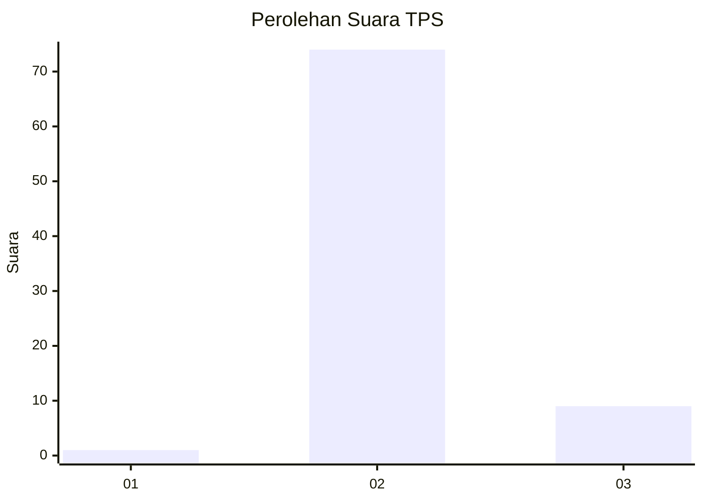
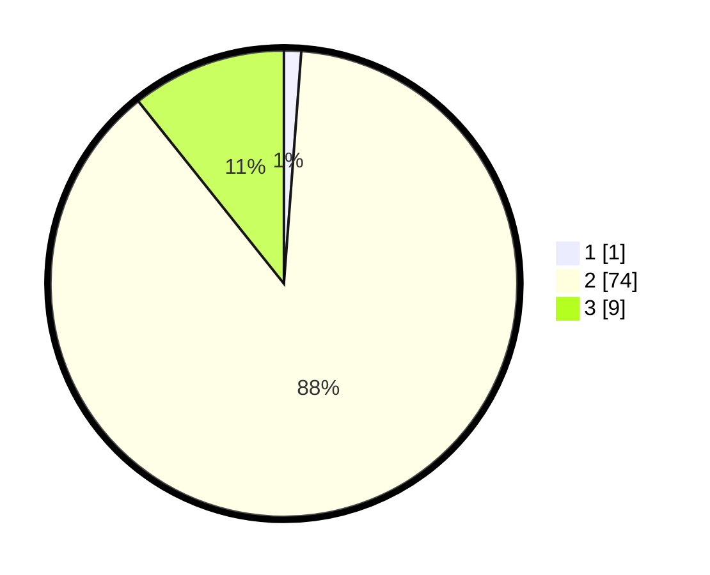

# Hasil

## Grafik

## Tabel

| No. | Nama Paslon    | Suara | Suara (raw) | Persentase |
|:--- |:-------------- | -----:| -----------:| ----------:|
| 1   | ANIES MUHAIMIN | 1     | [1][p-1]    | 1,19       |
| 2   | PRABOWO GIBRAN | 74    | [74][p-2]   | 88,10      |
| 3   | GANJAR MAHFUD  | 9     | [9][p-3]    | 10,71      |

[p-1]: https://github.com/gigit-pemilu/pemilu-2024-36-banten/blob/main/pilpres/hitung-suara/sub/36-banten/sub/03-tangerang/sub/20-legok/sub/2009-rancagong/sub/022-tps/sub/paslon-1.txt
[p-2]: https://github.com/gigit-pemilu/pemilu-2024-36-banten/blob/main/pilpres/hitung-suara/sub/36-banten/sub/03-tangerang/sub/20-legok/sub/2009-rancagong/sub/022-tps/sub/paslon-2.txt
[p-3]: https://github.com/gigit-pemilu/pemilu-2024-36-banten/blob/main/pilpres/hitung-suara/sub/36-banten/sub/03-tangerang/sub/20-legok/sub/2009-rancagong/sub/022-tps/sub/paslon-3.txt

## Foto C Plano

https://sirekap-obj-formc.kpu.go.id/165c/pemilu/ppwp/36/03/20/20/09/3603202009022-20240220-193538--e1ec6c0c-251e-49b3-bcc8-06214828a8fc.jpg

https://sirekap-obj-formc.kpu.go.id/165c/pemilu/ppwp/36/03/20/20/09/3603202009022-20240220-193609--9d71555a-04c5-425b-8806-a80dbbda4736.jpg

https://sirekap-obj-formc.kpu.go.id/165c/pemilu/ppwp/36/03/20/20/09/3603202009022-20240220-193838--4c0d71d9-3a6e-4723-b212-db2b2ed812a1.jpg

## Metadata

| Key        | Value               |
| ---------- | ------------------- |
| Time Stamp | 2024-02-20 20:00:00 |

## DATA PEMILIH TETAP

Jumlah pemilih dalam DPT: **379**.
 * L: **343**.
 * P: **725**.

## DATA PENGGUNA HAK PILIH

Jumlah pengguna hak pilih dalam DPT: **833**.
 * L: **354**.
 * P: **336**.

Jumlah pengguna hak pilih dalam DPTb: **888**.
 * L: **888**.
 * P: **800**.

Jumlah pengguna hak pilih dalam DPK: **842**.
 * L: **80**.
 * P: **883**.

Jumlah pengguna hak pilih: **333**.
 * L: **235**.
 * P: **336**.

## JUMLAH SUARA SAH DAN TIDAK SAH

JUMLAH SELURUH SUARA SAH: **244**.

JUMLAH SUARA TIDAK SAH: **9**.

JUMLAH SELURUH SUARA SAH DAN SUARA TIDAK SAH: **223**.

