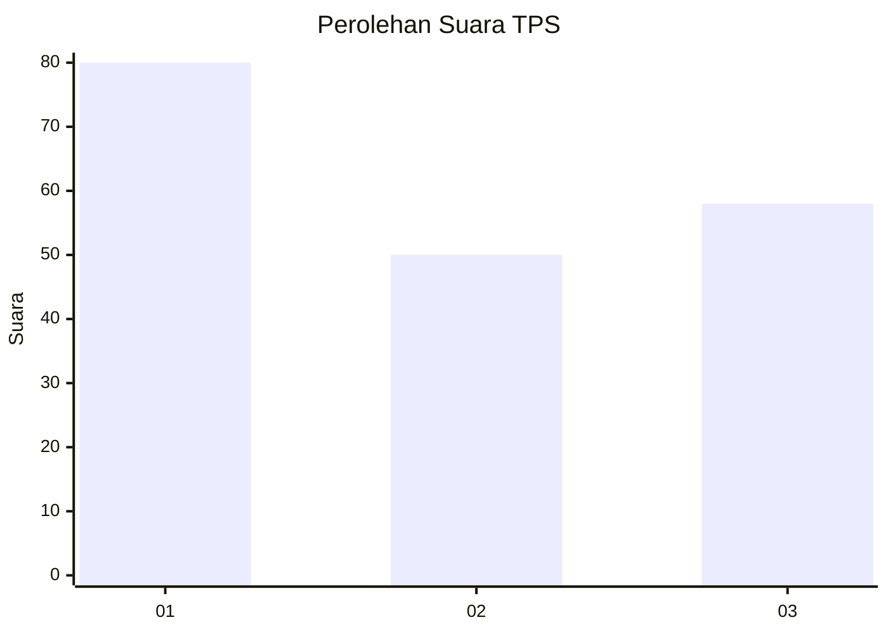
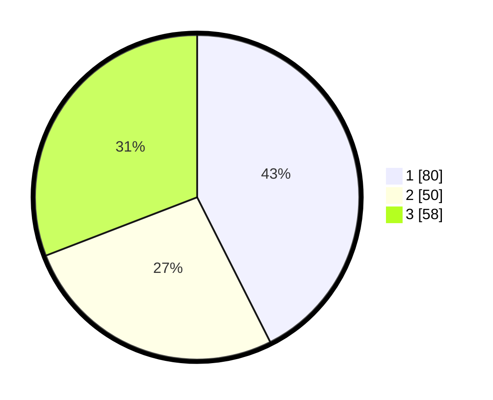

# Hasil

## Grafik

## Tabel

| No. | Nama Paslon    | Suara | Suara (raw) | Persentase |
|:--- |:-------------- | -----:| -----------:| ----------:|
| 1   | ANIES MUHAIMIN | 80    | [80][p-1]   | 42,55      |
| 2   | PRABOWO GIBRAN | 50    | [50][p-2]   | 26,60      |
| 3   | GANJAR MAHFUD  | 58    | [58][p-3]   | 30,85      |

[p-1]: https://github.com/gigit-pemilu/pemilu-2024/blob/main/pilpres/hitung-suara/sub/36-banten/sub/03-tangerang/sub/20-legok/sub/2009-rancagong/sub/026-tps/sub/paslon-1.txt
[p-2]: https://github.com/gigit-pemilu/pemilu-2024/blob/main/pilpres/hitung-suara/sub/36-banten/sub/03-tangerang/sub/20-legok/sub/2009-rancagong/sub/026-tps/sub/paslon-2.txt
[p-3]: https://github.com/gigit-pemilu/pemilu-2024/blob/main/pilpres/hitung-suara/sub/36-banten/sub/03-tangerang/sub/20-legok/sub/2009-rancagong/sub/026-tps/sub/paslon-3.txt

## Foto C Plano

https://sirekap-obj-formc.kpu.go.id/a01a/pemilu/ppwp/36/03/20/20/09/3603202009026-20240220-194915--32c9605f-1099-4fad-bdc0-d3da2c7ce102.jpg

https://sirekap-obj-formc.kpu.go.id/a01a/pemilu/ppwp/36/03/20/20/09/3603202009026-20240220-195018--043f3ae5-c5d2-47e1-9f32-67f823e558a1.jpg

https://sirekap-obj-formc.kpu.go.id/a01a/pemilu/ppwp/36/03/20/20/09/3603202009026-20240220-195251--8cfe302c-7f55-4701-85b0-45e74b091d2c.jpg

## Metadata

| Key        | Value               |
| ---------- | ------------------- |
| Time Stamp | 2024-02-20 20:00:00 |

## DATA PEMILIH TETAP

Jumlah pemilih dalam DPT: **647**.
 * L: **220**.
 * P: **0**.

## DATA PENGGUNA HAK PILIH

Jumlah pengguna hak pilih dalam DPT: **147**.
 * L: **0**.
 * P: **0**.

Jumlah pengguna hak pilih dalam DPTb: **528**.
 * L: **805**.
 * P: **555**.

Jumlah pengguna hak pilih dalam DPK: **47**.
 * L: **87**.
 * P: **87**.

Jumlah pengguna hak pilih: **777**.
 * L: **148**.
 * P: **124**.

## JUMLAH SUARA SAH DAN TIDAK SAH

JUMLAH SELURUH SUARA SAH: **242**.

JUMLAH SUARA TIDAK SAH: **7**.

JUMLAH SELURUH SUARA SAH DAN SUARA TIDAK SAH: **350**.

