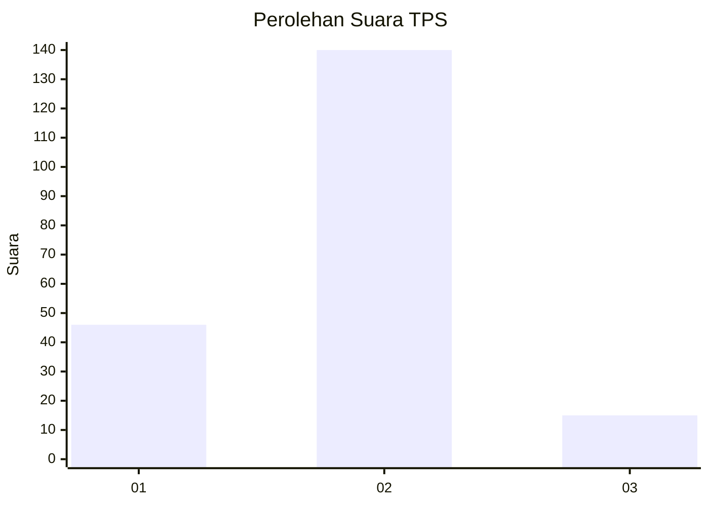
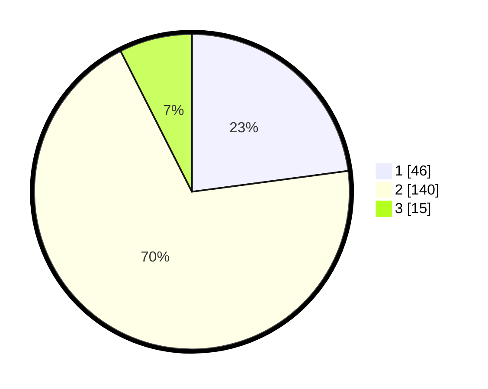

# Hasil

## Grafik

## Tabel

| No. | Nama Paslon    | Suara | Suara (raw) | Persentase |
|:--- |:-------------- | -----:| -----------:| ----------:|
| 1   | ANIES MUHAIMIN | 46    | [46][p-1]   | 22,89      |
| 2   | PRABOWO GIBRAN | 140   | [140][p-2]  | 69,65      |
| 3   | GANJAR MAHFUD  | 15    | [15][p-3]   | 7,46       |

[p-1]: https://github.com/gigit-pemilu/pemilu-2024-36-banten/blob/main/pilpres/hitung-suara/sub/36-banten/sub/03-tangerang/sub/20-legok/sub/2009-rancagong/sub/032-tps/sub/paslon-1.txt
[p-2]: https://github.com/gigit-pemilu/pemilu-2024-36-banten/blob/main/pilpres/hitung-suara/sub/36-banten/sub/03-tangerang/sub/20-legok/sub/2009-rancagong/sub/032-tps/sub/paslon-2.txt
[p-3]: https://github.com/gigit-pemilu/pemilu-2024-36-banten/blob/main/pilpres/hitung-suara/sub/36-banten/sub/03-tangerang/sub/20-legok/sub/2009-rancagong/sub/032-tps/sub/paslon-3.txt

## Foto C Plano

https://sirekap-obj-formc.kpu.go.id/9cbc/pemilu/ppwp/36/03/20/20/09/3603202009032-20240220-195949--6bbaab1e-b6ba-4788-b669-e4a414b1418d.jpg

https://sirekap-obj-formc.kpu.go.id/9cbc/pemilu/ppwp/36/03/20/20/09/3603202009032-20240220-200025--5840c365-b2f4-47c3-bac8-3f15ea00e4a5.jpg

https://sirekap-obj-formc.kpu.go.id/9cbc/pemilu/ppwp/36/03/20/20/09/3603202009032-20240220-200055--420f6b5c-f5c3-43e4-a4cb-b00b40db3367.jpg

## Metadata

| Key        | Value               |
| ---------- | ------------------- |
| Time Stamp | 2024-02-24 22:31:28 |

## DATA PEMILIH TETAP

Jumlah pemilih dalam DPT: **351**.
 * L: **400**.
 * P: **742**.

## DATA PENGGUNA HAK PILIH

Jumlah pengguna hak pilih dalam DPT: **219**.
 * L: **404**.
 * P: **210**.

Jumlah pengguna hak pilih dalam DPTb: **40**.
 * L: **40**.
 * P: **0**.

Jumlah pengguna hak pilih dalam DPK: **0**.
 * L: **700**.
 * P: **6**.

Jumlah pengguna hak pilih: **104**.
 * L: **207**.
 * P: **47**.

## JUMLAH SUARA SAH DAN TIDAK SAH

JUMLAH SELURUH SUARA SAH: **20**.

JUMLAH SUARA TIDAK SAH: **0**.

JUMLAH SELURUH SUARA SAH DAN SUARA TIDAK SAH: **201**.

