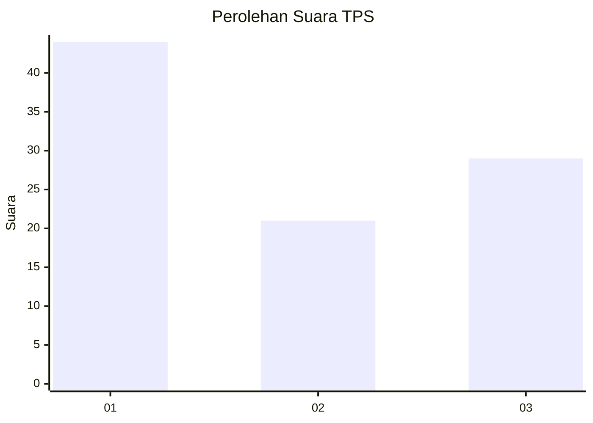
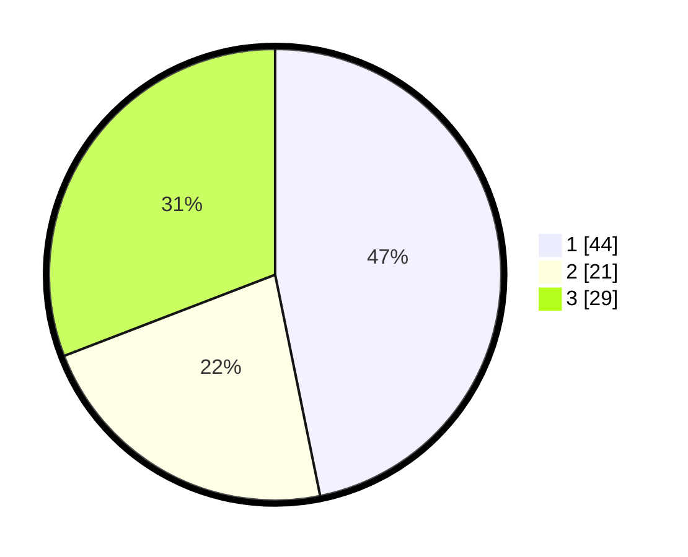

# Hasil

## Grafik

## Tabel

| No. | Nama Paslon    | Suara | Suara (raw) | Persentase |
|:--- |:-------------- | -----:| -----------:| ----------:|
| 1   | ANIES MUHAIMIN | 44    | [44][p-1]   | 46,81      |
| 2   | PRABOWO GIBRAN | 21    | [21][p-2]   | 22,34      |
| 3   | GANJAR MAHFUD  | 29    | [29][p-3]   | 30,85      |

[p-1]: https://github.com/gigit-pemilu/pemilu-2024-36-banten/blob/main/pilpres/hitung-suara/sub/36-banten/sub/03-tangerang/sub/20-legok/sub/2009-rancagong/sub/034-tps/sub/paslon-1.txt
[p-2]: https://github.com/gigit-pemilu/pemilu-2024-36-banten/blob/main/pilpres/hitung-suara/sub/36-banten/sub/03-tangerang/sub/20-legok/sub/2009-rancagong/sub/034-tps/sub/paslon-2.txt
[p-3]: https://github.com/gigit-pemilu/pemilu-2024-36-banten/blob/main/pilpres/hitung-suara/sub/36-banten/sub/03-tangerang/sub/20-legok/sub/2009-rancagong/sub/034-tps/sub/paslon-3.txt

## Foto C Plano

https://sirekap-obj-formc.kpu.go.id/a245/pemilu/ppwp/36/03/20/20/09/3603202009034-20240220-201847--25b72998-1d38-4aec-8ff4-bb20348a51ed.jpg

https://sirekap-obj-formc.kpu.go.id/a245/pemilu/ppwp/36/03/20/20/09/3603202009034-20240220-201930--c1da4a01-0220-4aa9-b43c-5a5b4d1b382c.jpg

https://sirekap-obj-formc.kpu.go.id/a245/pemilu/ppwp/36/03/20/20/09/3603202009034-20240220-202002--8b59e437-4851-4e5a-afb8-06b2ea4b85b6.jpg

## Metadata

| Key        | Value               |
| ---------- | ------------------- |
| Time Stamp | 2024-02-24 22:31:28 |

## DATA PEMILIH TETAP

Jumlah pemilih dalam DPT: **557**.
 * L: **557**.
 * P: **557**.

## DATA PENGGUNA HAK PILIH

Jumlah pengguna hak pilih dalam DPT: **444**.
 * L: **777**.
 * P: **4**.

Jumlah pengguna hak pilih dalam DPTb: **40**.
 * L: **774**.
 * P: **444**.

Jumlah pengguna hak pilih dalam DPK: **44**.
 * L: **4**.
 * P: **440**.

Jumlah pengguna hak pilih: **444**.
 * L: **444**.
 * P: **444**.

## JUMLAH SUARA SAH DAN TIDAK SAH

JUMLAH SELURUH SUARA SAH: **244**.

JUMLAH SUARA TIDAK SAH: **2**.

JUMLAH SELURUH SUARA SAH DAN SUARA TIDAK SAH: **246**.

