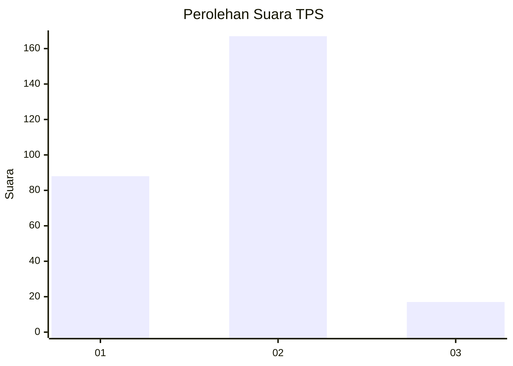
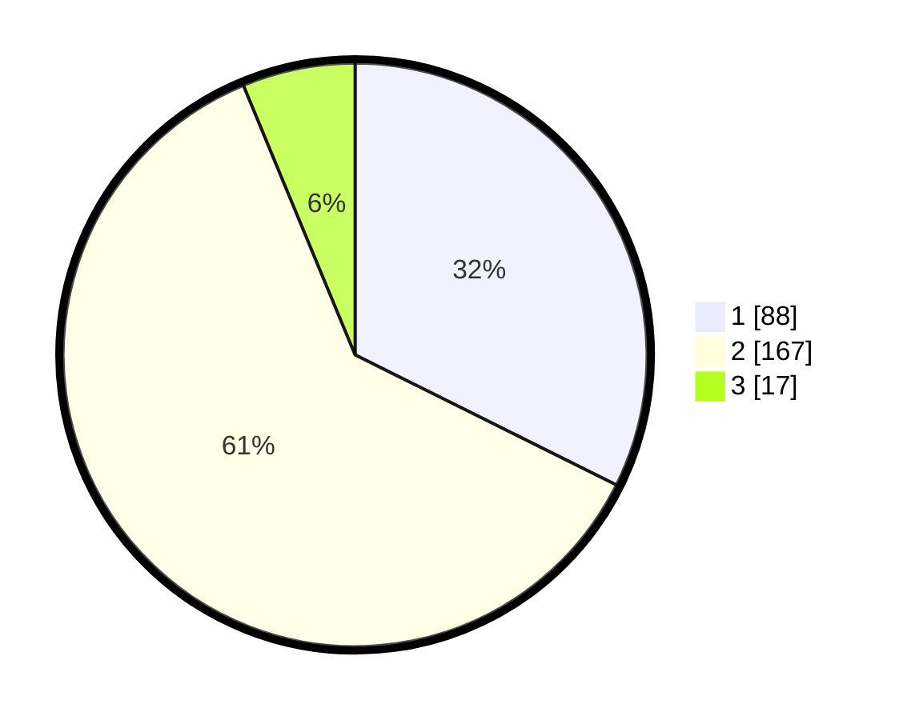

# Hasil

## Grafik

## Tabel

| No. | Nama Paslon    | Suara | Suara (raw) | Persentase |
|:--- |:-------------- | -----:| -----------:| ----------:|
| 1   | ANIES MUHAIMIN | 88    | [88][p-1]   | 32,35      |
| 2   | PRABOWO GIBRAN | 167   | [167][p-2]  | 61,40      |
| 3   | GANJAR MAHFUD  | 17    | [17][p-3]   | 6,25       |

[p-1]: https://github.com/gigit-pemilu/pemilu-2024/blob/main/pilpres/hitung-suara/sub/36-banten/sub/03-tangerang/sub/20-legok/sub/2010-kemuning/sub/013-tps/sub/paslon-1.txt
[p-2]: https://github.com/gigit-pemilu/pemilu-2024/blob/main/pilpres/hitung-suara/sub/36-banten/sub/03-tangerang/sub/20-legok/sub/2010-kemuning/sub/013-tps/sub/paslon-2.txt
[p-3]: https://github.com/gigit-pemilu/pemilu-2024/blob/main/pilpres/hitung-suara/sub/36-banten/sub/03-tangerang/sub/20-legok/sub/2010-kemuning/sub/013-tps/sub/paslon-3.txt

## Foto C Plano

https://sirekap-obj-formc.kpu.go.id/9491/pemilu/ppwp/36/03/20/20/10/3603202010013-20240224-105220--0c7910e1-8ff8-4397-a93d-fb0d90793b18.jpg

https://sirekap-obj-formc.kpu.go.id/9491/pemilu/ppwp/36/03/20/20/10/3603202010013-20240224-105323--baa63c0a-ed8b-4c2f-a288-eec9b8cc0967.jpg

https://sirekap-obj-formc.kpu.go.id/9491/pemilu/ppwp/36/03/20/20/10/3603202010013-20240224-105553--7d955083-aa8e-4276-9f4a-73422e5408fd.jpg

## Metadata

| Key        | Value               |
| ---------- | ------------------- |
| Time Stamp | 2024-02-24 22:31:28 |

