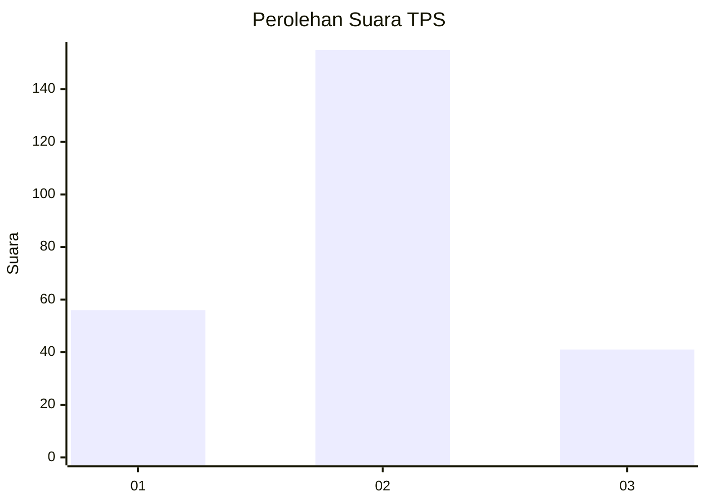

# Hasil

## Grafik

## Tabel

| No. | Nama Paslon    | Suara | Suara (raw) | Persentase |
|:--- |:-------------- | -----:| -----------:| ----------:|
| 1   | ANIES MUHAIMIN | 56    | [56][p-1]   | 22,22      |
| 2   | PRABOWO GIBRAN | 155   | [155][p-2]  | 61,51      |
| 3   | GANJAR MAHFUD  | 41    | [41][p-3]   | 16,27      |

[p-1]: https://github.com/gigit-pemilu/pemilu-2024-36-banten/blob/main/pilpres/hitung-suara/sub/36-banten/sub/03-tangerang/sub/20-legok/sub/2012-cirarab/sub/019-tps/sub/paslon-1.txt
[p-2]: https://github.com/gigit-pemilu/pemilu-2024-36-banten/blob/main/pilpres/hitung-suara/sub/36-banten/sub/03-tangerang/sub/20-legok/sub/2012-cirarab/sub/019-tps/sub/paslon-2.txt
[p-3]: https://github.com/gigit-pemilu/pemilu-2024-36-banten/blob/main/pilpres/hitung-suara/sub/36-banten/sub/03-tangerang/sub/20-legok/sub/2012-cirarab/sub/019-tps/sub/paslon-3.txt

## Foto C Plano

https://sirekap-obj-formc.kpu.go.id/7ca0/pemilu/ppwp/36/03/20/20/12/3603202012019-20240225-171402--67522571-c2e8-4f5d-99c2-4741892f1c51.jpg

https://sirekap-obj-formc.kpu.go.id/7ca0/pemilu/ppwp/36/03/20/20/12/3603202012019-20240225-171521--f098b37f-7545-4449-a65c-4e91c710fde7.jpg

https://sirekap-obj-formc.kpu.go.id/7ca0/pemilu/ppwp/36/03/20/20/12/3603202012019-20240225-171622--cb5075d8-ae3a-4b10-b8a7-d28f60b40eaf.jpg

## Metadata

| Key        | Value               |
| ---------- | ------------------- |
| Time Stamp | 2024-02-26 11:00:00 |

## DATA PEMILIH TETAP

Jumlah pemilih dalam DPT: **388**.
 * L: **145**.
 * P: **142**.

## DATA PENGGUNA HAK PILIH

Jumlah pengguna hak pilih dalam DPT: **245**.
 * L: **420**.
 * P: **425**.

Jumlah pengguna hak pilih dalam DPTb: **884**.
 * L: **201**.
 * P: **83**.

Jumlah pengguna hak pilih dalam DPK: **822**.
 * L: **1**.
 * P: **81**.

Jumlah pengguna hak pilih: **252**.
 * L: **622**.
 * P: **439**.

## JUMLAH SUARA SAH DAN TIDAK SAH

JUMLAH SELURUH SUARA SAH: **252**.

JUMLAH SUARA TIDAK SAH: **0**.

JUMLAH SELURUH SUARA SAH DAN SUARA TIDAK SAH: **252**.

