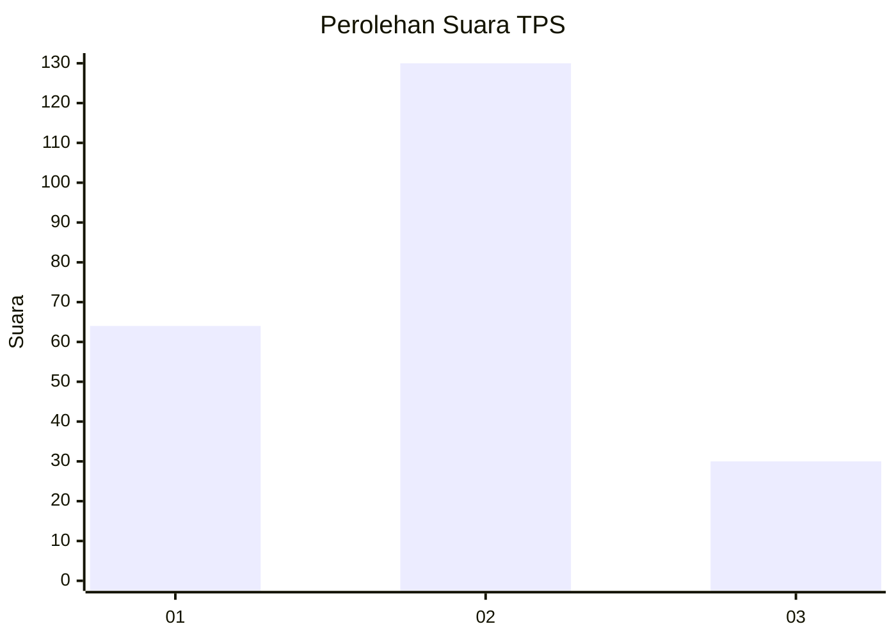
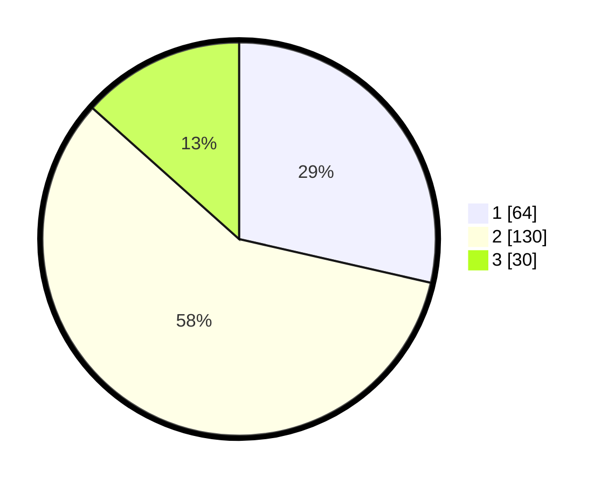

# Hasil

## Grafik

## Tabel

| No. | Nama Paslon    | Suara | Suara (raw) | Persentase |
|:--- |:-------------- | -----:| -----------:| ----------:|
| 1   | ANIES MUHAIMIN | 64    | [64][p-1]   | 28,57      |
| 2   | PRABOWO GIBRAN | 130   | [130][p-2]  | 58,04      |
| 3   | GANJAR MAHFUD  | 30    | [30][p-3]   | 13,39      |

[p-1]: https://github.com/gigit-pemilu/pemilu-2024-36-banten/blob/main/pilpres/hitung-suara/sub/36-banten/sub/03-tangerang/sub/22-pagedangan/sub/1004-medang/sub/001-tps/sub/paslon-1.txt
[p-2]: https://github.com/gigit-pemilu/pemilu-2024-36-banten/blob/main/pilpres/hitung-suara/sub/36-banten/sub/03-tangerang/sub/22-pagedangan/sub/1004-medang/sub/001-tps/sub/paslon-2.txt
[p-3]: https://github.com/gigit-pemilu/pemilu-2024-36-banten/blob/main/pilpres/hitung-suara/sub/36-banten/sub/03-tangerang/sub/22-pagedangan/sub/1004-medang/sub/001-tps/sub/paslon-3.txt

## Foto C Plano

https://sirekap-obj-formc.kpu.go.id/45b7/pemilu/ppwp/36/03/22/10/04/3603221004001-20240224-115350--8494673a-c780-4b84-a7dc-dd0982f1bb38.jpg

https://sirekap-obj-formc.kpu.go.id/45b7/pemilu/ppwp/36/03/22/10/04/3603221004001-20240224-115451--4a02c91e-7c4f-43f6-9061-07e6ae61b580.jpg

https://sirekap-obj-formc.kpu.go.id/45b7/pemilu/ppwp/36/03/22/10/04/3603221004001-20240224-115610--af014f93-34b5-422c-b840-beebb5b6fc03.jpg

## Metadata

| Key        | Value               |
| ---------- | ------------------- |
| Time Stamp | 2024-02-26 18:00:00 |

