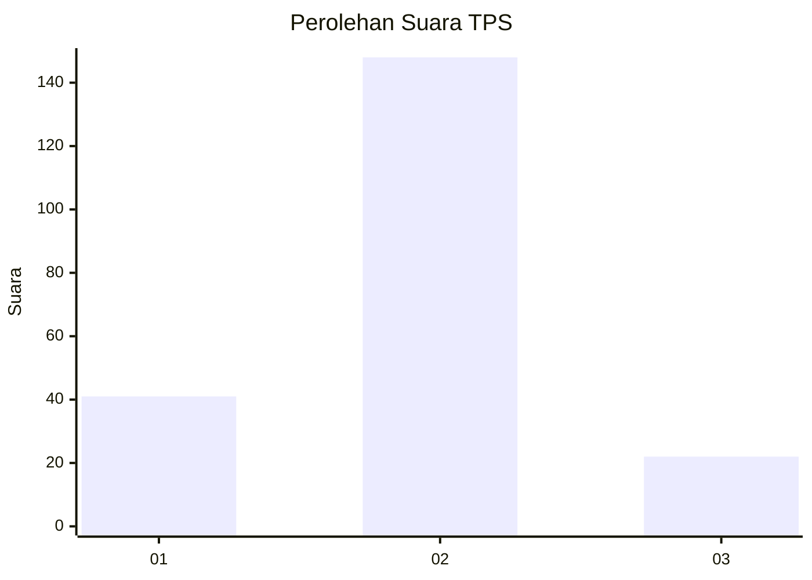
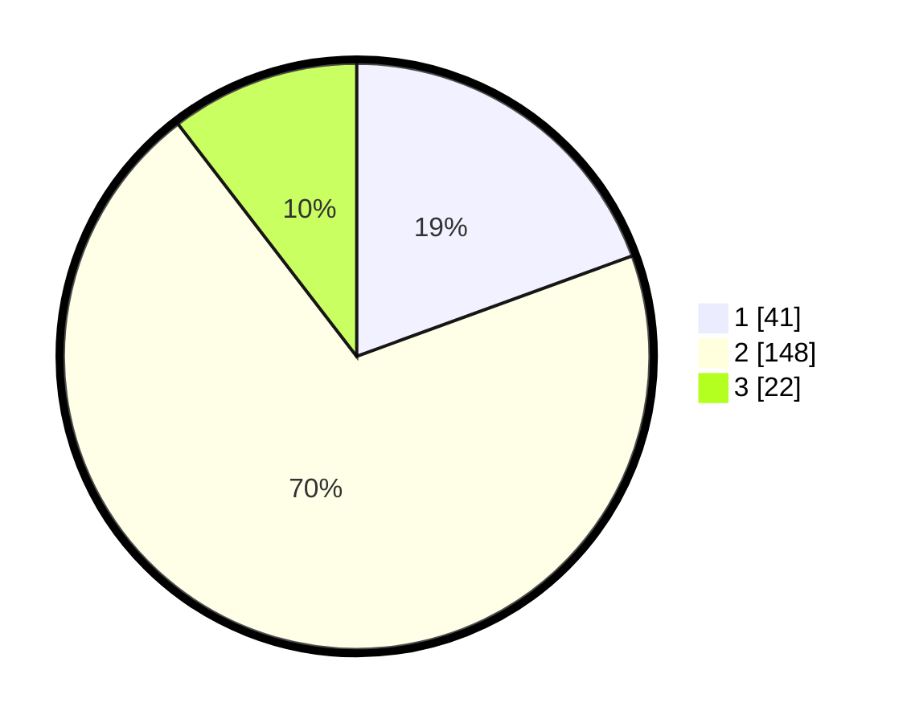

# Hasil

## Grafik

## Tabel

| No. | Nama Paslon    | Suara | Suara (raw) | Persentase |
|:--- |:-------------- | -----:| -----------:| ----------:|
| 1   | ANIES MUHAIMIN | 41    | [41][p-1]   | 19,43      |
| 2   | PRABOWO GIBRAN | 148   | [148][p-2]  | 70,14      |
| 3   | GANJAR MAHFUD  | 22    | [22][p-3]   | 10,43      |

[p-1]: https://github.com/gigit-pemilu/pemilu-2024-36-banten/blob/main/pilpres/hitung-suara/sub/36-banten/sub/03-tangerang/sub/22-pagedangan/sub/1004-medang/sub/002-tps/sub/paslon-1.txt
[p-2]: https://github.com/gigit-pemilu/pemilu-2024-36-banten/blob/main/pilpres/hitung-suara/sub/36-banten/sub/03-tangerang/sub/22-pagedangan/sub/1004-medang/sub/002-tps/sub/paslon-2.txt
[p-3]: https://github.com/gigit-pemilu/pemilu-2024-36-banten/blob/main/pilpres/hitung-suara/sub/36-banten/sub/03-tangerang/sub/22-pagedangan/sub/1004-medang/sub/002-tps/sub/paslon-3.txt

## Foto C Plano

https://sirekap-obj-formc.kpu.go.id/c121/pemilu/ppwp/36/03/22/10/04/3603221004002-20240224-132335--04256bae-e468-44b4-9b97-50f873cd6616.jpg

https://sirekap-obj-formc.kpu.go.id/c121/pemilu/ppwp/36/03/22/10/04/3603221004002-20240224-132415--5b337b2d-02e5-486c-8b5a-21994e73c321.jpg

https://sirekap-obj-formc.kpu.go.id/c121/pemilu/ppwp/36/03/22/10/04/3603221004002-20240224-132446--ccffa683-f6fc-4ac8-9b8a-fe9d08f76a7a.jpg

## Metadata

| Key        | Value               |
| ---------- | ------------------- |
| Time Stamp | 2024-02-24 22:31:28 |

