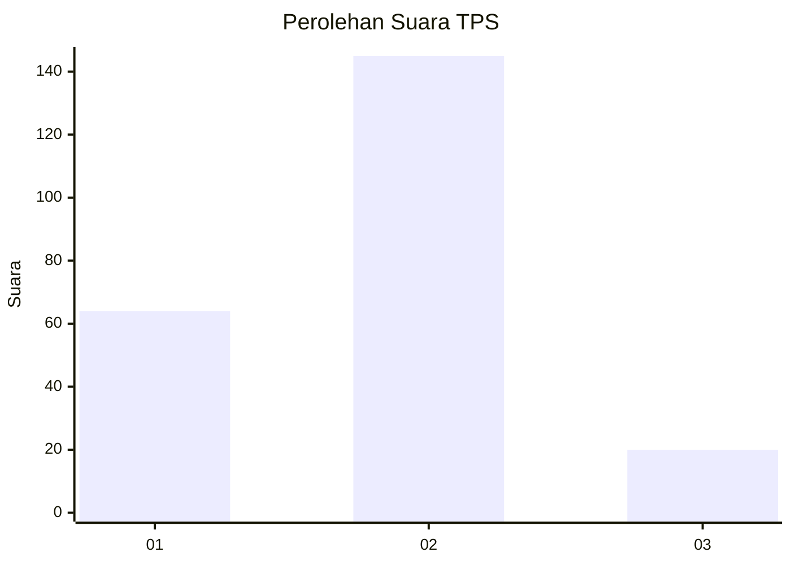
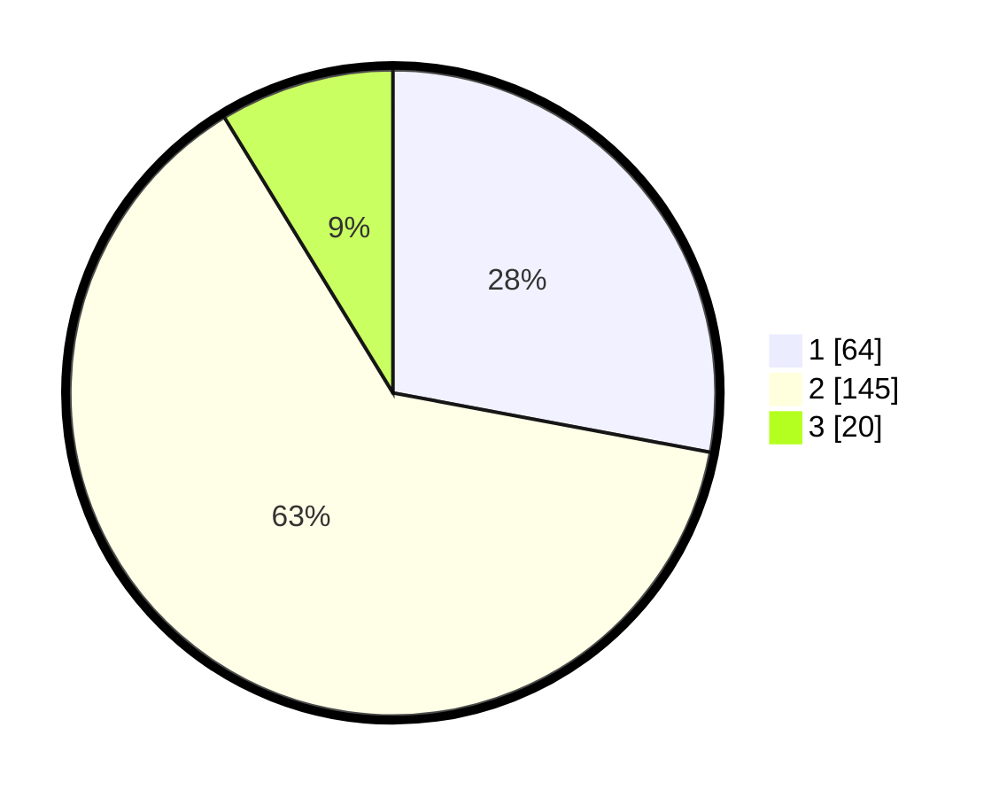

# Hasil

## Grafik

## Tabel

| No. | Nama Paslon    | Suara | Suara (raw) | Persentase |
|:--- |:-------------- | -----:| -----------:| ----------:|
| 1   | ANIES MUHAIMIN | 64    | [64][p-1]   | 27,95      |
| 2   | PRABOWO GIBRAN | 145   | [145][p-2]  | 63,32      |
| 3   | GANJAR MAHFUD  | 20    | [20][p-3]   | 8,73       |

[p-1]: https://github.com/gigit-pemilu/pemilu-2024/blob/main/pilpres/hitung-suara/sub/36-banten/sub/03-tangerang/sub/22-pagedangan/sub/1004-medang/sub/003-tps/sub/paslon-1.txt
[p-2]: https://github.com/gigit-pemilu/pemilu-2024/blob/main/pilpres/hitung-suara/sub/36-banten/sub/03-tangerang/sub/22-pagedangan/sub/1004-medang/sub/003-tps/sub/paslon-2.txt
[p-3]: https://github.com/gigit-pemilu/pemilu-2024/blob/main/pilpres/hitung-suara/sub/36-banten/sub/03-tangerang/sub/22-pagedangan/sub/1004-medang/sub/003-tps/sub/paslon-3.txt

## Foto C Plano

https://sirekap-obj-formc.kpu.go.id/8113/pemilu/ppwp/36/03/22/10/04/3603221004003-20240224-141025--b8f56589-655b-46c0-a646-c9a1c8789f0e.jpg

https://sirekap-obj-formc.kpu.go.id/8113/pemilu/ppwp/36/03/22/10/04/3603221004003-20240224-141055--d39109cc-2eb0-403c-aafb-94ea74648939.jpg

https://sirekap-obj-formc.kpu.go.id/8113/pemilu/ppwp/36/03/22/10/04/3603221004003-20240224-141130--d0a3d5d8-f9ec-4895-ab66-c5c271485442.jpg

## Metadata

| Key        | Value               |
| ---------- | ------------------- |
| Time Stamp | 2024-02-28 20:00:00 |

