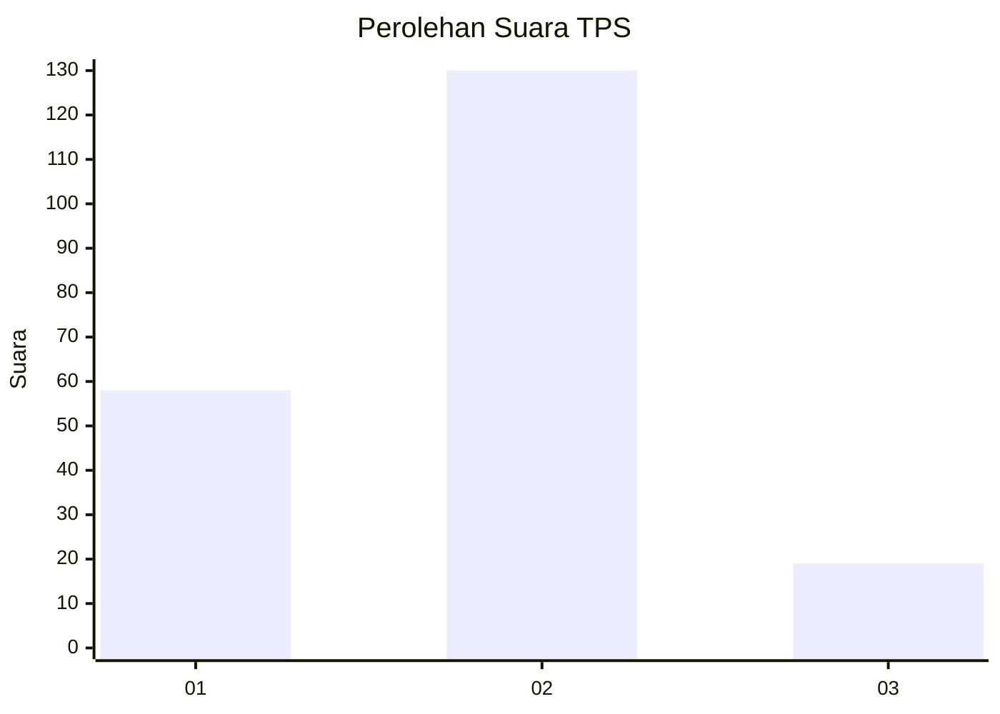
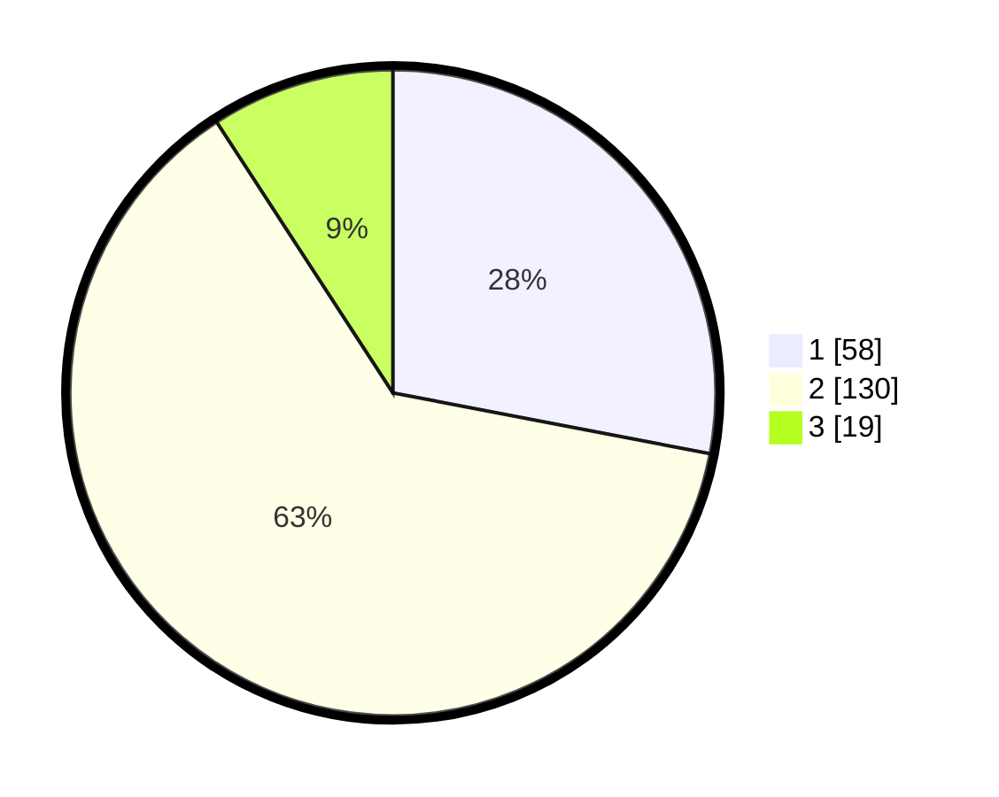

# Hasil

## Grafik

## Tabel

| No. | Nama Paslon    | Suara | Suara (raw) | Persentase |
|:--- |:-------------- | -----:| -----------:| ----------:|
| 1   | ANIES MUHAIMIN | 58    | [58][p-1]   | 28,02      |
| 2   | PRABOWO GIBRAN | 130   | [130][p-2]  | 62,80      |
| 3   | GANJAR MAHFUD  | 19    | [19][p-3]   | 9,18       |

[p-1]: https://github.com/gigit-pemilu/pemilu-2024/blob/main/pilpres/hitung-suara/sub/36-banten/sub/03-tangerang/sub/22-pagedangan/sub/1004-medang/sub/004-tps/sub/paslon-1.txt
[p-2]: https://github.com/gigit-pemilu/pemilu-2024/blob/main/pilpres/hitung-suara/sub/36-banten/sub/03-tangerang/sub/22-pagedangan/sub/1004-medang/sub/004-tps/sub/paslon-2.txt
[p-3]: https://github.com/gigit-pemilu/pemilu-2024/blob/main/pilpres/hitung-suara/sub/36-banten/sub/03-tangerang/sub/22-pagedangan/sub/1004-medang/sub/004-tps/sub/paslon-3.txt

## Foto C Plano

https://sirekap-obj-formc.kpu.go.id/bc6a/pemilu/ppwp/36/03/22/10/04/3603221004004-20240224-152359--5c4749f7-39b4-42f9-acc8-6c15e5693031.jpg

https://sirekap-obj-formc.kpu.go.id/bc6a/pemilu/ppwp/36/03/22/10/04/3603221004004-20240224-152431--1e0c528a-92be-4817-8c1d-cb58a2b427f2.jpg

https://sirekap-obj-formc.kpu.go.id/bc6a/pemilu/ppwp/36/03/22/10/04/3603221004004-20240224-152500--bd2608f9-4314-4ebe-80bc-3869ea2529f2.jpg

## Metadata

| Key        | Value               |
| ---------- | ------------------- |
| Time Stamp | 2024-02-24 22:31:28 |

