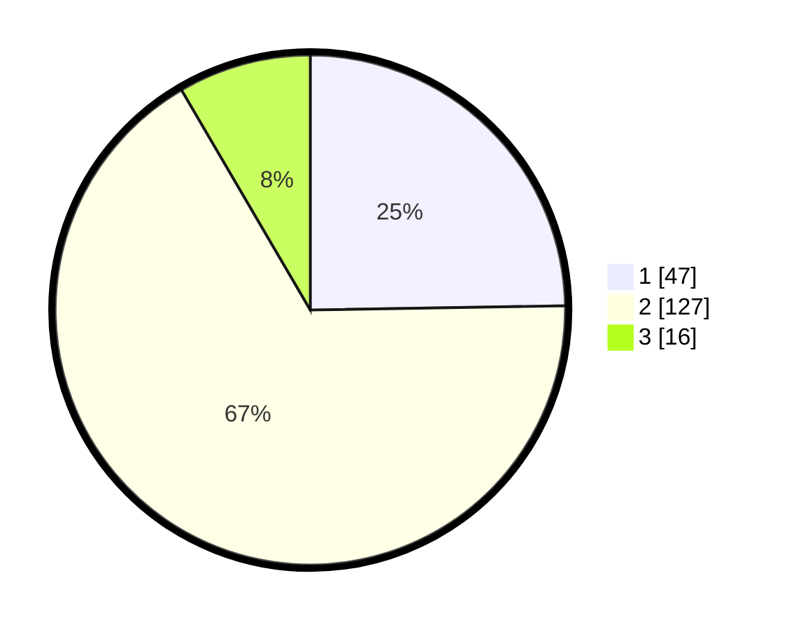

# Hasil

## Grafik

## Tabel

| No. | Nama Paslon    | Suara | Suara (raw) | Persentase |
|:--- |:-------------- | -----:| -----------:| ----------:|
| 1   | ANIES MUHAIMIN | 47    | [47][p-1]   | 24,74      |
| 2   | PRABOWO GIBRAN | 127   | [127][p-2]  | 66,84      |
| 3   | GANJAR MAHFUD  | 16    | [16][p-3]   | 8,42       |

[p-1]: https://github.com/gigit-pemilu/pemilu-2024/blob/main/pilpres/hitung-suara/sub/36-banten/sub/03-tangerang/sub/22-pagedangan/sub/1004-medang/sub/006-tps/sub/paslon-1.txt
[p-2]: https://github.com/gigit-pemilu/pemilu-2024/blob/main/pilpres/hitung-suara/sub/36-banten/sub/03-tangerang/sub/22-pagedangan/sub/1004-medang/sub/006-tps/sub/paslon-2.txt
[p-3]: https://github.com/gigit-pemilu/pemilu-2024/blob/main/pilpres/hitung-suara/sub/36-banten/sub/03-tangerang/sub/22-pagedangan/sub/1004-medang/sub/006-tps/sub/paslon-3.txt

## Foto C Plano

https://sirekap-obj-formc.kpu.go.id/278f/pemilu/ppwp/36/03/22/10/04/3603221004006-20240224-165526--ab0496a1-0e50-45d4-9e4c-38dad44cb272.jpg

https://sirekap-obj-formc.kpu.go.id/278f/pemilu/ppwp/36/03/22/10/04/3603221004006-20240224-165600--bed4eb1b-4aaf-45a7-a4bf-3e898fc458e4.jpg

https://sirekap-obj-formc.kpu.go.id/278f/pemilu/ppwp/36/03/22/10/04/3603221004006-20240224-165629--949c000b-2562-48a9-b398-4ddec8280380.jpg

## Metadata

| Key        | Value               |
| ---------- | ------------------- |
| Time Stamp | 2024-02-28 20:00:00 |

