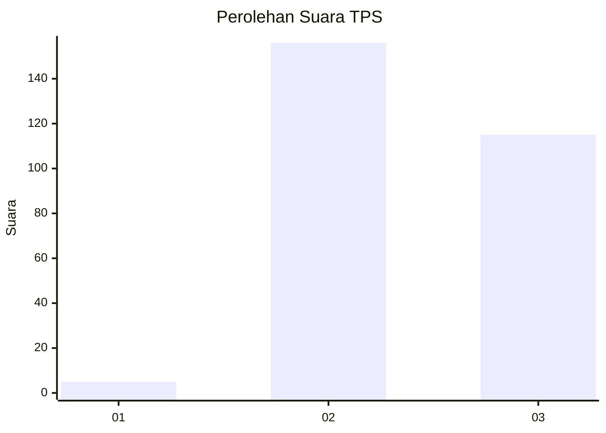
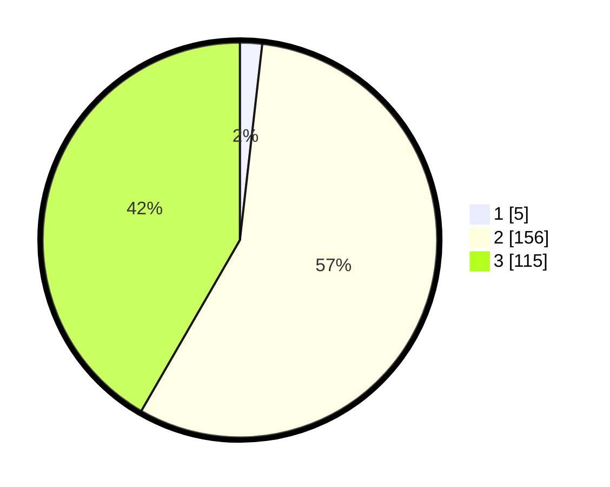

# Hasil

## Grafik

## Tabel

| No. | Nama Paslon    | Suara | Suara (raw) | Persentase |
|:--- |:-------------- | -----:| -----------:| ----------:|
| 1   | ANIES MUHAIMIN | 5     | [5][p-1]    | 1,81       |
| 2   | PRABOWO GIBRAN | 156   | [156][p-2]  | 56,52      |
| 3   | GANJAR MAHFUD  | 115   | [115][p-3]  | 41,67      |

[p-1]: https://github.com/gigit-pemilu/pemilu-2024-36-banten/blob/main/pilpres/hitung-suara/sub/36-banten/sub/03-tangerang/sub/22-pagedangan/sub/1004-medang/sub/012-tps/sub/paslon-1.txt
[p-2]: https://github.com/gigit-pemilu/pemilu-2024-36-banten/blob/main/pilpres/hitung-suara/sub/36-banten/sub/03-tangerang/sub/22-pagedangan/sub/1004-medang/sub/012-tps/sub/paslon-2.txt
[p-3]: https://github.com/gigit-pemilu/pemilu-2024-36-banten/blob/main/pilpres/hitung-suara/sub/36-banten/sub/03-tangerang/sub/22-pagedangan/sub/1004-medang/sub/012-tps/sub/paslon-3.txt

## Foto C Plano

https://sirekap-obj-formc.kpu.go.id/3602/pemilu/ppwp/36/03/22/10/04/3603221004012-20240225-160417--6fd19a3a-8a74-4803-84e9-dcdd4d09c20e.jpg

https://sirekap-obj-formc.kpu.go.id/3602/pemilu/ppwp/36/03/22/10/04/3603221004012-20240225-160503--36059878-931d-42ff-bce4-f9af14c61682.jpg

https://sirekap-obj-formc.kpu.go.id/3602/pemilu/ppwp/36/03/22/10/04/3603221004012-20240225-160532--9175e9bb-558c-454b-ae45-1081745e9525.jpg

## Metadata

| Key        | Value               |
| ---------- | ------------------- |
| Time Stamp | 2024-02-28 20:00:00 |

