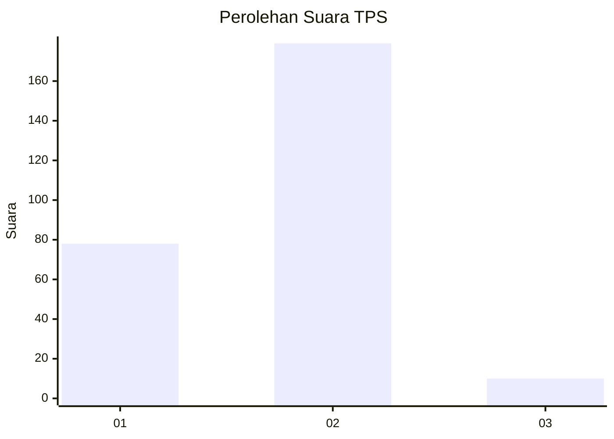
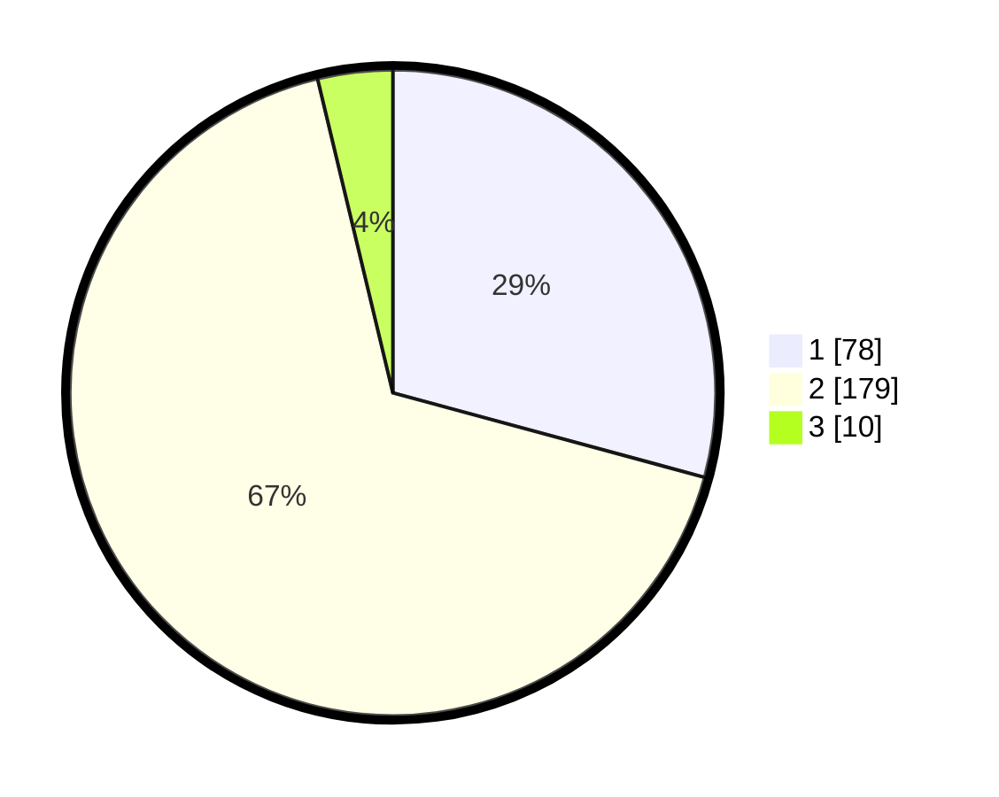

# Hasil

## Grafik

## Tabel

| No. | Nama Paslon    | Suara | Suara (raw) | Persentase |
|:--- |:-------------- | -----:| -----------:| ----------:|
| 1   | ANIES MUHAIMIN | 78    | [78][p-1]   | 29,21      |
| 2   | PRABOWO GIBRAN | 179   | [179][p-2]  | 67,04      |
| 3   | GANJAR MAHFUD  | 10    | [10][p-3]   | 3,75       |

[p-1]: https://github.com/gigit-pemilu/pemilu-2024-36-banten/blob/main/pilpres/hitung-suara/sub/36-banten/sub/03-tangerang/sub/22-pagedangan/sub/2002-cicalengka/sub/016-tps/sub/paslon-1.txt
[p-2]: https://github.com/gigit-pemilu/pemilu-2024-36-banten/blob/main/pilpres/hitung-suara/sub/36-banten/sub/03-tangerang/sub/22-pagedangan/sub/2002-cicalengka/sub/016-tps/sub/paslon-2.txt
[p-3]: https://github.com/gigit-pemilu/pemilu-2024-36-banten/blob/main/pilpres/hitung-suara/sub/36-banten/sub/03-tangerang/sub/22-pagedangan/sub/2002-cicalengka/sub/016-tps/sub/paslon-3.txt

## Foto C Plano

https://sirekap-obj-formc.kpu.go.id/1400/pemilu/ppwp/36/03/22/20/02/3603222002016-20240222-151601--9f681211-d127-460a-8dc6-a11b8e151a7b.jpg

https://sirekap-obj-formc.kpu.go.id/1400/pemilu/ppwp/36/03/22/20/02/3603222002016-20240222-152029--c30e4975-073c-432b-8440-8fe246f0d420.jpg

https://sirekap-obj-formc.kpu.go.id/1400/pemilu/ppwp/36/03/22/20/02/3603222002016-20240222-151937--7c1888d0-7184-44a3-8b70-1f495630b0c8.jpg

## Metadata

| Key        | Value               |
| ---------- | ------------------- |
| Time Stamp | 2024-02-24 22:31:28 |

