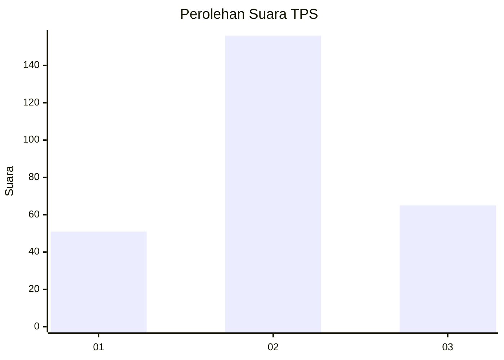
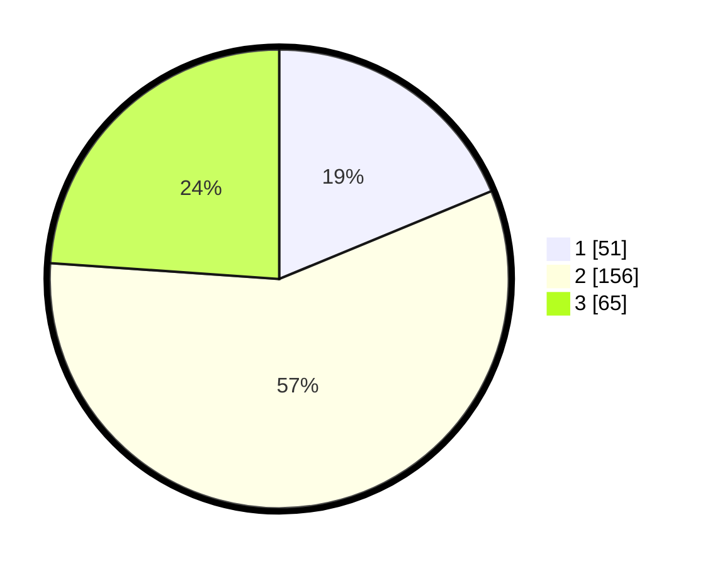

# Hasil

## Grafik

## Tabel

| No. | Nama Paslon    | Suara | Suara (raw) | Persentase |
|:--- |:-------------- | -----:| -----------:| ----------:|
| 1   | ANIES MUHAIMIN | 51    | [51][p-1]   | 18,75      |
| 2   | PRABOWO GIBRAN | 156   | [156][p-2]  | 57,35      |
| 3   | GANJAR MAHFUD  | 65    | [65][p-3]   | 23,90      |

[p-1]: https://github.com/gigit-pemilu/pemilu-2024-36-banten/blob/main/pilpres/hitung-suara/sub/36-banten/sub/03-tangerang/sub/22-pagedangan/sub/2005-cijantra/sub/014-tps/sub/paslon-1.txt
[p-2]: https://github.com/gigit-pemilu/pemilu-2024-36-banten/blob/main/pilpres/hitung-suara/sub/36-banten/sub/03-tangerang/sub/22-pagedangan/sub/2005-cijantra/sub/014-tps/sub/paslon-2.txt
[p-3]: https://github.com/gigit-pemilu/pemilu-2024-36-banten/blob/main/pilpres/hitung-suara/sub/36-banten/sub/03-tangerang/sub/22-pagedangan/sub/2005-cijantra/sub/014-tps/sub/paslon-3.txt

## Foto C Plano

https://sirekap-obj-formc.kpu.go.id/6069/pemilu/ppwp/36/03/22/20/05/3603222005014-20240214-220423--b464e005-1737-4795-aec0-2f857a6d4c68.jpg

https://sirekap-obj-formc.kpu.go.id/6069/pemilu/ppwp/36/03/22/20/05/3603222005014-20240214-220645--d0392440-4338-414c-811d-7d6c05058f8c.jpg

https://sirekap-obj-formc.kpu.go.id/6069/pemilu/ppwp/36/03/22/20/05/3603222005014-20240214-220848--7fd5b17a-6ef4-4e84-acd9-928fd66200d6.jpg

## Metadata

| Key        | Value               |
| ---------- | ------------------- |
| Time Stamp | 2024-02-25 12:00:00 |

