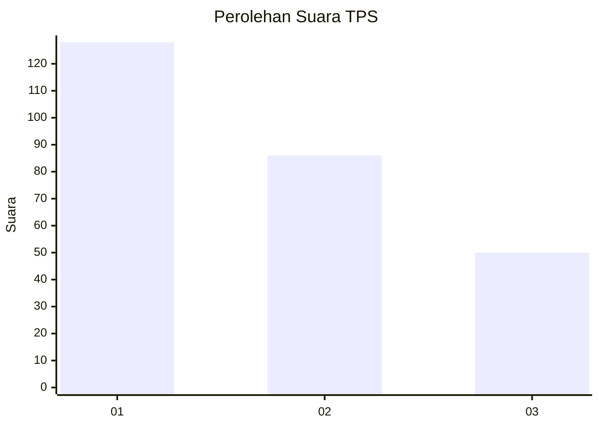
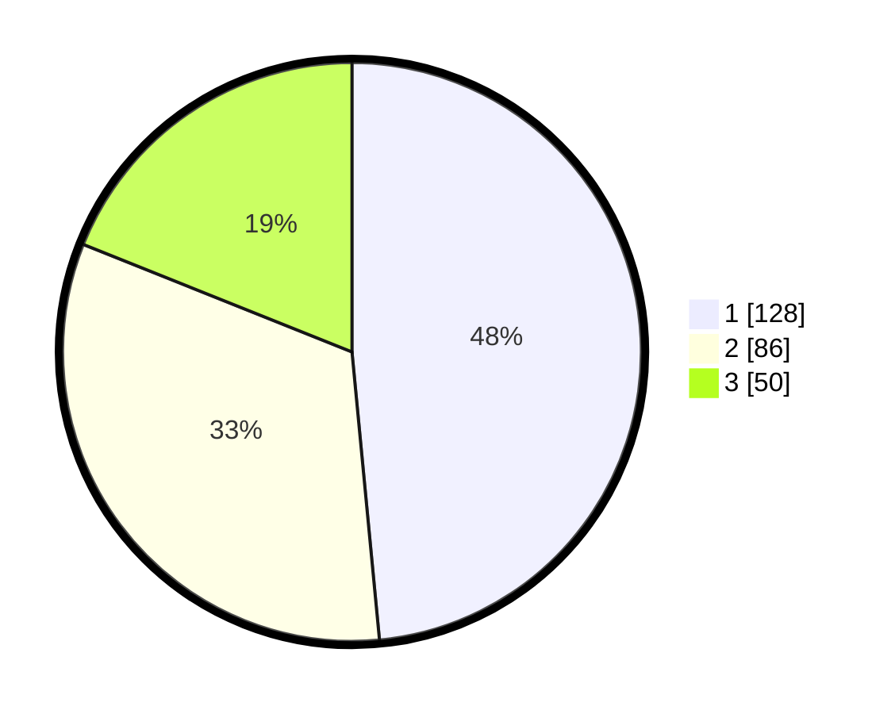

# Hasil

## Grafik

## Tabel

| No. | Nama Paslon    | Suara | Suara (raw) | Persentase |
|:--- |:-------------- | -----:| -----------:| ----------:|
| 1   | ANIES MUHAIMIN | 128   | [128][p-1]  | 48,48      |
| 2   | PRABOWO GIBRAN | 86    | [86][p-2]   | 32,58      |
| 3   | GANJAR MAHFUD  | 50    | [50][p-3]   | 18,94      |

[p-1]: https://github.com/gigit-pemilu/pemilu-2024-36-banten/blob/main/pilpres/hitung-suara/sub/36-banten/sub/03-tangerang/sub/22-pagedangan/sub/2006-lengkong-kulon/sub/001-tps/sub/paslon-1.txt
[p-2]: https://github.com/gigit-pemilu/pemilu-2024-36-banten/blob/main/pilpres/hitung-suara/sub/36-banten/sub/03-tangerang/sub/22-pagedangan/sub/2006-lengkong-kulon/sub/001-tps/sub/paslon-2.txt
[p-3]: https://github.com/gigit-pemilu/pemilu-2024-36-banten/blob/main/pilpres/hitung-suara/sub/36-banten/sub/03-tangerang/sub/22-pagedangan/sub/2006-lengkong-kulon/sub/001-tps/sub/paslon-3.txt

## Foto C Plano

https://sirekap-obj-formc.kpu.go.id/23f0/pemilu/ppwp/36/03/22/20/06/3603222006001-20240222-204136--910259b3-4b67-40db-8aac-f34a52b81874.jpg

https://sirekap-obj-formc.kpu.go.id/23f0/pemilu/ppwp/36/03/22/20/06/3603222006001-20240222-203450--8787bed7-d2cc-4938-a558-fe3024b3c2cf.jpg

https://sirekap-obj-formc.kpu.go.id/23f0/pemilu/ppwp/36/03/22/20/06/3603222006001-20240222-203812--b7f33fe1-dd38-4a74-9f94-f906ea25e80b.jpg

## Metadata

| Key        | Value               |
| ---------- | ------------------- |
| Time Stamp | 2024-02-25 11:00:00 |

