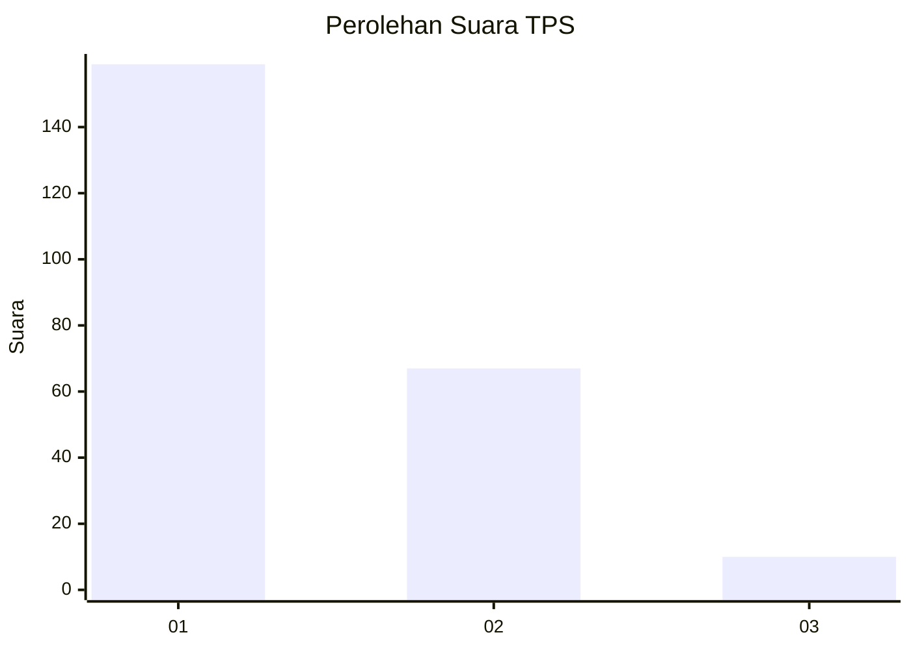
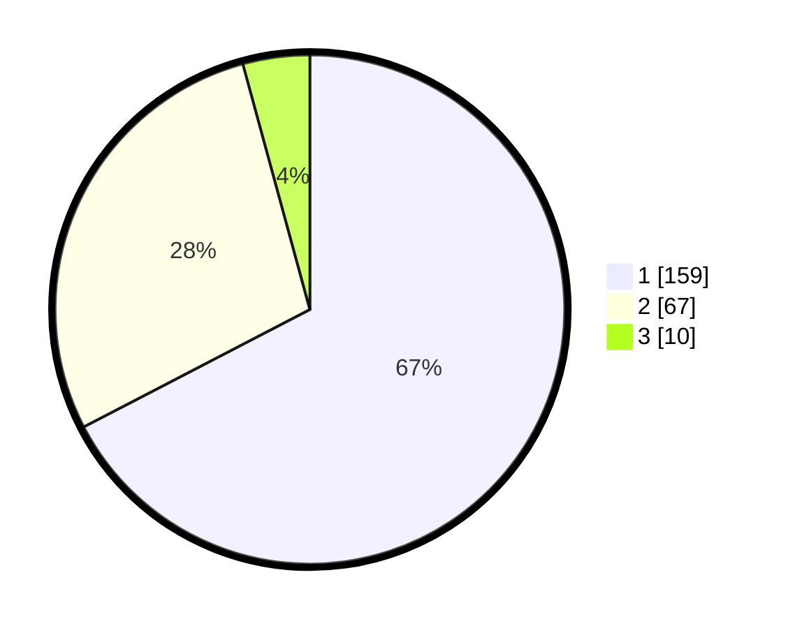

# Hasil

## Grafik

## Tabel

| No. | Nama Paslon    | Suara | Suara (raw) | Persentase |
|:--- |:-------------- | -----:| -----------:| ----------:|
| 1   | ANIES MUHAIMIN | 159   | [159][p-1]  | 67,37      |
| 2   | PRABOWO GIBRAN | 67    | [67][p-2]   | 28,39      |
| 3   | GANJAR MAHFUD  | 10    | [10][p-3]   | 4,24       |

[p-1]: https://github.com/gigit-pemilu/pemilu-2024-36-banten/blob/main/pilpres/hitung-suara/sub/36-banten/sub/03-tangerang/sub/22-pagedangan/sub/2006-lengkong-kulon/sub/003-tps/sub/paslon-1.txt
[p-2]: https://github.com/gigit-pemilu/pemilu-2024-36-banten/blob/main/pilpres/hitung-suara/sub/36-banten/sub/03-tangerang/sub/22-pagedangan/sub/2006-lengkong-kulon/sub/003-tps/sub/paslon-2.txt
[p-3]: https://github.com/gigit-pemilu/pemilu-2024-36-banten/blob/main/pilpres/hitung-suara/sub/36-banten/sub/03-tangerang/sub/22-pagedangan/sub/2006-lengkong-kulon/sub/003-tps/sub/paslon-3.txt

## Foto C Plano

https://sirekap-obj-formc.kpu.go.id/cc42/pemilu/ppwp/36/03/22/20/06/3603222006003-20240223-094000--c684520b-e89d-4c27-bc84-101cb251d812.jpg

https://sirekap-obj-formc.kpu.go.id/cc42/pemilu/ppwp/36/03/22/20/06/3603222006003-20240223-094044--7b5f1554-f9e4-4afa-8c59-aa47dc44102f.jpg

https://sirekap-obj-formc.kpu.go.id/cc42/pemilu/ppwp/36/03/22/20/06/3603222006003-20240223-094134--e85c9510-9536-4945-ac3e-3e94197fdbf6.jpg

## Metadata

| Key        | Value               |
| ---------- | ------------------- |
| Time Stamp | 2024-02-26 11:00:00 |

