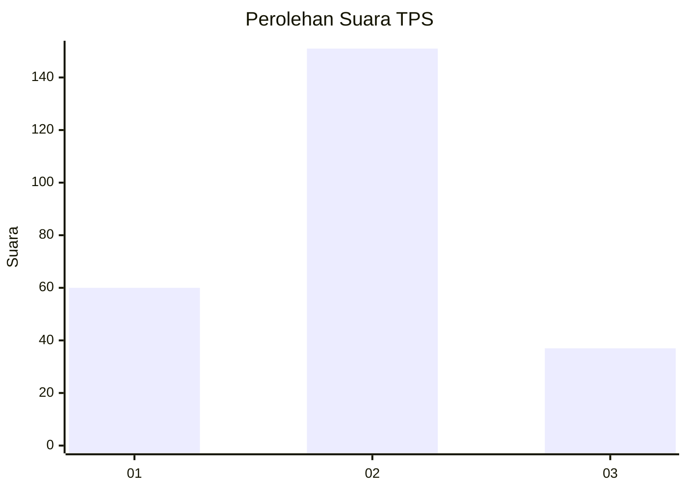
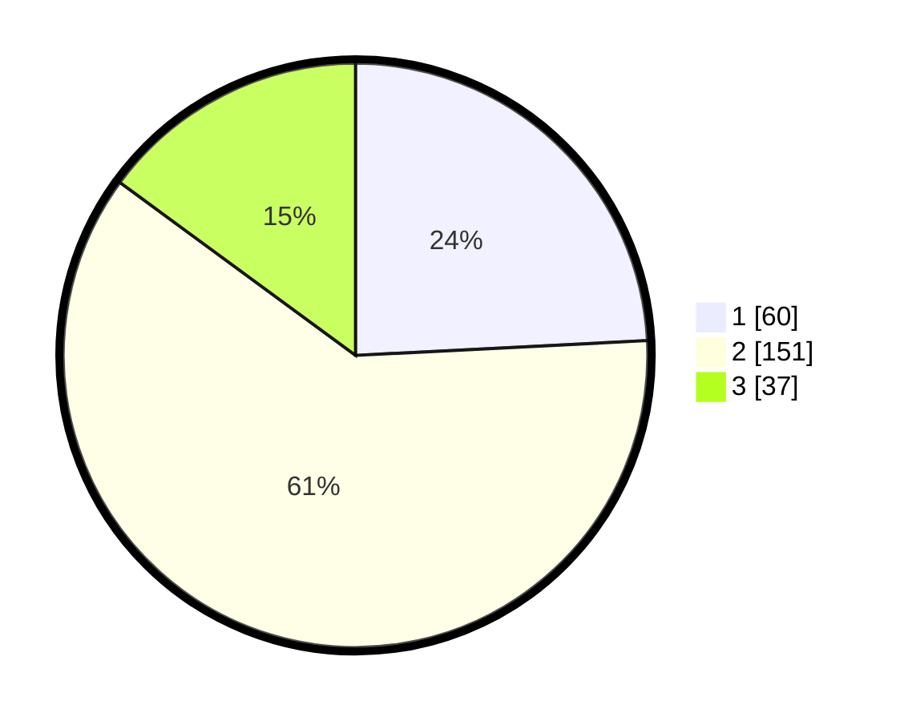

# Hasil

## Grafik

## Tabel

| No. | Nama Paslon    | Suara | Suara (raw) | Persentase |
|:--- |:-------------- | -----:| -----------:| ----------:|
| 1   | ANIES MUHAIMIN | 60    | [60][p-1]   | 24,19      |
| 2   | PRABOWO GIBRAN | 151   | [151][p-2]  | 60,89      |
| 3   | GANJAR MAHFUD  | 37    | [37][p-3]   | 14,92      |

[p-1]: https://github.com/gigit-pemilu/pemilu-2024/blob/main/pilpres/hitung-suara/sub/36-banten/sub/03-tangerang/sub/22-pagedangan/sub/2006-lengkong-kulon/sub/006-tps/sub/paslon-1.txt
[p-2]: https://github.com/gigit-pemilu/pemilu-2024/blob/main/pilpres/hitung-suara/sub/36-banten/sub/03-tangerang/sub/22-pagedangan/sub/2006-lengkong-kulon/sub/006-tps/sub/paslon-2.txt
[p-3]: https://github.com/gigit-pemilu/pemilu-2024/blob/main/pilpres/hitung-suara/sub/36-banten/sub/03-tangerang/sub/22-pagedangan/sub/2006-lengkong-kulon/sub/006-tps/sub/paslon-3.txt

## Foto C Plano

https://sirekap-obj-formc.kpu.go.id/4307/pemilu/ppwp/36/03/22/20/06/3603222006006-20240223-163807--f532824b-c1ac-409e-baa2-2d9ab87cbfd7.jpg

https://sirekap-obj-formc.kpu.go.id/4307/pemilu/ppwp/36/03/22/20/06/3603222006006-20240223-163921--5dd1ee76-eda5-48b2-bbcb-f140e0c9e95d.jpg

https://sirekap-obj-formc.kpu.go.id/4307/pemilu/ppwp/36/03/22/20/06/3603222006006-20240223-164025--32107160-b8ee-4973-8a0d-d5d605da27b2.jpg

## Metadata

| Key        | Value               |
| ---------- | ------------------- |
| Time Stamp | 2024-02-25 16:00:00 |

