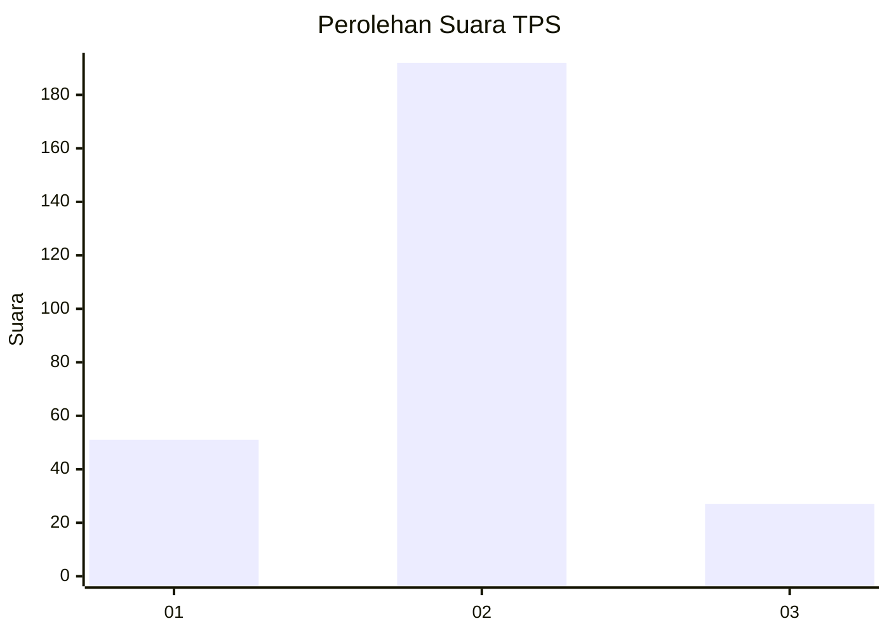
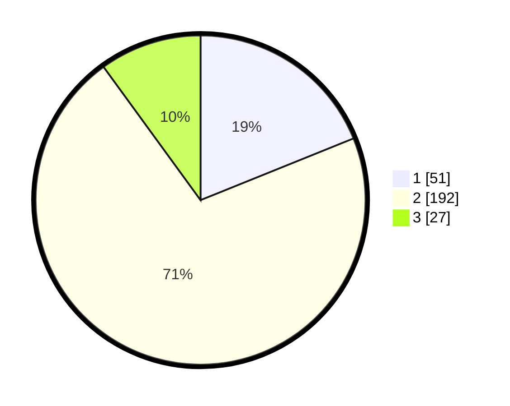

# Hasil

## Grafik

## Tabel

| No. | Nama Paslon    | Suara | Suara (raw) | Persentase |
|:--- |:-------------- | -----:| -----------:| ----------:|
| 1   | ANIES MUHAIMIN | 51    | [51][p-1]   | 18,89      |
| 2   | PRABOWO GIBRAN | 192   | [192][p-2]  | 71,11      |
| 3   | GANJAR MAHFUD  | 27    | [27][p-3]   | 10,00      |

[p-1]: https://github.com/gigit-pemilu/pemilu-2024-36-banten/blob/main/pilpres/hitung-suara/sub/36-banten/sub/03-tangerang/sub/22-pagedangan/sub/2006-lengkong-kulon/sub/022-tps/sub/paslon-1.txt
[p-2]: https://github.com/gigit-pemilu/pemilu-2024-36-banten/blob/main/pilpres/hitung-suara/sub/36-banten/sub/03-tangerang/sub/22-pagedangan/sub/2006-lengkong-kulon/sub/022-tps/sub/paslon-2.txt
[p-3]: https://github.com/gigit-pemilu/pemilu-2024-36-banten/blob/main/pilpres/hitung-suara/sub/36-banten/sub/03-tangerang/sub/22-pagedangan/sub/2006-lengkong-kulon/sub/022-tps/sub/paslon-3.txt

## Foto C Plano

https://sirekap-obj-formc.kpu.go.id/5a94/pemilu/ppwp/36/03/22/20/06/3603222006022-20240225-191200--f6383a90-7563-414a-896d-d933e5617389.jpg

https://sirekap-obj-formc.kpu.go.id/5a94/pemilu/ppwp/36/03/22/20/06/3603222006022-20240225-191227--14fbe5f1-23da-4b6b-9a37-9b9c99c955e9.jpg

https://sirekap-obj-formc.kpu.go.id/5a94/pemilu/ppwp/36/03/22/20/06/3603222006022-20240225-191254--2f6ae7bb-8037-4f7d-8d59-6bf767414d21.jpg

## Metadata

| Key        | Value               |
| ---------- | ------------------- |
| Time Stamp | 2024-02-28 19:00:00 |

