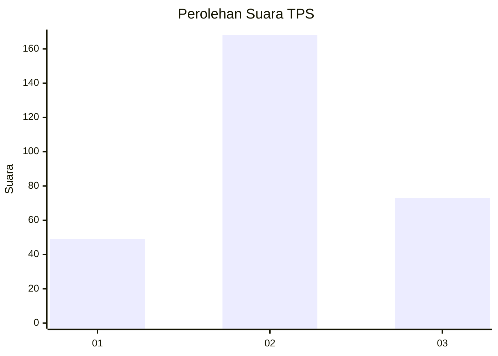
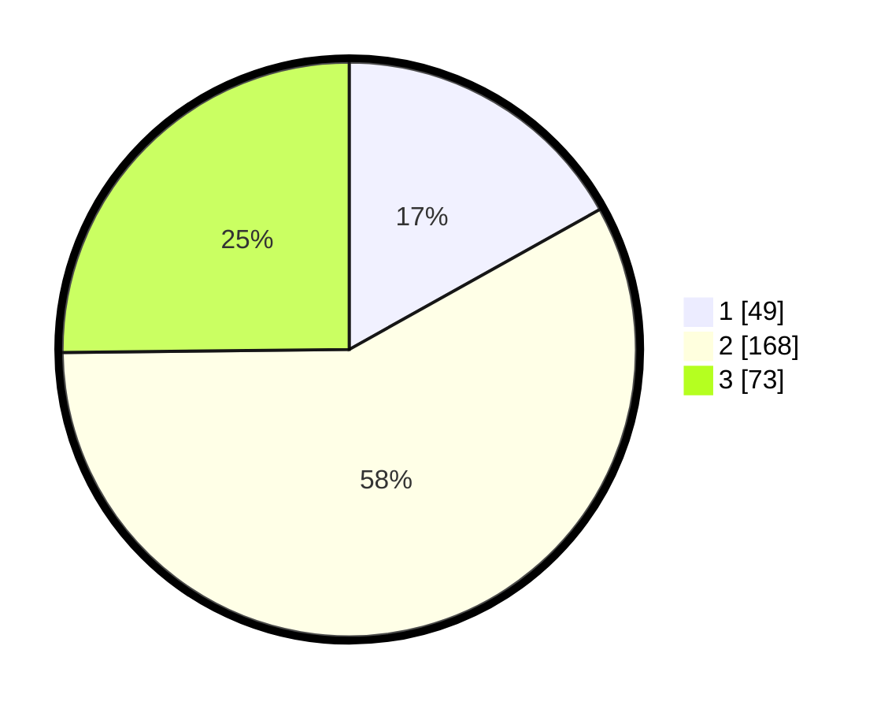

# Hasil

## Grafik

## Tabel

| No. | Nama Paslon    | Suara | Suara (raw) | Persentase |
|:--- |:-------------- | -----:| -----------:| ----------:|
| 1   | ANIES MUHAIMIN | 49    | [49][p-1]   | 16,90      |
| 2   | PRABOWO GIBRAN | 168   | [168][p-2]  | 57,93      |
| 3   | GANJAR MAHFUD  | 73    | [73][p-3]   | 25,17      |

[p-1]: https://github.com/gigit-pemilu/pemilu-2024-36-banten/blob/main/pilpres/hitung-suara/sub/36-banten/sub/03-tangerang/sub/22-pagedangan/sub/2008-jatake/sub/007-tps/sub/paslon-1.txt
[p-2]: https://github.com/gigit-pemilu/pemilu-2024-36-banten/blob/main/pilpres/hitung-suara/sub/36-banten/sub/03-tangerang/sub/22-pagedangan/sub/2008-jatake/sub/007-tps/sub/paslon-2.txt
[p-3]: https://github.com/gigit-pemilu/pemilu-2024-36-banten/blob/main/pilpres/hitung-suara/sub/36-banten/sub/03-tangerang/sub/22-pagedangan/sub/2008-jatake/sub/007-tps/sub/paslon-3.txt

## Foto C Plano

https://sirekap-obj-formc.kpu.go.id/8f95/pemilu/ppwp/36/03/22/20/08/3603222008007-20240220-213115--7d3575fa-7cc1-4bae-afaf-bc6d1719c9f2.jpg

https://sirekap-obj-formc.kpu.go.id/8f95/pemilu/ppwp/36/03/22/20/08/3603222008007-20240220-213142--7adabc18-5814-40df-91be-9b5a78ca8608.jpg

https://sirekap-obj-formc.kpu.go.id/8f95/pemilu/ppwp/36/03/22/20/08/3603222008007-20240220-213217--a5fd1825-b27f-4a63-a0a9-42873916768e.jpg

## Metadata

| Key        | Value               |
| ---------- | ------------------- |
| Time Stamp | 2024-02-24 22:31:28 |

