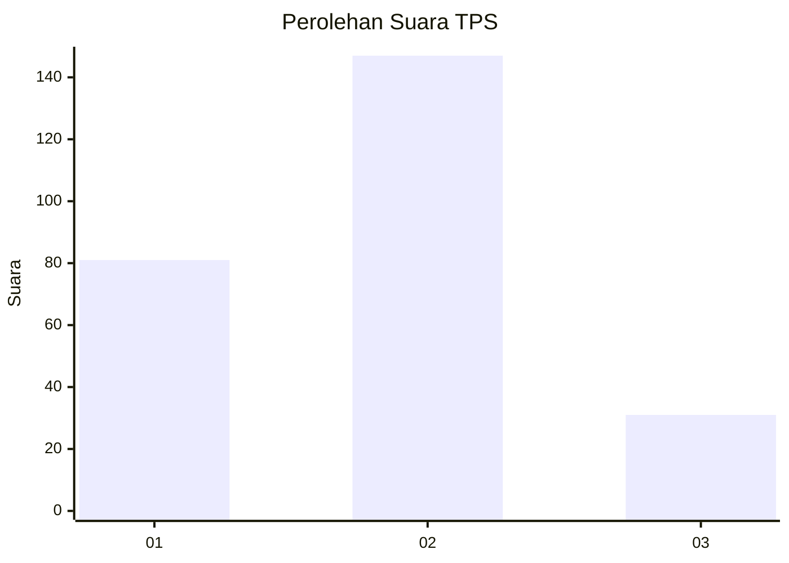
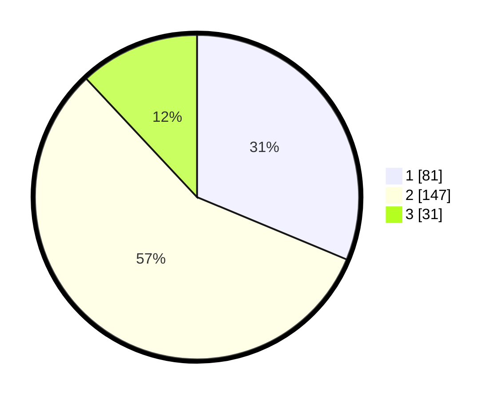

# Hasil

## Grafik

## Tabel

| No. | Nama Paslon    | Suara | Suara (raw) | Persentase |
|:--- |:-------------- | -----:| -----------:| ----------:|
| 1   | ANIES MUHAIMIN | 81    | [81][p-1]   | 31,27      |
| 2   | PRABOWO GIBRAN | 147   | [147][p-2]  | 56,76      |
| 3   | GANJAR MAHFUD  | 31    | [31][p-3]   | 11,97      |

[p-1]: https://github.com/gigit-pemilu/pemilu-2024-36-banten/blob/main/pilpres/hitung-suara/sub/36-banten/sub/03-tangerang/sub/23-cisauk/sub/1001-cisauk/sub/001-tps/sub/paslon-1.txt
[p-2]: https://github.com/gigit-pemilu/pemilu-2024-36-banten/blob/main/pilpres/hitung-suara/sub/36-banten/sub/03-tangerang/sub/23-cisauk/sub/1001-cisauk/sub/001-tps/sub/paslon-2.txt
[p-3]: https://github.com/gigit-pemilu/pemilu-2024-36-banten/blob/main/pilpres/hitung-suara/sub/36-banten/sub/03-tangerang/sub/23-cisauk/sub/1001-cisauk/sub/001-tps/sub/paslon-3.txt

## Foto C Plano

https://sirekap-obj-formc.kpu.go.id/4ba6/pemilu/ppwp/36/03/23/10/01/3603231001001-20240215-032137--f55cf3d9-9c7f-4318-ab82-2b44376e9475.jpg

https://sirekap-obj-formc.kpu.go.id/4ba6/pemilu/ppwp/36/03/23/10/01/3603231001001-20240215-032202--87698dd3-0346-4223-93db-5aa290a0e730.jpg

https://sirekap-obj-formc.kpu.go.id/4ba6/pemilu/ppwp/36/03/23/10/01/3603231001001-20240215-032217--6878f55a-dd6f-4d0d-90ce-ab4eb5d3b17c.jpg

## Metadata

| Key        | Value               |
| ---------- | ------------------- |
| Time Stamp | 2024-02-19 17:00:00 |

