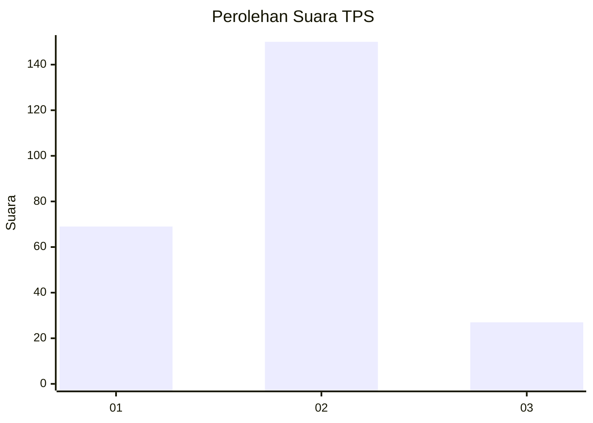
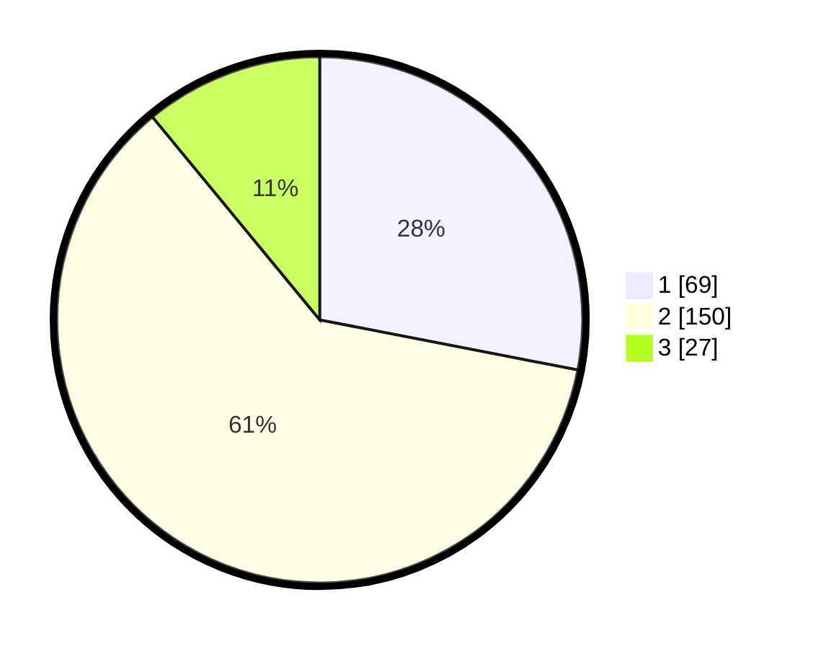

# Hasil

## Grafik

## Tabel

| No. | Nama Paslon    | Suara | Suara (raw) | Persentase |
|:--- |:-------------- | -----:| -----------:| ----------:|
| 1   | ANIES MUHAIMIN | 69    | [69][p-1]   | 28,05      |
| 2   | PRABOWO GIBRAN | 150   | [150][p-2]  | 60,98      |
| 3   | GANJAR MAHFUD  | 27    | [27][p-3]   | 10,98      |

[p-1]: https://github.com/gigit-pemilu/pemilu-2024/blob/main/pilpres/hitung-suara/sub/36-banten/sub/03-tangerang/sub/23-cisauk/sub/1001-cisauk/sub/002-tps/sub/paslon-1.txt
[p-2]: https://github.com/gigit-pemilu/pemilu-2024/blob/main/pilpres/hitung-suara/sub/36-banten/sub/03-tangerang/sub/23-cisauk/sub/1001-cisauk/sub/002-tps/sub/paslon-2.txt
[p-3]: https://github.com/gigit-pemilu/pemilu-2024/blob/main/pilpres/hitung-suara/sub/36-banten/sub/03-tangerang/sub/23-cisauk/sub/1001-cisauk/sub/002-tps/sub/paslon-3.txt

## Foto C Plano

https://sirekap-obj-formc.kpu.go.id/c4db/pemilu/ppwp/36/03/23/10/01/3603231001002-20240225-204836--12af52e3-26c6-4b40-96da-24612803c877.jpg

https://sirekap-obj-formc.kpu.go.id/c4db/pemilu/ppwp/36/03/23/10/01/3603231001002-20240225-205002--ca314025-1f22-4e1b-b57a-fa9944dd2efc.jpg

https://sirekap-obj-formc.kpu.go.id/c4db/pemilu/ppwp/36/03/23/10/01/3603231001002-20240225-204925--6f875217-d570-4959-8d31-481e6c204bd3.jpg

## Metadata

| Key        | Value               |
| ---------- | ------------------- |
| Time Stamp | 2024-02-28 22:00:00 |

