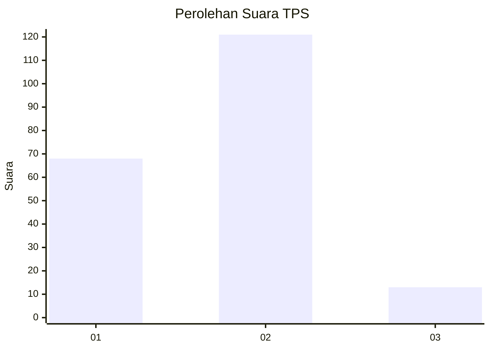
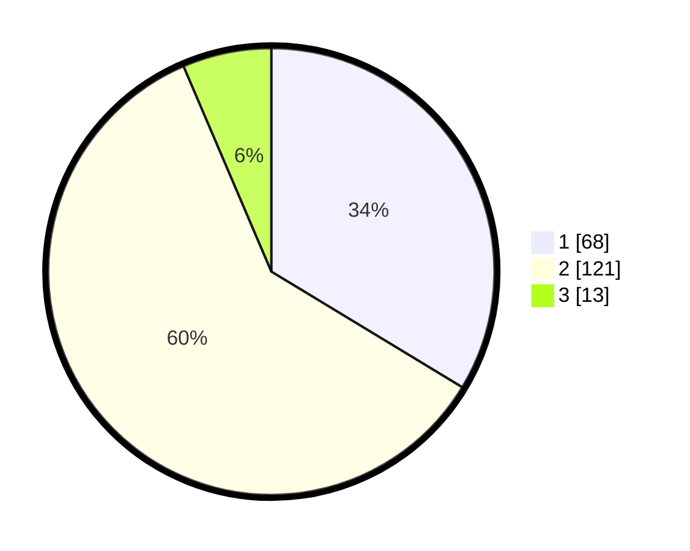

# Hasil

## Grafik

## Tabel

| No. | Nama Paslon    | Suara | Suara (raw) | Persentase |
|:--- |:-------------- | -----:| -----------:| ----------:|
| 1   | ANIES MUHAIMIN | 68    | [68][p-1]   | 33,66      |
| 2   | PRABOWO GIBRAN | 121   | [121][p-2]  | 59,90      |
| 3   | GANJAR MAHFUD  | 13    | [13][p-3]   | 6,44       |

[p-1]: https://github.com/gigit-pemilu/pemilu-2024-36-banten/blob/main/pilpres/hitung-suara/sub/36-banten/sub/03-tangerang/sub/23-cisauk/sub/1001-cisauk/sub/003-tps/sub/paslon-1.txt
[p-2]: https://github.com/gigit-pemilu/pemilu-2024-36-banten/blob/main/pilpres/hitung-suara/sub/36-banten/sub/03-tangerang/sub/23-cisauk/sub/1001-cisauk/sub/003-tps/sub/paslon-2.txt
[p-3]: https://github.com/gigit-pemilu/pemilu-2024-36-banten/blob/main/pilpres/hitung-suara/sub/36-banten/sub/03-tangerang/sub/23-cisauk/sub/1001-cisauk/sub/003-tps/sub/paslon-3.txt

## Foto C Plano

https://sirekap-obj-formc.kpu.go.id/f6d1/pemilu/ppwp/36/03/23/10/01/3603231001003-20240225-120857--58011375-88aa-4a39-bc28-ba208c45aa61.jpg

https://sirekap-obj-formc.kpu.go.id/f6d1/pemilu/ppwp/36/03/23/10/01/3603231001003-20240225-120749--8a4e8d32-8419-40ba-9d96-c5f78276eedd.jpg

https://sirekap-obj-formc.kpu.go.id/f6d1/pemilu/ppwp/36/03/23/10/01/3603231001003-20240225-120820--608d5429-36db-4294-ae70-65fd14c24686.jpg

## Metadata

| Key        | Value               |
| ---------- | ------------------- |
| Time Stamp | 2024-02-28 19:00:00 |

