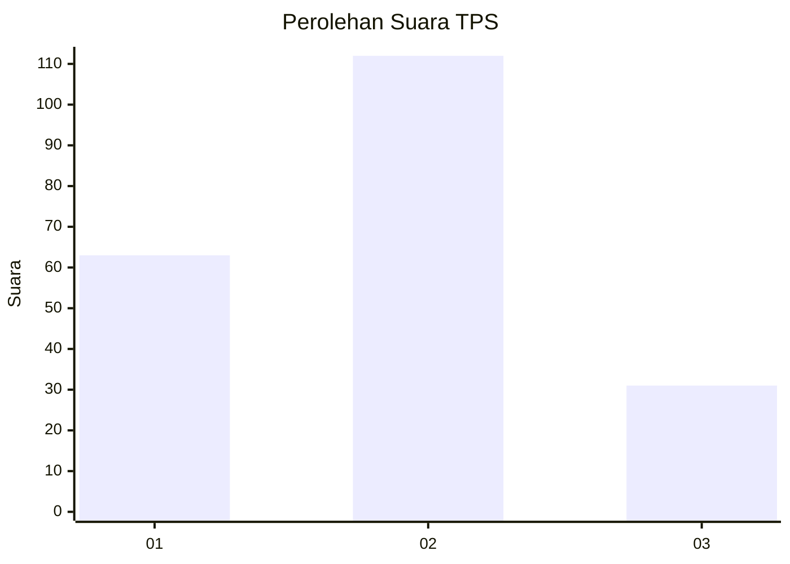
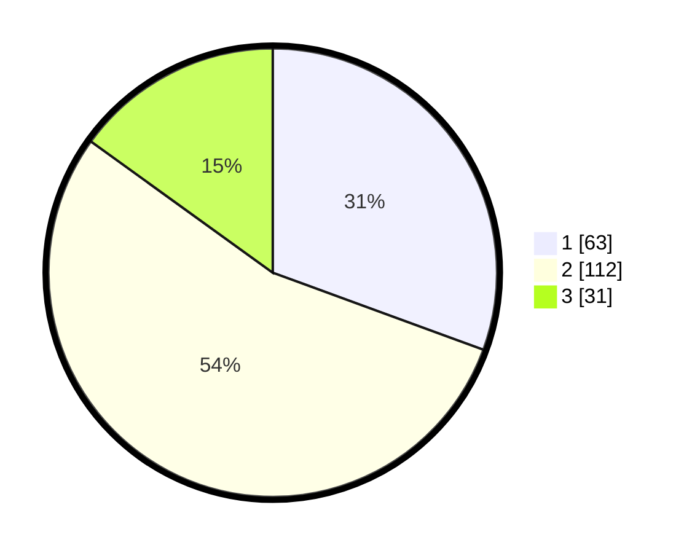

# Hasil

## Grafik

## Tabel

| No. | Nama Paslon    | Suara | Suara (raw) | Persentase |
|:--- |:-------------- | -----:| -----------:| ----------:|
| 1   | ANIES MUHAIMIN | 63    | [63][p-1]   | 30,58      |
| 2   | PRABOWO GIBRAN | 112   | [112][p-2]  | 54,37      |
| 3   | GANJAR MAHFUD  | 31    | [31][p-3]   | 15,05      |

[p-1]: https://github.com/gigit-pemilu/pemilu-2024/blob/main/pilpres/hitung-suara/sub/36-banten/sub/03-tangerang/sub/23-cisauk/sub/1001-cisauk/sub/004-tps/sub/paslon-1.txt
[p-2]: https://github.com/gigit-pemilu/pemilu-2024/blob/main/pilpres/hitung-suara/sub/36-banten/sub/03-tangerang/sub/23-cisauk/sub/1001-cisauk/sub/004-tps/sub/paslon-2.txt
[p-3]: https://github.com/gigit-pemilu/pemilu-2024/blob/main/pilpres/hitung-suara/sub/36-banten/sub/03-tangerang/sub/23-cisauk/sub/1001-cisauk/sub/004-tps/sub/paslon-3.txt

## Foto C Plano

https://sirekap-obj-formc.kpu.go.id/a212/pemilu/ppwp/36/03/23/10/01/3603231001004-20240227-140357--127e1327-2401-4a4e-9a1d-f7f3faba1b5e.jpg

https://sirekap-obj-formc.kpu.go.id/a212/pemilu/ppwp/36/03/23/10/01/3603231001004-20240227-140437--d72a12f5-f269-4e71-bb66-c3658536b08e.jpg

https://sirekap-obj-formc.kpu.go.id/a212/pemilu/ppwp/36/03/23/10/01/3603231001004-20240227-140509--ef675dbe-1f99-46bf-acf9-9beece64c41d.jpg

## Metadata

| Key        | Value               |
| ---------- | ------------------- |
| Time Stamp | 2024-02-28 19:00:00 |

