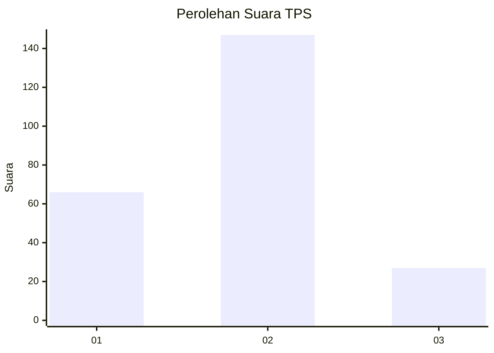
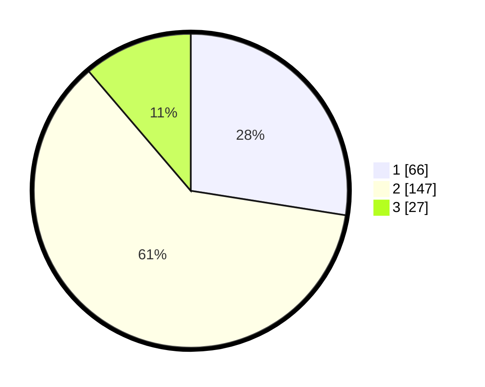

# Hasil

## Grafik

## Tabel

| No. | Nama Paslon    | Suara | Suara (raw) | Persentase |
|:--- |:-------------- | -----:| -----------:| ----------:|
| 1   | ANIES MUHAIMIN | 66    | [66][p-1]   | 27,50      |
| 2   | PRABOWO GIBRAN | 147   | [147][p-2]  | 61,25      |
| 3   | GANJAR MAHFUD  | 27    | [27][p-3]   | 11,25      |

[p-1]: https://github.com/gigit-pemilu/pemilu-2024-36-banten/blob/main/pilpres/hitung-suara/sub/36-banten/sub/03-tangerang/sub/23-cisauk/sub/1001-cisauk/sub/005-tps/sub/paslon-1.txt
[p-2]: https://github.com/gigit-pemilu/pemilu-2024-36-banten/blob/main/pilpres/hitung-suara/sub/36-banten/sub/03-tangerang/sub/23-cisauk/sub/1001-cisauk/sub/005-tps/sub/paslon-2.txt
[p-3]: https://github.com/gigit-pemilu/pemilu-2024-36-banten/blob/main/pilpres/hitung-suara/sub/36-banten/sub/03-tangerang/sub/23-cisauk/sub/1001-cisauk/sub/005-tps/sub/paslon-3.txt

## Foto C Plano

https://sirekap-obj-formc.kpu.go.id/7660/pemilu/ppwp/36/03/23/10/01/3603231001005-20240227-134242--1a4f06c5-7af9-4be9-aa58-b265209a3c38.jpg

https://sirekap-obj-formc.kpu.go.id/7660/pemilu/ppwp/36/03/23/10/01/3603231001005-20240227-134412--e322b2ce-6624-4611-b641-54e1e69c9a18.jpg

https://sirekap-obj-formc.kpu.go.id/7660/pemilu/ppwp/36/03/23/10/01/3603231001005-20240227-134537--9bce39ce-ef57-4790-b2cb-a13cb27eb90e.jpg

## Metadata

| Key        | Value               |
| ---------- | ------------------- |
| Time Stamp | 2024-03-02 18:00:00 |

