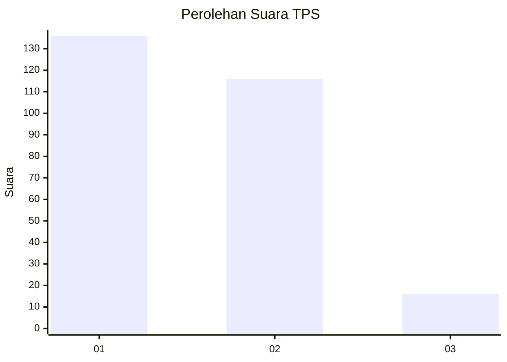
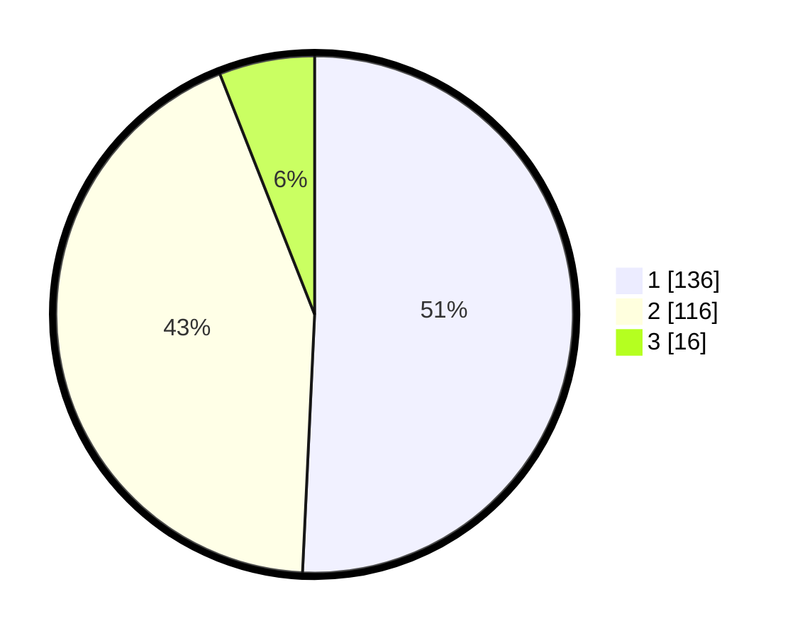

# Hasil

## Grafik

## Tabel

| No. | Nama Paslon    | Suara | Suara (raw) | Persentase |
|:--- |:-------------- | -----:| -----------:| ----------:|
| 1   | ANIES MUHAIMIN | 136   | [136][p-1]  | 50,75      |
| 2   | PRABOWO GIBRAN | 116   | [116][p-2]  | 43,28      |
| 3   | GANJAR MAHFUD  | 16    | [16][p-3]   | 5,97       |

[p-1]: https://github.com/gigit-pemilu/pemilu-2024/blob/main/pilpres/hitung-suara/sub/36-banten/sub/03-tangerang/sub/23-cisauk/sub/2005-suradita/sub/019-tps/sub/paslon-1.txt
[p-2]: https://github.com/gigit-pemilu/pemilu-2024/blob/main/pilpres/hitung-suara/sub/36-banten/sub/03-tangerang/sub/23-cisauk/sub/2005-suradita/sub/019-tps/sub/paslon-2.txt
[p-3]: https://github.com/gigit-pemilu/pemilu-2024/blob/main/pilpres/hitung-suara/sub/36-banten/sub/03-tangerang/sub/23-cisauk/sub/2005-suradita/sub/019-tps/sub/paslon-3.txt

## Foto C Plano

https://sirekap-obj-formc.kpu.go.id/a150/pemilu/ppwp/36/03/23/20/05/3603232005019-20240223-135205--97f9d8af-5989-4c81-8d68-a8d549c20c81.jpg

https://sirekap-obj-formc.kpu.go.id/a150/pemilu/ppwp/36/03/23/20/05/3603232005019-20240223-135726--81fd8943-b862-4e7e-97cc-7451a766e264.jpg

https://sirekap-obj-formc.kpu.go.id/a150/pemilu/ppwp/36/03/23/20/05/3603232005019-20240223-140047--36a0899f-6661-4891-a7f4-eac97e39bcb8.jpg

## Metadata

| Key        | Value               |
| ---------- | ------------------- |
| Time Stamp | 2024-02-24 22:31:28 |

