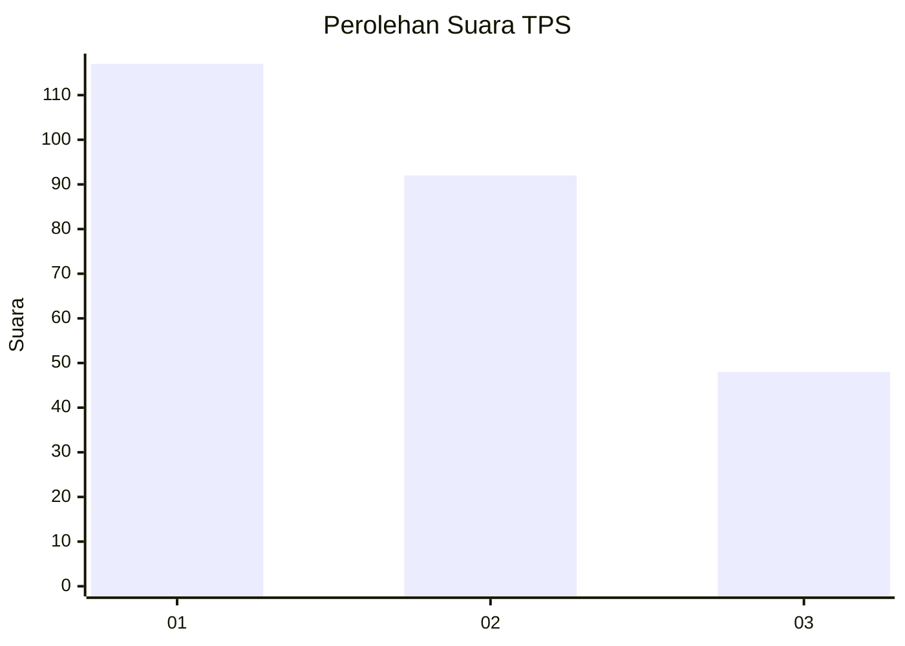
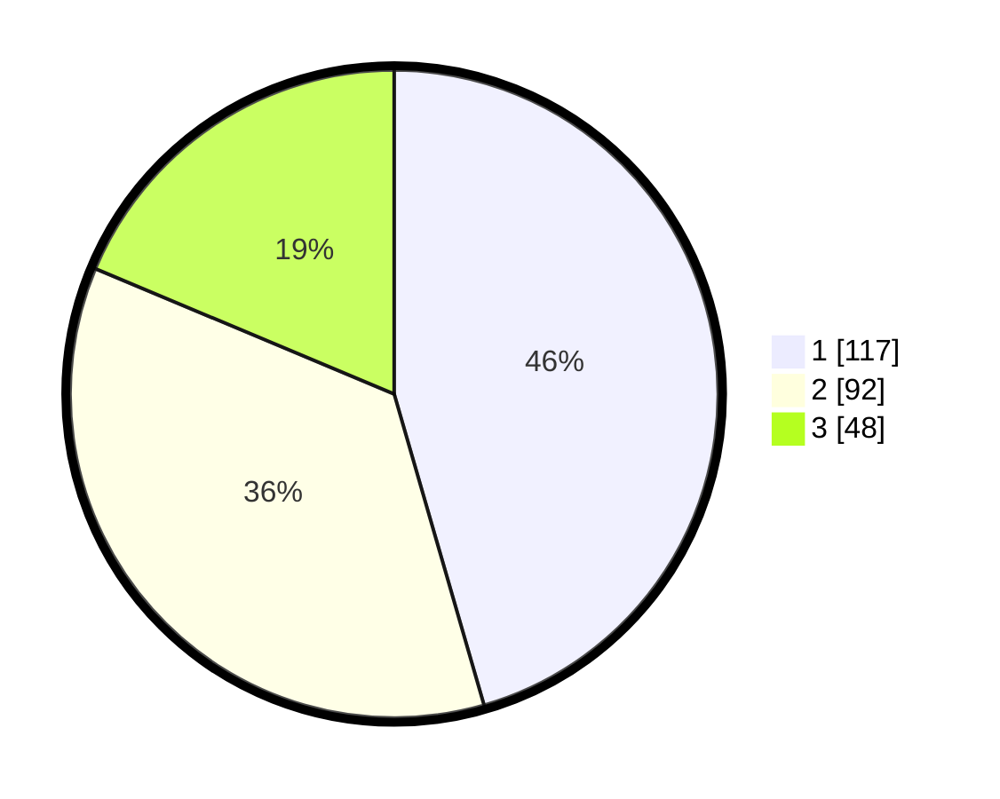

# Hasil

## Grafik

## Tabel

| No. | Nama Paslon    | Suara | Suara (raw) | Persentase |
|:--- |:-------------- | -----:| -----------:| ----------:|
| 1   | ANIES MUHAIMIN | 117   | [117][p-1]  | 45,53      |
| 2   | PRABOWO GIBRAN | 92    | [92][p-2]   | 35,80      |
| 3   | GANJAR MAHFUD  | 48    | [48][p-3]   | 18,68      |

[p-1]: https://github.com/gigit-pemilu/pemilu-2024/blob/main/pilpres/hitung-suara/sub/36-banten/sub/03-tangerang/sub/23-cisauk/sub/2005-suradita/sub/046-tps/sub/paslon-1.txt
[p-2]: https://github.com/gigit-pemilu/pemilu-2024/blob/main/pilpres/hitung-suara/sub/36-banten/sub/03-tangerang/sub/23-cisauk/sub/2005-suradita/sub/046-tps/sub/paslon-2.txt
[p-3]: https://github.com/gigit-pemilu/pemilu-2024/blob/main/pilpres/hitung-suara/sub/36-banten/sub/03-tangerang/sub/23-cisauk/sub/2005-suradita/sub/046-tps/sub/paslon-3.txt

## Foto C Plano

https://sirekap-obj-formc.kpu.go.id/2383/pemilu/ppwp/36/03/23/20/05/3603232005046-20240226-202331--9a09fac5-69ea-4134-bf72-7a9208080530.jpg

https://sirekap-obj-formc.kpu.go.id/2383/pemilu/ppwp/36/03/23/20/05/3603232005046-20240224-143626--8febe238-fdb7-4084-ad9a-da0fe27db58d.jpg

https://sirekap-obj-formc.kpu.go.id/2383/pemilu/ppwp/36/03/23/20/05/3603232005046-20240224-143757--2b1105b7-546c-4eea-9e54-f503b0acd49a.jpg

## Metadata

| Key        | Value               |
| ---------- | ------------------- |
| Time Stamp | 2024-02-28 19:00:00 |

