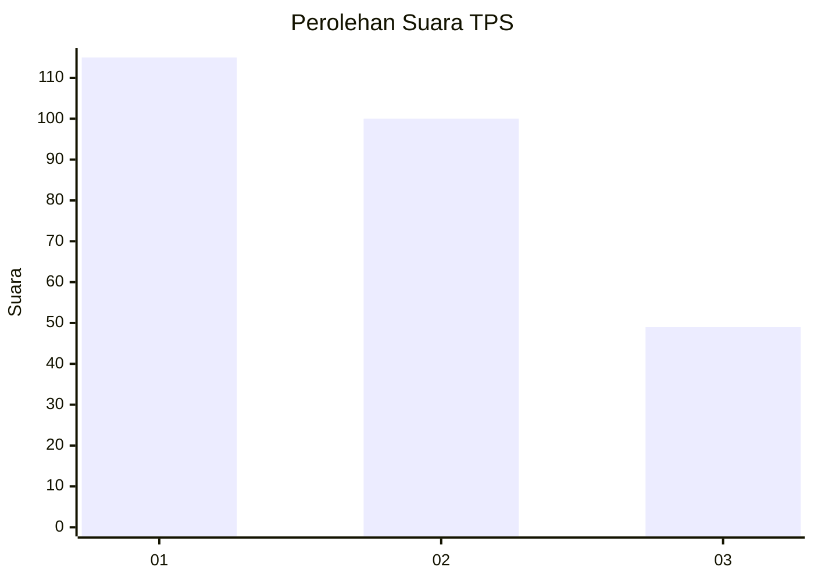
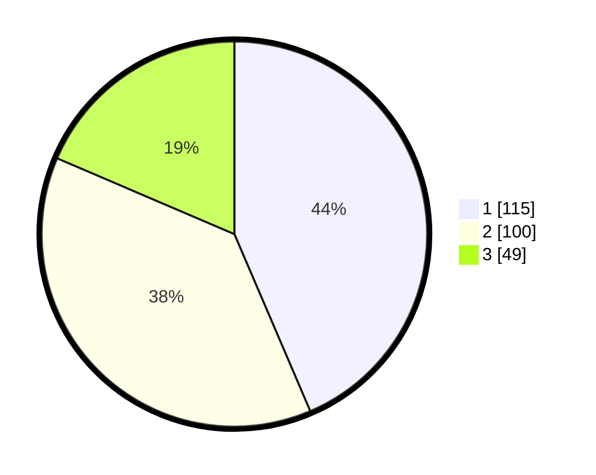

# Hasil

## Grafik

## Tabel

| No. | Nama Paslon    | Suara | Suara (raw) | Persentase |
|:--- |:-------------- | -----:| -----------:| ----------:|
| 1   | ANIES MUHAIMIN | 115   | [115][p-1]  | 43,56      |
| 2   | PRABOWO GIBRAN | 100   | [100][p-2]  | 37,88      |
| 3   | GANJAR MAHFUD  | 49    | [49][p-3]   | 18,56      |

[p-1]: https://github.com/gigit-pemilu/pemilu-2024/blob/main/pilpres/hitung-suara/sub/36-banten/sub/03-tangerang/sub/23-cisauk/sub/2005-suradita/sub/050-tps/sub/paslon-1.txt
[p-2]: https://github.com/gigit-pemilu/pemilu-2024/blob/main/pilpres/hitung-suara/sub/36-banten/sub/03-tangerang/sub/23-cisauk/sub/2005-suradita/sub/050-tps/sub/paslon-2.txt
[p-3]: https://github.com/gigit-pemilu/pemilu-2024/blob/main/pilpres/hitung-suara/sub/36-banten/sub/03-tangerang/sub/23-cisauk/sub/2005-suradita/sub/050-tps/sub/paslon-3.txt

## Foto C Plano

https://sirekap-obj-formc.kpu.go.id/72ea/pemilu/ppwp/36/03/23/20/05/3603232005050-20240224-162250--599cdba0-d3cd-4e29-aea4-083fb401be06.jpg

https://sirekap-obj-formc.kpu.go.id/72ea/pemilu/ppwp/36/03/23/20/05/3603232005050-20240224-162447--10af6d8c-a2c2-4260-b7e6-ed4b0a3a5374.jpg

https://sirekap-obj-formc.kpu.go.id/72ea/pemilu/ppwp/36/03/23/20/05/3603232005050-20240224-162824--20258f44-52f4-412d-902d-267576da2e10.jpg

## Metadata

| Key        | Value               |
| ---------- | ------------------- |
| Time Stamp | 2024-03-01 16:00:00 |

